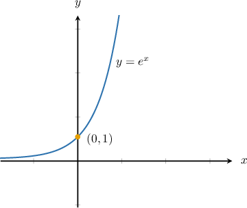
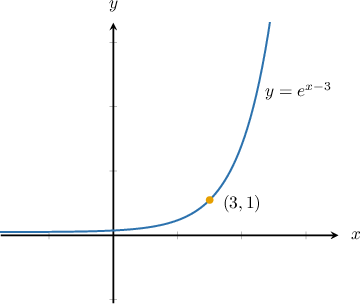
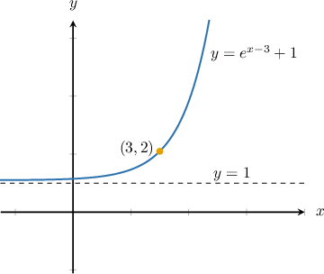
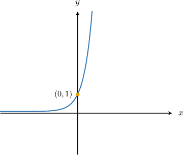
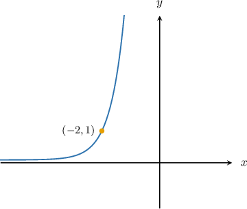
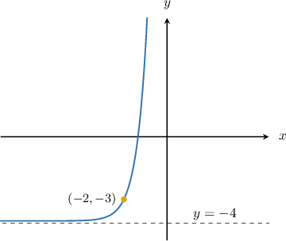
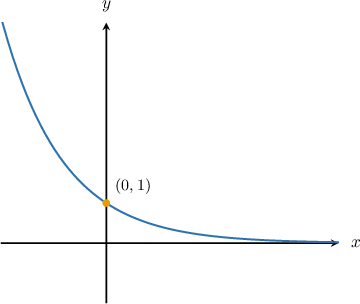
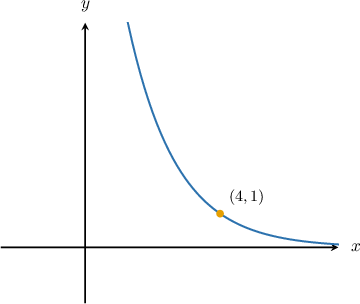
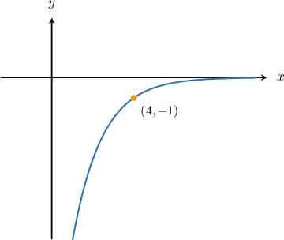

# Combining Graph Transformations of Exponential Functions

Source: https://www.mathacademy.com/topics/6351?courseId=111
Topic ID: 6351

## Prerequisites

- [The Natural Logarithm](./818-the-natural-logarithm.md)
- [Horizontal Translations of Functions](./1584-horizontal-translations-of-functions.md)
- [Vertical Reflections of Exponential Functions](./1682-vertical-reflections-of-exponential-functions.md)

## Lesson

### Introduction

Recall that **Euler's number,** denoted $e,$ is an irrational number whose decimal approximation is

$$

e\approx2.718\,281\,828.

$$

As we'll discover, the exponential growth curve $y=e^x$ is one of the most important curves in mathematics. Its graph is given below.

Now, suppose we want to sketch the graph of $y=e^{x-3} + 1.$

First, we shift it $3$ units to the right to get $y=e^{x-3}.$ The $y$-intercept moves from $(0,1)$ to the point $(3,1)$ but the horizontal asymptote stays at $y=0.$

Then, we vertically shift it by $1$ unit up to give $e^{x-3} + 1.$ The point $(3,1)$ moves to $(3,2)$ and the horizontal asymptote moves from $y=0$ to $y=1.$

### Example: Exponential Growth Functions With Horizontal and Vertical Shifts

#### Question

Plot the curve of $y=8^{x+2}-4.$

#### Explanation

To plot the given function, we follow these steps:

- First, we plot the graph of $y=8^x.$

- To plot $y=8^{x+2},$ we shift the graph of $y=8^{x}$ horizontally by $2$ units to the left. The $y$-intercept moves from $(0,1)$ to $(-2,1),$ but the horizontal asymptote stays at $y=0.$

- To plot $y=8^{x+2}-4,$ we shift the graph of $y=8^{x+2}$ vertically by $4$ units down. The point $(-2,1)$ moves to $(-2,-3)$ and the horizontal asymptote moves from $y=0$ to $y=-4.$

### Example: Exponential Functions With Vertical Reflections and Horizontal Shifts

#### Question

Sketch the graph of the function $y=-\left(\dfrac{1}{2}\right)^{x-4}.$

#### Explanation

To plot the given function, we follow these steps:

- We take the curve $y=\left(\dfrac{1}{2}\right)^x.$

- Horizontally shift it by $4$ units to the right to give $y=\left(\dfrac{1}{2}\right)^{x-4}.$ The $y$-intercept moves from $(0,1)$ to $(4,1)$ but the horizontal asymptote stays at $y=0.$

- Then, reflect it on the $x$-axis to give $y=-\left(\dfrac{1}{2}\right)^{x-4}.$ The point $(4,1)$ moves to $(4,-1)$ and the horizontal asymptote stays at $y=0.$

