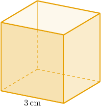
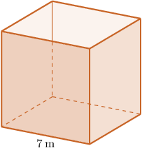
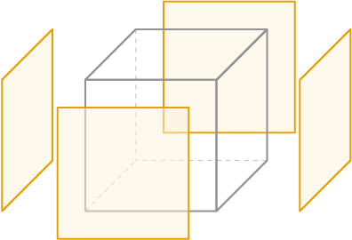

# Surface Areas of Cubes

Source: https://www.mathacademy.com/topics/681?courseId=111
Topic ID: 681

## Prerequisites

- [Areas of Rectangles and Squares](../../../middle-school/lessons/grade-7/1352-areas-of-rectangles-and-squares.md)
- [The Product Rule for Radicals](../../../middle-school/lessons/grade-8/1927-the-product-rule-for-radicals.md)
- [Finding Surface Areas Using Nets](./2469-finding-surface-areas-using-nets.md)

## Lesson

### Introduction

Suppose we want to find the surface area of a cube whose edges are $3\,\textrm{cm}$ in length, like the one shown below.

The surface area of the cube is the area of all the faces combined. In general, for a cube with sides of length $s,$ there are $6$ sides, each with area $\mathcal A = s^2.$ So, the surface area is given by

$$

S = 6\mathcal A =6 s^2.

$$

To find the surface area of the cube above, we substitute $s=3 \: \textrm{cm}$ into the formula. This gives

$$

S = 6(3\, \text{cm})^2 = 54 \,\textrm{cm}^2.

$$

Therefore, the surface area of the cube is $54\,\textrm{cm}^2.$

### Example: Finding the Surface Area of a Cube Given a Side Length

#### Question

Determine the surface area for the cube above.

#### Explanation

The surface area $S$ of a cube can be found using the formula

$$

S = 6s^2,

$$

where $s$ is the side length of the cube.

Substituting $s = 7\,\textrm{m}$ into the formula, we get

$$

S = 6(7\, \text{m})^2 = 294\,\textrm{m}^2 .

$$

### Example: Finding the Side Length of a Cube Given the Surface Area

#### Question

The surface area of a cube is $240$ square units. Find the length of the edges of the cube.

#### Explanation

The surface area $S$ of a cube is made of $6$ congruent squares. So, the area $\mathcal A$ of one face is

$$

\mathcal{A} = \dfrac{S}{6} = \frac{240}{6} = 40\,.

$$

Since $\mathcal A = s^2,$ where $s$ is the length of an edge, we can find $s$ as follows:

$$

s = \sqrt{\mathcal{A}} = \sqrt{40} = 2\sqrt{10}

$$

Therefore, the length of the edges is $2\sqrt{10}$ units.

### Lateral Surface Areas of Cubes

The **lateral surface area** of a cube is the surface area of the side faces alone. In other words, it's the surface area that does not include the area of the top or bottom faces.

The lateral surface area $S_L$ of a cube can be found using the formula

$$

S_L = 4s^2,

$$

where $s$ is the length of a side.

### Example: Calculating the Lateral Surface Area of a Cube Given its Dimensions

#### Question

Determine the lateral surface area for the cube above.

#### Explanation

The lateral surface area $S_L$ of a cube can be found using the formula

$$

S_L = 4s^2,

$$

where $s$ is the side length of the cube.

Substituting $s = 9\,\textrm{cm}$ into the formula, we get

$$

S_L = 4(9\, \text{cm})^2 = 324 \,\textrm{cm}^2.

$$
