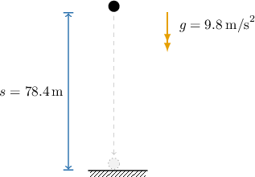
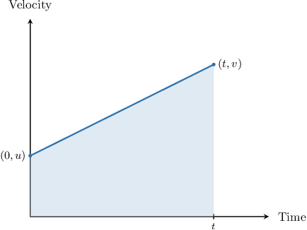

# Modeling Downwards Vertical Motion

Source: https://www.mathacademy.com/topics/688?courseId=111
Topic ID: 688

## Prerequisites

- [Roots of Quadratic Functions](./661-roots-of-quadratic-functions.md)
- [Converting Between Mixed Units](../../../high-school/traditional/lessons/algebra-i/2233-converting-between-mixed-units.md)
- [Speed-Time Graphs](../../../high-school/traditional/lessons/algebra-i/2327-speed-time-graphs.md)

## Lesson

### Introduction

Imagine a ball is dropped from a $78.4\,\text{m}$ rooftop. How do we determine how long it will take for the ball to hit the ground?

We can show that the distance traveled by a falling object can be modeled using the quadratic function

$$

s=ut + \dfrac{1}{2}gt^2.

$$

This equation looks tricky, so let's go through each variable:

- $s$ is the **displacement** of the object, measured in meters. For our purposes, the displacement measures the object's distance from the starting point.

- $u$ is the **initial velocity** of the object, measured in meters per second.

- $t$ is time, measured in seconds.

- $g=9.8\,\text{m/s}^2$ is a constant known as the **acceleration due to gravity.** It tells us the acceleration of a falling object close to the earth's surface.

In our example, we want to find the time it takes for a ball to fall a distance of

$$

s =78.4\,\text{m}.

$$

Since the ball was *dropped*, its initial velocity was zero. Therefore, we have

$$

u = 0 \,\text{m/s}.

$$

Substituting the known values into our equation for $s$ and solving for $t,$ we get the following:

$$

\begin{aligned}78.4 & =(0)𝑡+\frac{1}{2}(9.8)𝑡^{2} \\ 78.4 & =4.9𝑡^{2} \\ 𝑡^{2} & =\frac{78.4}{4.9} \\ 𝑡^{2} & =16 \\ 𝑡 & =±4\end{aligned}

$$

So, we have two solutions, $t=4$ and $t=-4$ seconds. However, we are only interested in the positive solution because the ball hits the ground after some positive duration of time has passed.

Therefore, the ball will hit the ground after $t=4$ seconds.

### Example: Solving for Displacement

#### Question

A penny is projected vertically downward with an initial velocity of $300 \, \text{m/min}$ and hits the ground after $2$ seconds. Find the distance the penny covered during its fall.

#### Explanation

To solve this problem, we use the formula

$$

s=ut+\dfrac{1}{2}gt^2,

$$

where $s$ is the displacement, measured from the starting position in the direction of the initial motion, $u$ is the initial velocity, $t$ is the time since the beginning of the motion, and $g$ is the acceleration due to gravity.

Let's summarize the information we have:

- We can find the initial velocity of the object in meters per second as follows:

- The penny falls for $t=2\,\text{s}.$

- The acceleration due to gravity is $g=9.8\,\text{m/s}^2.$

Substituting these values into the formula, we obtain the following:

$$

\begin{aligned}𝑠 & =𝑢𝑡+\frac{1}{2}𝑔𝑡^{2} \\ & =(5)(2)+\frac{1}{2}(9.8)(2)^{2} \\ & =10+19.6 \\ & =29.6\end{aligned}

$$

Therefore, the distance is $29.6\,\text{m}.$

### Example: Solving for Initial Velocity

#### Question

A ball is projected vertically down from a building with a height of $110.4 \, \text{m}.$ It takes $4\,\text{s}$ to hit the ground. What was the initial velocity of the ball?

#### Explanation

To solve this problem, we use the formula

$$

s=ut+\dfrac{1}{2}gt^2,

$$

where $s$ is the displacement, measured from the starting position in the direction of the initial motion, $u$ is the initial velocity, $t$ is the time since the beginning of the motion, and $g$ is the acceleration due to gravity.

Let's summarize the information we have:

- The ball falls for $t=4\,\text{s}.$

- The ball covers the distance of $s=110.4\, \text{m}.$

- The acceleration due to gravity is $g=9.8\,\text{m/s}^2.$

Substituting these values into the formula and solving for $u,$ we obtain the following:

$$

\begin{aligned}𝑠 & =𝑢𝑡+\frac{1}{2}𝑔𝑡^{2} \\ (110.4) & =𝑢(4)+\frac{1}{2}(9.8)(4)^{2} \\ 110.4 & =4𝑢+78.4 \\ 32 & =4𝑢 \\ 𝑢 & =8\end{aligned}

$$

Therefore, the initial velocity of the ball was $u= 8 \, \text{m/s}.$

### Example: Solving for Time

#### Question

A stone is projected vertically downward from a height of $19.6\,\text{m}$ with a velocity of $14.7\,\text{m/s}.$ How long will it take for the stone to hit the ground?

#### Explanation

To solve this problem, we use the formula

$$

s=ut+\dfrac{1}{2}gt^2,

$$

where $s$ is the displacement, measured from the starting position in the direction of the initial motion, $u$ is the initial velocity, $t$ is the time since the beginning of the motion, and $g$ is the acceleration due to gravity.

Let's summarize the information we have:

- The initial velocity of the stone is $u=14.7\,\text{m/s}.$

- The stone covers the distance of $s=19.6\,\text{m}.$

- The acceleration due to gravity is $g=9.8\,\text{m/s}^2.$

Substituting these values into the formula and solving for $t,$ we obtain the following:

$$

\begin{aligned}19.6 & =(14.7)𝑡+\frac{1}{2}(9.8)𝑡^{2} \\ 4(4.9) & =3(4.9)𝑡+(4.9)𝑡^{2} \\ 4(4.9) & =3(4.9)𝑡+(4.9)𝑡^{2} \\ 4 & =3𝑡+𝑡^{2} \\ 𝑡^{2}+3𝑡−4 & =0 \\ (𝑡+4)(𝑡−1) & =0 \\ 𝑡 & =−4,\,1\end{aligned}

$$

We disregard the negative solution. Therefore, the stone hits the ground after $t=1$ second.

### Deriving the Formula

Let's show that the distance traveled by an object with constant acceleration can be modeled using the quadratic function

$$

s = ut + \dfrac{1}{2}at^2,

$$

where $u$ is the object's initial velocity, $t$ is time, and $a$ is the acceleration.

Plotting this situation on a velocity-time diagram, we obtain the following:

Notice that:

- Our object has initial velocity $u.$ This corresponds to the point $(0,u)$ on the diagram.

- At time $t$ our object has velocity $v.$ This corresponds to the point $(t,v)$ on the diagram.

- The acceleration $a$ corresponds to the slope of the line connecting $(0,u)$ and $(t,v).$

Calculating the slope of the line, we have

$$

a = \dfrac{v - u}{t}

$$

which can be written as

$$

v = u + at.

$$

Next, recall that the distance $s$ covered by the object corresponds to the area below the line. Since the area under the graph is a trapezoid, the distance $s$ given by

$$

\begin{aligned}𝑠 & =\frac{(base_{1}+base_{2})}{2}⋅height \\ & =\frac{(𝑢+𝑣)}{2}⋅𝑡 \\ & =\frac{𝑢+(𝑢+𝑎𝑡)}{2}⋅𝑡 \\ & =\frac{(2𝑢+𝑎𝑡)𝑡}{2} \\ & =𝑢𝑡+\frac{1}{2}𝑎𝑡^{2}.\end{aligned}

$$

When dealing with a motion under gravity it's common to let $a=g=9.8\,\text{m/s}^2,$ the acceleration due to gravity.

### Modeling Assumptions

In this topic, we made the following assumptions:

- All objects are treated like a **particle**, a small point with no length, width, or height.

- All objects move vertically down in a straight line, so acceleration due to gravity is taken as positive.

- The only acceleration the objects have is due to gravity, and any other forces (such as wind resistance) are negligible.
