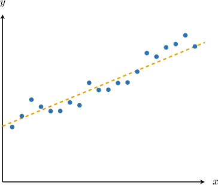
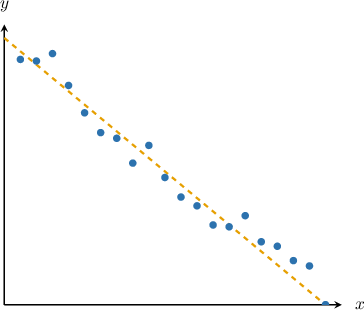
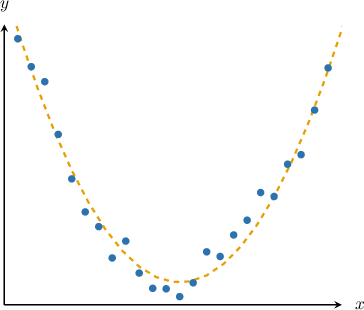
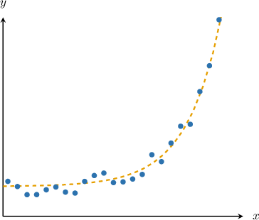
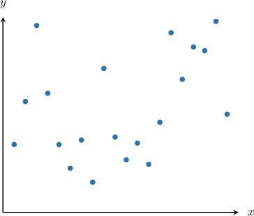
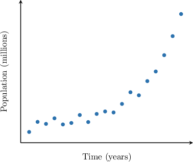
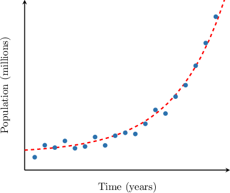
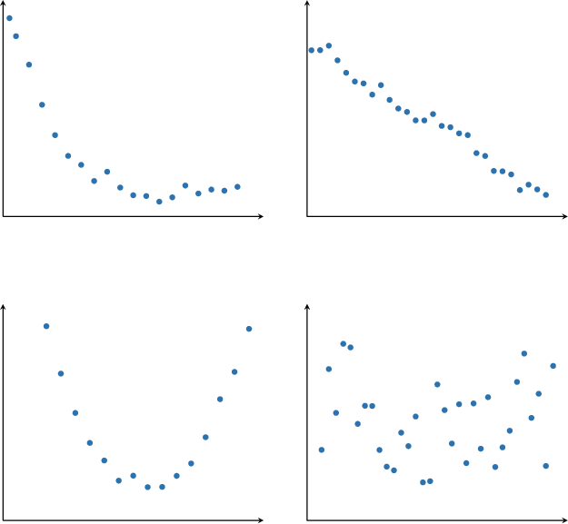
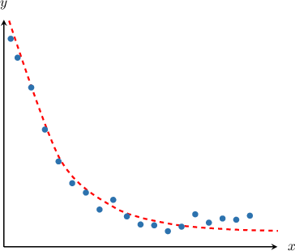

# Selecting a Regression Model

Source: https://www.mathacademy.com/topics/736?courseId=111
Topic ID: 736

## Prerequisites

- [Graphing Elementary Quadratic Functions](./453-graphing-elementary-quadratic-functions.md)
- [Linear Correlation](./734-linear-correlation.md)
- [Graphing Exponential Growth Functions](../../../high-school/traditional/lessons/algebra-i/1530-graphing-exponential-growth-functions.md)
- [Graphing Exponential Decay Functions](../../../high-school/traditional/lessons/algebra-i/1531-graphing-exponential-decay-functions.md)

## Lesson

### Introduction

A common problem in statistics is recognizing whether data follows a trend. Thankfully, we can often identify trends in data simply by looking at a scatter plot. We list a few common examples below:

- **Positive linear correlation**: The points seem to follow a straight line with a positive slope.

- **Negative linear correlation**: The points seem to follow a straight line with a negative slope.

- **Quadratic correlation**: The points on the plot are scattered along a parabola.

- **Exponential correlation**: The points on the plot are scattered along an exponential curve.

- **No correlation**: The points seem to be scattered randomly.

The process of fitting data to a linear, quadratic, exponential, or another type of curve is called **regression**.

### Example: Identifying an Appropriate Regression Model

#### Question

A country keeps a record of its population growth. The scatter plot above shows the correspondence between the population (in millions) and the time (in years) since records began. Which of the following is the most appropriate regression model for this data?

1. Linear

2. Quadratic

3. Exponential

#### Explanation

As values of $x$ increase, the corresponding values of $y$ increase rapidly. It seems like the points on the plot are scattered along an exponential curve, as shown below.

Therefore, the most appropriate regression model is **

### Example: Identifying a Diagram Corresponding to a Model

#### Question

Which of the following scatter plots shows a possible exponential dependence between the variables?

#### Explanation

In the case of exponential dependence, the points on the plot should be scattered along a curve whose $y$-values increase or decrease rapidly.

Among the given options, the only scatter plot that fits the description is the following:

