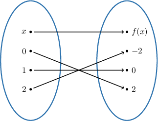
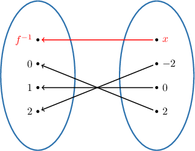
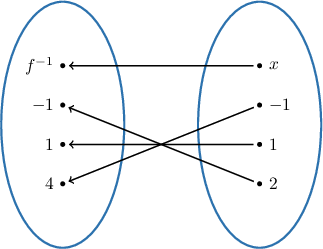
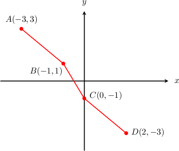
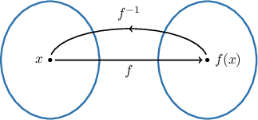

# Introduction to Inverse Functions

Source: https://www.mathacademy.com/topics/753?courseId=111
Topic ID: 753

## Prerequisites

- [Describing Function Composition](./3817-describing-function-composition.md)

## Lesson

### Introduction

Consider the mapping diagram of the function $f(x),$ shown below.

Let's now reverse the arrows, as follows:

Now, we have a mapping diagram that "reverses" the action of the function $f.$ The diagram itself represents a new function, which we call the **inverse of the function $f,$** and denote by $f^{-1}.$

We can evaluate the inverse function $f^{-1}$ at any point in the range of $f.$ For example, to find the value of $f^{-1}(2),$ we notice that we have an arrow from ${\color{black}2}$ (on the right) to ${\color{black}0}$ (on the left). Therefore,

$$

f^{-1}({\color{black}2}) = {\color{black}0}.

$$

In the original function, $f,$ that same arrow went from ${\color{black}0}$ (on the left) to ${\color{black}2}$ (on the right). So, we have that $f({\color{black}0})={\color{black}2},$ and as a result, we obtain

$$

f^{-1}(f(0)) = 0.

$$

So, applying the function $f$ and then "reversing" the action using $f^{-1}$ will get us back to $0.$

In general, this is true for every $x$ in the domain of the function $f\mathbin{:}$

$$

f^{-1}(f(x)) = x

$$

### Example: Evaluating an Inverse Function From a Mapping Diagram

#### Question

The function $f(x)$ is represented by the mapping diagram above. What is $f^{-1}(-1)?$

#### Explanation

****

The function $f^{-1}(x)$ reverses the action of $f(x),$ as depicted below.

From the above, we see that $f^{-1}(-1) = 4.$

****

From the given mapping diagram, we have

$$

f(4) = -1.

$$

Applying $f^{-1}$ to both sides of the above equation, and using the fact that $f^{-1}\left(f(x)\right) = x,$ we get

$$

\begin{aligned}𝑓^{−1}(𝑓(4)) & =𝑓^{−1}(−1) \\ 4 & =𝑓^{−1}(−1).\end{aligned}

$$

Therefore, we conclude that $f^{-1}(-1) = 4.$

### Example: Evaluating an Inverse Function Given Function Data

#### Question

Given the function $f(x)$ defined by the table above, what is the value of $f^{-1}(3)?$

#### Explanation

From the table, we have

$$

f(-4) = 3.

$$

Applying $f^{-1}$ to both sides of the above equation, and using the fact that $f^{-1}\left(f(x)\right) = x,$ we get

$$

\begin{aligned}𝑓^{−1}(𝑓(−4)) & =𝑓^{−1}(3) \\ −4 & =𝑓^{−1}(3).\end{aligned}

$$

Therefore, we conclude that $f^{-1}(3) = -4.$

### Example: Evaluating an Inverse Function Using a Graph

#### Question

The graph of $y = f(x)$ is given above. The points $A,B,C,$ and $D$ lie on the graph, as shown. What is the value of $f^{-1}(-3)?$

#### Explanation

The point $D$ on the graph has coordinates $(2,-3).$ Therefore,

$$

f(2) = -3.

$$

Applying $f^{-1}$ to both sides of the above equation, and using the fact that $f^{-1}\left(f(x)\right) = x,$ we get

$$

\begin{aligned}𝑓^{−1}(𝑓(2)) & =𝑓^{−1}(−3) \\ 2 & =𝑓^{−1}(−3).\end{aligned}

$$

Therefore, we conclude that $f^{-1}(-3) = 2.$

### The Definition of the Inverse Function

Recall that the "reverses" the action of so that which can be visualized using the mapping diagram, as shown below.

Since is just the composition we can now give the algebraic definition of the inverse.

The function is called the **inverse of the function** if for each in the domain of

In other words, to show that two functions and are inverses of each other, we need to check the following condition:

### Example: Computing an Inverse Function Using the Definition

#### Question

Suppose that $f(x)=\dfrac{x}{4}-2$ and $g(x)=4x-2k.$ If $g$ is the inverse of $f,$ then what is the value of $k$?

#### Explanation

If $g$ is the inverse of $f,$ then we must have

$$

g(f(x)) = x.

$$

To find $g(f(x)),$ we write down the function $g$ and replace every occurrence of $x$ with $f(x)\mathbin{:}$

$$

\begin{aligned}𝑔(𝑥) & =4𝑥−2𝑘 \\ 𝑔(𝑓(𝑥)) & =4𝑓(𝑥)−2𝑘\end{aligned}

$$

Then, we substitute ${\color{blue}f(x)} = {\color{blue}\dfrac{x}{4}-2}$ into the right-hand side of our expression and simplify, as follows:

$$

\begin{aligned}𝑔(𝑓(𝑥)) & =4𝑓(𝑥)−2𝑘 \\ & =4(\frac{𝑥}{4}−2)−2𝑘 \\ & =𝑥−8−2𝑘\end{aligned}

$$

Because $g$ is the inverse of $f,$ we also know that $g(f(x)) = x.$ Equating the above expression with $x$ and solving for $k,$ we get

$$

\begin{aligned}𝑥−8−2𝑘 & =𝑥 \\ 𝑥−8−2𝑘 & =𝑥 \\ −8−2𝑘 & =0 \\ 2𝑘 & =−8 \\ 𝑘 & =−4.\end{aligned}

$$
