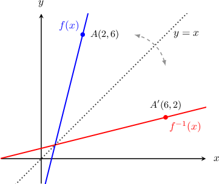
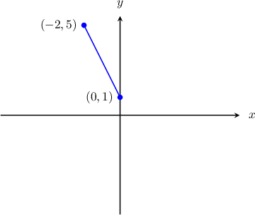
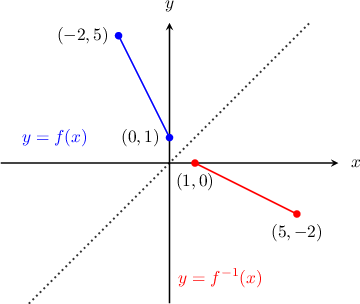

# Graphs of Inverse Functions

Source: https://www.mathacademy.com/topics/756?courseId=111
Topic ID: 756

## Prerequisites

- [Introduction to Inverse Functions](./753-introduction-to-inverse-functions.md)
- [The Range of a Function](../../../high-school/traditional/lessons/algebra-i/754-the-range-of-a-function.md)

## Lesson

### Introduction

Consider the function

$$

{\color{black}f(x)} = 4x-2,

$$

defined over the entire real line, and its inverse function

$$

{\color{black}f^{-1}(x)} = \dfrac{1}{4}(x+2).

$$

If we plot both ${\color{blue}y=f(x)}$ and ${\color{red}y=f^{-1}(x)}$ on the same diagram, we can see that the graph of ${\color{red}y=f^{-1}(x)}$ is a **reflection** of ${\color{blue}y=f(x)}$ in the line $y=x.$

Each point $(a,b)$ on the graph of ${\color{blue}y=f(x)}$ has a corresponding point $(b,a)$ on the graph of the inverse function ${\color{red}y=f^{-1}(x)}.$ That is to say, the $x$ and $y$ coordinates swap.

For example, notice that the point $A(2,6)$ on ${\color{blue}y=f(x)}$ has the corresponding point $A'(6,2)$ on ${\color{red}y=f^{-1}(x)}.$

### Example: Identifying Points That Lie on the Graph on an Inverse Function

#### Question

Given that the function $f(x)$ has an inverse $f^{-1}(x),$ and the point $(2,9)$ lies on the graph $y=f(x),$ which point must lie on the graph of $y=f^{-1}(x)?$

#### Explanation

The function $y = f^{-1}(x)$ is a reflection of $y = f(x)$ in the line $y=x.$ Therefore, each point $(a,b)$ on $y = f(x)$ has a corresponding point $(b,a)$ on $y = f^{-1}(x).$ In other words, the $x$ and $y$ coordinates swap.

Since the point $(2,9)$ lies on $y = f(x),$ the point $(9,2)$ lies on $y = f^{-1}(x).$

### Example: Identifying the Graph of an Inverse Function

#### Question

The graph of $y=f(x)$ is shown below. Sketch the graph of $y = f^{-1}(x).$

#### Explanation

Remember that each point $(a,b)$ on $y = f(x)$ has a corresponding point $(b,a)$ on $y = f^{-1}(x).$ In other words, the points on $y=f(x)$ have corresponding points on $y=f^{-1}(x)$ with the coordinates swapped:

$$

\begin{aligned}(0,1) & ⟶(1,0) \\ (−2,5) & ⟶(5,−2)\end{aligned}

$$

To graph $y=f^{-1}(x),$ we plot the two points $(1,0)$ and $(5,-2)$ and connect the segment. We see that, as expected, the function $y = f^{-1}(x)$ is a reflection of $y = f(x)$ in the line $y=x.$

