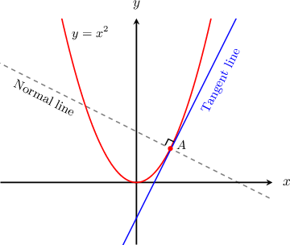

# Calculating the Equation of a Normal Line Using Differentiation

Source: https://www.mathacademy.com/topics/987?courseId=111
Topic ID: 987

## Prerequisites

- [Calculating the Equation of a Tangent Line Using Differentiation](./986-calculating-the-equation-of-a-tangent-line-using-differentiation.md)
- [Finding Equations of Perpendicular Lines](./3562-finding-equations-of-perpendicular-lines.md)
- [Finding Intersections of Lines and Quadratic Functions](./6341-finding-intersections-of-lines-and-quadratic-functions.md)

## Lesson

### Introduction

The equation of the normal line to the curve $y = f(x)$ at the point $P(x_1,y_1),$ in point-slope form, is given by

$$

y - y_1 = m (x - x_1), \hspace{1cm} m=-\dfrac{1}{f'(x_1)}.

$$

Here, $m=-\dfrac{1}{f'(x_1)}$ because the slope of the normal line is the negative reciprocal of the slope of the tangent line, and $f'(x_1)$ represents the slope of the tangent line to $y=f(x)$ at the point $(x_1,y_1).$

For example, suppose we want to compute the equation of the normal line to the curve $y=x^2$ at the point $A(1,1).$ This normal line is the dashed line shown below, which is perpendicular to the solid tangent line.

Since $y=x^2,$ we have $f(x)=x^2.$ We begin by calculating the derivative of $f(x)\mathbin{:}$

$$

f'(x) = \dfrac {\textrm{d}}{\textrm{d}x}(x^2)= 2x

$$

At $A(1,1),$ the slope of the tangent line is given by

$$

f'(1) = 2(1) = 2.

$$

However, we want the normal line, and the slope of the normal line is the negative reciprocal of the slope of the tangent line:

$$

m = -\dfrac{1}{f'(1)} = -\dfrac{1}{2}

$$

Finally, we work out the equation of the normal line using the point-slope form:

$$

\begin{aligned}𝑦−1 & =−\frac{1}{2}(𝑥−1) \\ 𝑦 & =−\frac{𝑥}{2}+\frac{1}{2}+1 \\ 𝑦 & =−\frac{𝑥}{2}+\frac{3}{2}.\end{aligned}

$$

Therefore, the equation of the normal line is $y=-\dfrac x 2 + \dfrac 3 2.$ We could also write this in standard form as $x+2y=3.$

### Example: Calculating the Slope of a Normal Line to a Curve at a Point

#### Question

Find the slope of the normal line to the curve $y = 2x^3 -x^2$ at the point $(1,1).$

#### Explanation

Let $f(x) = 2x^3-x^2.$ First, we compute the derivative:

$$

f'(x) =6x^2 -2x

$$

Then, we compute the slope of the tangent at the point $(1,1)\mathbin{:}$

$$

m=f'(1) = 6(1)^2 - 2(1) = 4

$$

Therefore, the slope of the normal line $m'$ is

$$

m' = -\dfrac{1}{m} = -\dfrac 1 4.

$$

### Example: Determining the Equation of a Normal Line to a Curve at a Point

#### Question

The equation of the normal line to the curve $y=x^3 - x^2$ at the point $(1,0)$ is given by $y=px+q$ where $p$ and $q$ are constants. Find the values of $p$ and $q.$

#### Explanation

Let $f(x)=x^3 - x^2.$ First, we compute the derivative:

$$

\begin{aligned}𝑓^{′}(𝑥)=\frac{d}{d𝑥}(𝑥^{3}−𝑥^{2})=3𝑥^{2}−2𝑥\end{aligned}

$$

Then, we compute the slope of the tangent at the point $(1, 0){:}$

$$

\begin{aligned}𝑚=𝑓^{′}(1)=3−2=1\end{aligned}

$$

Therefore, the slope of the normal line $m'$ is

$$

m'=-\dfrac{1}{m}=-1.

$$

Finally, the equation of the normal line is

$$

\begin{aligned}𝑦−0 & =−(𝑥−1) \\ 𝑦 & =−𝑥+1.\end{aligned}

$$

Therefore, $p=-1$ and $q=1.$

### Example: Determining the Intercepts of a Normal Line

#### Question

Find where the normal line to the curve $f(x) = 2\sqrt{x} -4x$ at the point $(1,-2)$ intersects the $x$-axis.

#### Explanation

Taking the derivative, we have

$$

\begin{aligned}𝑓^{′}(𝑥) & =\frac{d}{d𝑥}(2\sqrt{√𝑥}−4𝑥) \\ & =\frac{d}{d𝑥}(2𝑥^{1/2}−4𝑥) \\ & =𝑥^{−1/2}−4.\end{aligned}

$$

So the slope of the tangent line is

$$

m=f'(1) = (1)^{-1/2} - 4 = -3,

$$

and therefore the slope of the normal line is

$$

m' = -\dfrac{1}{m} = \dfrac 1 3.

$$

The equation of the normal line is

$$

\begin{aligned}𝑦−(−2) & =\frac{1}{3}(𝑥−1) \\ 𝑦+2 & =\frac{1}{3}(𝑥−1) \\ 𝑦 & =\frac{1}{3}𝑥−\frac{1}{3}−2 \\ 𝑦 & =\frac{1}{3}𝑥−\frac{7}{3}.\end{aligned}

$$

Lastly, we find the point of intersection with the $x$-axis by setting $y=0$ and solving the resulting equation. We get

$$

\begin{aligned}\frac{1}{3}𝑥−\frac{7}{3} & =0 \\ \frac{1}{3}𝑥 & =\frac{7}{3} \\ 𝑥 & =7.\end{aligned}

$$

Therefore, the normal line intersects the $x$-axis at $(7,0).$
