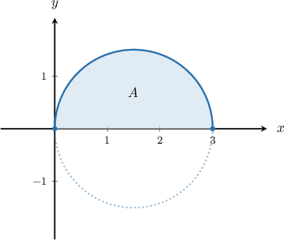
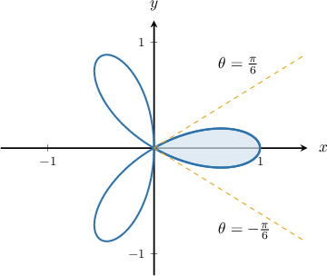
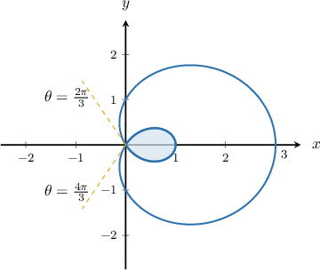
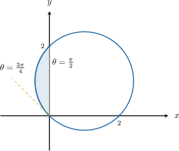
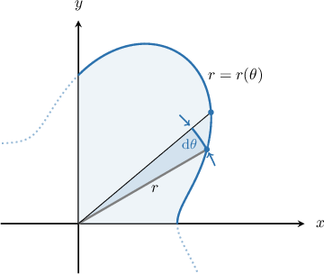

# Finding the Area of a Polar Region

Source: https://www.mathacademy.com/topics/1000?courseId=136
Topic ID: 1000

## Prerequisites

- [Integration Using the Double-Angle Formulas](./1038-integration-using-the-double-angle-formulas.md)
- [Polar Equations of Radial Lines](./2173-polar-equations-of-radial-lines.md)

## Lesson

### Introduction

Suppose we want to find the area of the region bounded by the polar curve $r = 3\cos\theta$ and the rays $\theta_1 = 0$ and $\theta_2 = \dfrac{\pi}{2},$ as shown in blue in the picture below. Can we calculate this area using polar coordinates?

In general, the area of the region bounded by a polar curve $r=r(\theta)$ and the rays $\theta=\theta_1$ and $\theta=\theta_2$ is given by the formula

$$

A = \dfrac{1}{2} \int_{\theta_1}^{\theta_2} r^2 \:\textrm{d}\theta.

$$

Therefore, the area of the half-circle above can be obtained as follows:

$$

\begin{aligned}𝐴 & =\frac{1}{2}∫_{𝜋/20}^{}(3cos⁡𝜃)^{2}\,d𝜃 \\ & =\frac{9}{2}∫_{𝜋/20}^{}cos^{2}⁡𝜃\,d𝜃 \\ & =\frac{9}{2}∫_{𝜋/20}^{}\frac{1}{2}(1+cos⁡(2𝜃))\,d𝜃 \\ & =\frac{9}{4}(𝜃_{𝜋/20}^{}+\frac{1}{2}sin⁡(2𝜃)_{𝜋/20}^{}) \\ & =\frac{9}{4}(\frac{𝜋}{2}+0) \\ & =\frac{9𝜋}{8}\end{aligned}

$$

### Example: Finding the Area Bounded by a Petal of a Polar Rose

#### Question

Find the area bounded by the polar curve $r = \cos(3\theta)$ and the lines $\theta = -\dfrac{\pi}{6}$ and $\theta = \dfrac{\pi}{6}.$

#### Explanation

The area bounded by a polar curve is given by

$$

A = \dfrac{1}{2} \int_{\theta_1}^{\theta_2} r^2(\theta) \, \textrm{d}\theta \,.

$$

When $r(\theta) = \cos(3\theta),$ $\theta_1=-\dfrac{\pi}{6},$ and $\theta_2=\dfrac{\pi}{6},$ this gives

$$

\begin{aligned}𝐴 & =\frac{1}{2}∫_{𝜃_{2}𝜃_{1}}^{}𝑟^{2}\,d𝜃 \\ & =\frac{1}{2}∫_{𝜋/6−𝜋/6}^{}cos^{2}⁡(3𝜃)\,d𝜃 \\ & =\frac{1}{4}∫_{𝜋/6−𝜋/6}^{}(1+cos⁡(6𝜃))\,d𝜃 \\ & =\frac{1}{4}(𝜃_{𝜋/6−𝜋/6}^{}+\frac{1}{6}sin⁡(6𝜃)_{𝜋/6−𝜋/6}^{}) \\ & =\frac{1}{4}((\frac{𝜋}{6}−(−\frac{𝜋}{6}))+\frac{1}{6}(sin⁡𝜋−sin⁡(−𝜋))) \\ & =\frac{1}{4}(\frac{𝜋}{3}+0) \\ & =\frac{𝜋}{12}.\end{aligned}

$$

### Example: Finding the Area Bounded by the Loop of a Limaçon

#### Question

Find the area bounded by the polar curve $r = 1+2\cos\theta$ for $\dfrac{2\pi}{3} \leq \theta \leq \dfrac{4\pi}{3},$ as shown below.

#### Explanation

The area bounded by a polar curve is given by

$$

A = \dfrac{1}{2} \int_{\theta_1}^{\theta_2} r^2(\theta) \, \textrm{d}\theta \,.

$$

When $r(\theta) = 1+2\cos(\theta),$ $\theta_1=\dfrac{2\pi}{3},$ and $\theta_2=\dfrac{4\pi}{3},$ this gives

$$

\begin{aligned}𝐴 & =\frac{1}{2}∫_{𝜃_{2}𝜃_{1}}^{}𝑟^{2}\,d𝜃 \\ & =\frac{1}{2}∫_{4𝜋/32𝜋/3}^{}(1+2cos⁡(𝜃))^{2}\,d𝜃 \\ & =\frac{1}{2}∫_{4𝜋/32𝜋/3}^{}(1+4cos⁡𝜃+4cos^{2}⁡𝜃)\,d𝜃 \\ & =\frac{1}{2}(𝜃\,_{4𝜋/32𝜋/3}^{}+4sin⁡𝜃\,_{4𝜋/32𝜋/3}^{}+4⋅\frac{1}{2}∫_{4𝜋/32𝜋/3}^{}(1+cos⁡(2𝜃))\,d𝜃) \\ & =\frac{1}{2}(𝜃\,_{4𝜋/32𝜋/3}^{}+4sin⁡𝜃\,_{4𝜋/32𝜋/3}^{}+2𝜃\,_{4𝜋/32𝜋/3}^{}+sin⁡(2𝜃)\,_{4𝜋/32𝜋/3}^{}) \\ & =\frac{1}{2}(3𝜃\,_{4𝜋/32𝜋/3}^{}+4sin⁡𝜃\,_{4𝜋/32𝜋/3}^{}+sin⁡(2𝜃)\,_{4𝜋/32𝜋/3}^{}) \\ & =\frac{1}{2}(2𝜋−4\sqrt{√3}+\sqrt{√3}) \\ & =\frac{1}{2}(2𝜋−3\sqrt{√3}).\end{aligned}

$$

### Example: Finding Areas Bounded by Other Polar Curves

#### Question

Find the area bounded by the polar curve $r = 2\sin\theta + 2\cos\theta$ for $\dfrac{\pi}{2} \leq \theta \leq \dfrac{3\pi}{4},$ as shown above.

#### Explanation

The area bounded by a polar curve is given by

$$

A = \dfrac{1}{2} \int_{\theta_1}^{\theta_2} r^2(\theta) \, \textrm{d}\theta \,.

$$

When $r(\theta) = 2\sin\theta + 2\cos\theta,$ $\theta_1=\dfrac{\pi}{2},$ and $\theta_2=\dfrac{3\pi}{4},$ this gives

$$

\begin{aligned}𝐴 & =\frac{1}{2}∫_{𝜃_{2}𝜃_{1}}^{}𝑟^{2}\,d𝜃 \\ & =\frac{1}{2}∫_{3𝜋/4𝜋/2}^{}(2sin⁡𝜃+2cos⁡𝜃)^{2}\,d𝜃 \\ & =\frac{1}{2}∫_{3𝜋/4𝜋/2}^{}(4sin^{2}⁡𝜃+8sin⁡𝜃cos⁡𝜃+4cos^{2}⁡𝜃)\,d𝜃 \\ & =\frac{1}{2}∫_{3𝜋/4𝜋/2}^{}(4+8sin⁡𝜃cos⁡𝜃)\,d𝜃 \\ & =\frac{4}{2}∫_{3𝜋/4𝜋/2}^{}(1+sin⁡(2𝜃))\,d𝜃 \\ & =2(𝜃\,_{3𝜋/4𝜋/2}^{}−\frac{cos⁡(2𝜃)}{2}\,_{3𝜋/4𝜋/2}^{}) \\ & =2𝜃\,_{3𝜋/4𝜋/2}^{}−cos⁡(2𝜃)\,_{3𝜋/4𝜋/2}^{} \\ & =2(\frac{3𝜋}{4}−\frac{𝜋}{2})−(cos⁡(\frac{3𝜋}{2})−cos⁡(𝜋)) \\ & =\frac{𝜋}{2}−1 \\ & =\frac{𝜋−2}{2}.\end{aligned}

$$

### Intuition Behind the Formula

We've been using the following formula for the area of the region bounded by a polar curve $r=r(\theta)$ and the rays $\theta=\theta_1$ and $\theta=\theta_2{:}$

$$

A = \dfrac{1}{2} \int_{\theta_1}^{\theta_2} r^2 \:\textrm{d}\theta

$$

But where does this formula come from?

To see where the formula comes from, we can think about breaking up the area bounded by a polar curve into infinitesimally small sectors of circles.

As shown in the graph below, each sector has a radius of $r$ and spans an infinitesimally small angle, $\textrm d \theta.$

The ratio of the area of a sector to the full area of the circle must be the same as the ratio of the angle of the sector to a full revolution of the circle. So, if the area of a sector is $\textrm dA,$ then we can set up and solve the following proportion:

$$

\dfrac{\textrm dA}{\pi r^2} = \dfrac{\textrm d\theta}{2\pi} \quad \Rightarrow \quad \textrm dA = \dfrac{1}{2} r^2 \textrm d\theta

$$

Finally, to find the area under the curve, we can integrate the areas of all the sectors:

$$

\begin{aligned}𝐴 & =∫_{𝜃_{2}𝜃_{1}}^{}\frac{1}{2}𝑟^{2}\,d𝜃 \\ & =\frac{1}{2}∫_{𝜃_{2}𝜃_{1}}^{}𝑟^{2}\,d𝜃\end{aligned}

$$
