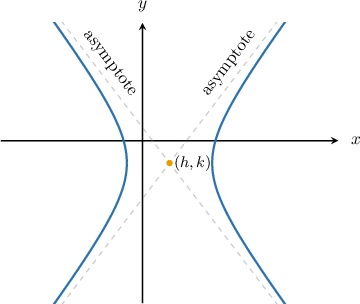
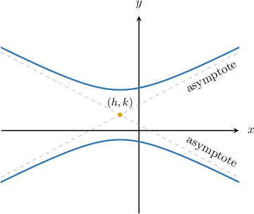

# Asymptotes of Hyperbolas Centered at a General Point

Source: https://www.mathacademy.com/topics/1029?courseId=136
Topic ID: 1029

## Prerequisites

- [Solving Equations Using the Square Root Method](../../../high-school/traditional/lessons/algebra-i/430-solving-equations-using-the-square-root-method.md)
- [Equations of Hyperbolas Centered at a General Point](./733-equations-of-hyperbolas-centered-at-a-general-point.md)
- [Asymptotes of Hyperbolas Centered at the Origin](./872-asymptotes-of-hyperbolas-centered-at-the-origin.md)

## Lesson

### Introduction

Recall that the equation of a horizontal hyperbola centered at $(h,k)$ is given by

$$

\dfrac{(x-h)^2}{a^2} - \dfrac{(y-k)^2}{b^2} = 1.

$$

The equations of the asymptotes of this horizontal hyperbola, as depicted in the diagram below, are

$$

y - k = \pm \dfrac b a (x - h).

$$

On the other hand, the equation of a vertical hyperbola centered at $(h,k)$ is given by

$$

\dfrac{(y-k)^2}{a^2} - \dfrac{(x-h)^2}{b^2} = 1.

$$

The equations of the asymptotes of this vertical hyperbola are

$$

y - k = \pm \dfrac a b (x - h).

$$

**Note:** To remember which formula to use for the asymptotes of a hyperbola, notice that the numerator of the fraction is always the constant associated with $y$ in the equation:

$$

y - k = \pm \dfrac{\text{constant associated with }y}{\text{constant associated with }x} (x - h)

$$

### Example: Finding the Asymptotes of a Horizontal Hyperbola Given in Standard Form

#### Question

Calculate the asymptotes of the hyperbola $\dfrac{(x+2)^2}{18} - \dfrac{(y+7)^2}{32} = 1.$

#### Explanation

The standard equation of a horizontal hyperbola centered at $(h,k)$ is

$$

\frac{(x-h)^2}{a^2} - \frac{(y-k)^2}{b^2}=1.

$$

For a horizontal hyperbola, the equations of the asymptotes are

$$

y-k=\pm \dfrac{b}{a}(x-h).

$$

In our case, we have

$$

(h,k) = (-2,-7),\qquad a=\sqrt{18} = 3\sqrt{2}, \qquad b=\sqrt{32} = 4\sqrt{2}.

$$

Therefore, the asymptotes are given by

$$

\begin{aligned}𝑦+7 & =±(\frac{4\sqrt{2}}{3\sqrt{2}})(𝑥+2) \\ 𝑦+7 & =±\frac{4}{3}(𝑥+2).\end{aligned}

$$

### Example: Finding the Asymptotes of a Vertical Hyperbola Given in Standard Form

#### Question

Calculate the asymptotes of the hyperbola $\dfrac{(y - 1) ^ 2} {16} - \dfrac{(x + 3)^2}{9} = 1$.

#### Explanation

The standard equation of a vertical hyperbola centered at $(h,k)$ is

$$

\dfrac{(y-k)^2}{a^2} - \dfrac{(x-h)^2}{b^2} = 1.

$$

For a vertical hyperbola, the equations of the asymptotes are

$$

y-k = \pm\dfrac{a}{b}(x-h).

$$

In our case, we have

$$

a = \sqrt{16} = 4, \qquad b = \sqrt{9} = 3, \qquad h = -3, \qquad k = 1.

$$

Therefore, the asymptotes are given by

$$

\begin{aligned}𝑦−1 & =±\frac{4}{3}(𝑥−(−3)) \\ 𝑦−1 & =±\frac{4}{3}(𝑥+3).\end{aligned}

$$

### Example: Finding the Asymptotes of a Horizontal Hyperbola by Completing the Square

#### Question

Calculate the asymptotes of the hyperbola $9x^2 - y^2 - 36 x - 2y + 26 = 0.$

#### Explanation

To rewrite the equation of the hyperbola in standard form, we need to group the $x$ and $y$ terms and complete the squares, as follows:

$$

\begin{aligned}9𝑥^{2}−𝑦^{2}−36𝑥−2𝑦+26 & =0 \\ 9𝑥^{2}−36𝑥−𝑦^{2}−2𝑦+26 & =0 \\ 9[𝑥^{2}−4𝑥]−[𝑦^{2}+2𝑦]+26 & =0 \\ 9[(𝑥−2)^{2}−4]−[(𝑦+1)^{2}−1]+26 & =0 \\ 9(𝑥−2)^{2}−36−(𝑦+1)^{2}+1+26 & =0 \\ 9(𝑥−2)^{2}−(𝑦+1)^{2} & =−26−1+36 \\ 9(𝑥−2)^{2}−(𝑦+1)^{2} & =9 \\ (𝑥−2)^{2}−\frac{(𝑦+1)^{2}}{9}=1 & \end{aligned}

$$

The asymptotes of the horizontal hyperbola

$$

\dfrac{(x-h)^2}{a^2} - \dfrac{(y-k)^2}{b^2} = 1

$$

are given by

$$

y-k = \pm\dfrac{b}{a}(x-h).

$$

In our case, we have

$$

h = 2, \qquad k = -1, \qquad a = \sqrt{1} = 1,\qquad b = \sqrt{9} = 3.

$$

Therefore, the asymptotes of the hyperbola are

$$

\begin{aligned}𝑦+1 & =±3(𝑥−2).\end{aligned}

$$

### Example: Finding the Asymptotes of a Vertical Hyperbola by Completing the Square

#### Question

Calculate the asymptotes of the hyperbola $y^2 - x^2 - 2y = 0.$

#### Explanation

To rewrite the equation of the hyperbola in standard form, we need to group the $x$ and $y$ terms and complete the squares, as follows:

$$

\begin{aligned}𝑦^{2}−𝑥^{2}−2𝑦 & =0 \\ (𝑦^{2}−2𝑦)−𝑥^{2} & =0 \\ (𝑦−1)^{2}−1−𝑥^{2} & =0 \\ (𝑦−1)^{2}−𝑥^{2} & =1\end{aligned}

$$

The asymptotes of the vertical hyperbola

$$

\dfrac{(y-k)^2}{a^2} - \dfrac{(x-h)^2}{b^2} = 1

$$

are given by

$$

y-k=\pm \dfrac{a}{b}(x-h) .

$$

In our case, we have

$$

(h,k) = (0,1), \qquad a = \sqrt{1} = 1, \qquad b= \sqrt{1} = 1.

$$

Therefore, the asymptotes of the hyperbola are

$$

\begin{aligned}𝑦−1 & =±𝑥.\end{aligned}

$$
