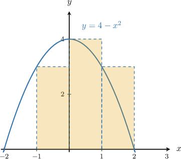

# Left and Right Riemann Sums in Sigma Notation

Source: https://www.mathacademy.com/topics/1042?courseId=136
Topic ID: 1042

## Prerequisites

- [Approximating Areas With the Left Riemann Sum](./477-approximating-areas-with-the-left-riemann-sum.md)
- [Approximating Areas With the Right Riemann Sum](./1281-approximating-areas-with-the-right-riemann-sum.md)
- [Describing Function Composition](../../../high-school/traditional/lessons/algebra-i/3817-describing-function-composition.md)
- [Properties of Finite Series](../../../high-school/integrated-math-honors/lessons/integrated-math-ii-honors/3958-properties-of-finite-series.md)

## Lesson

### Introduction

Remember that the formula for the left Riemann sum for $y=f(x)$ with a regular step size over the interval $[a,b]$ is

$$

({\color{red}{f(x_0)}} + {\color{red}{f(x_1)}} + \ldots + {\color{red}{f(x_{n-1})}}) \cdot {\color{blue}{\Delta x}},

$$

where $n$ is the number of rectangles, $x_0=a$ and $x_{n}=b$ are the endpoints of the interval, and the step size is $\Delta x = \dfrac{b-a}{n}.$

The formula above contains a lot of addition signs. We can simplify this by writing the sum in the **sigma notation**:

$$

\sum_{k=0}^{n-1} {\color{red}f(x_k)}\,{\color{blue}\Delta x},

$$

where $x_k = a+ k\Delta x$ for $k=0,1,2,\ldots,n-1.$

### Example: Expressing a Left Riemann Sum in Sigma Notation

#### Question

The area under the curve $y=4-x^2$ between $x=-1,$ $x=2,$ and the $x$-axis is approximated using a left Riemann sum, as shown below. What is the expression for the Riemann sum in sigma notation?

#### Explanation

The left Riemann sum for $y=f(x)$ with a regular step size in sigma notation is

$$

\sum_{k=0}^{n-1} f(x_k)\Delta x,

$$

where $x_k = a + k\Delta x$ with $\Delta x = \dfrac{b-a}{n}.$

From the diagram, we see that there are $n=3$ rectangles. The endpoints indicate that $a=-1$ and $b=2,$ so the step size is

$$

\Delta x = \dfrac{2-(-1)}{3} = \dfrac 3 3 = 1.

$$

Therefore, using sigma notation, the left Riemann sum can be expressed as

$$

\begin{aligned}\underset{\underset{𝑘=0}{∑}}{\overset{}{𝑛−1}}𝑓(𝑥_{𝑘})Δ𝑥 & =\underset{\underset{𝑘=0}{∑}}{\overset{}{𝑛−1}}𝑓(𝑎+𝑘Δ𝑥)Δ𝑥 \\ & =\underset{\underset{𝑘=0}{∑}}{\overset{}{3−1}}𝑓(−1+𝑘⋅1)⋅1 \\ & =\underset{\underset{𝑘=0}{∑}}{\overset{}{2}}𝑓(𝑘−1) \\ & =\underset{\underset{𝑘=0}{∑}}{\overset{}{2}}(4−(𝑘−1)^{2}) \\ & =\underset{\underset{𝑘=0}{∑}}{\overset{}{2}}(4−𝑘^{2}+2𝑘−1) \\ & =\underset{\underset{𝑘=0}{∑}}{\overset{}{2}}(3+2𝑘−𝑘^{2}).\end{aligned}

$$

### Right Riemann Sums in Sigma Notation

Recall that the formula for the right Riemann sum for $y=f(x)$ over the interval $[a,b]$ is

$$

({\color{red}f(x_1)} + {\color{red}f(x_2)} + \ldots + {\color{red}f(x_n)}) \cdot {\color{blue}\Delta x}.

$$

This right Riemann sum in sigma notation is

$$

\sum_{k=1}^{n} {\color{red}f(x_k)}{\color{blue}\Delta x},

$$

where $x_k=a+k\Delta x$ and $\Delta x = \dfrac{b-a}{n}.$

Notice that this is very similar to the left Riemann sum. The only differences are that the counter starts at $k=1$ instead of $k=0,$ and the counter ends at $k=n$ instead of $k=n-1.$

### Example: Expressing a Right Riemann Sum in Sigma Notation

#### Question

The area under the curve $y=\cos\left(\dfrac{x}{2}\right)$ between $x=0$ and $x=3$ and the $x$-axis is approximated by a right Riemann sum using $3$ subintervals of equal length. What is the expression for the Riemann sum in sigma notation?

#### Explanation

The right Riemann sum for $y=f(x)$ with a regular step size in sigma notation is

$$

\sum_{i=1}^n f(x_i)\Delta x,

$$

where $x_i = a + i\Delta x$ and $\Delta x = \dfrac{b-a}{n}.$

Note that here we are using the index $i$ instead of $k.$ It doesn't matter which letter we use for the counter.

We're told that there are $n=3$ subintervals. The endpoints indicate that $a=0$ and $b=3.$ So, we have

$$

\Delta x = \dfrac{3-0}{3} = \dfrac{3}{3} = 1.

$$

Therefore, using sigma notation, the right Riemann sum can be expressed as

$$

\begin{aligned}\underset{\underset{𝑖=1}{∑}}{\overset{}{𝑛}}𝑓(𝑥_{𝑖})Δ𝑥 & =\underset{\underset{𝑖=1}{∑}}{\overset{}{𝑛}}𝑓(𝑎+𝑖Δ𝑥)Δ𝑥 \\ & =\underset{\underset{𝑖=1}{∑}}{\overset{}{3}}𝑓(0+𝑖⋅1)⋅1 \\ & =\underset{\underset{𝑖=1}{∑}}{\overset{}{3}}𝑓(𝑖) \\ & =\underset{\underset{𝑖=1}{∑}}{\overset{}{3}}cos⁡(\frac{𝑖}{2}).\end{aligned}

$$
