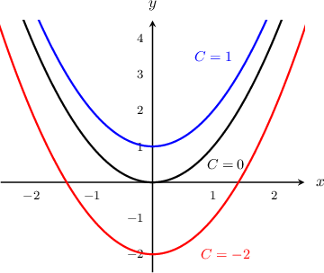

# Solving First-Order ODEs Using Direct Integration

Source: https://www.mathacademy.com/topics/1061?courseId=136
Topic ID: 1061

## Prerequisites

- [Integrating Trigonometric Functions Using Substitution](./478-integrating-trigonometric-functions-using-substitution.md)
- [Verifying Solutions of Differential Equations](./1181-verifying-solutions-of-differential-equations.md)
- [Integrating Exponential Functions Using Substitution](./3770-integrating-exponential-functions-using-substitution.md)

## Lesson

### Introduction

Often, differential equations aren't easy to solve. Some are so difficult that they can only be solved using entire rooms full of very powerful computers!

However, there is one type that's often quite easy. These are differential equations that can be written as

$$

\dfrac{\textrm d y}{\textrm d x} = g(x).

$$

As an example, suppose that we want to find the solution to

$$

\dfrac{\textrm d y}{\textrm d x} = \dfrac{1}{1+2x}.

$$

We can solve this differential equation by integrating both sides:

$$

\int\dfrac{\textrm d y}{\textrm d x}\,\textrm d x = \int\dfrac{1}{1+2x}\,\textrm d x

$$

For the left-hand side, calculating the indefinite integral of $\dfrac{\textrm d y}{\textrm d x}$ gives $y+C_1$ because differentiation is reversed by integration. For the right-hand side, this is a reasonably standard integral that we know how to compute. So, we get

$$

y + C_1 = \dfrac{1}{2}\ln|1+2x| + C_2.

$$

We now tidy up the result, solving for $y$ and combining the two constants $C_1$ and $C_2$ into a third constant $C=C_2-C_1.$

$$

\begin{aligned}𝑦+𝐶_{1} & =\frac{1}{2}ln⁡|1+2𝑥|+𝐶_{2} \\ 𝑦 & =\frac{1}{2}ln⁡|1+2𝑥|+(𝐶_{2}−𝐶_{1}) \\ & =\frac{1}{2}ln⁡|1+2𝑥|+𝐶\end{aligned}

$$

The solution we obtained is called a **general solution** because it involves the arbitrary constant $C.$ This is in contrast to "particular" solutions, in which the constant is set to a fixed value. We will learn more about particular solutions later, but for now we will focus on general solutions.

**Note:** Remember that we combined the constants $C_1$ and $C_2$ into a single constant $C.$ For these types of differential equations, we can usually do this, and for that reason, we often go straight to adding a constant $C$ to one side of the equation.

### Example: Finding the General Solution of a Differential Equation Using Integration

#### Question

Find the general solution to the differential equation $f'(x) - 3\sin(2x) = 0.$

#### Explanation

First, we rearrange the equation to give

$$

f'(x) = 3\sin{2x}.

$$

Then, we integrate both sides of the equation with respect to $x,$ and get

$$

\begin{aligned}∫𝑓^{′}(𝑥)\,d𝑥 & =∫3sin⁡2𝑥\,d𝑥 \\ 𝑓(𝑥) & =3∫sin⁡2𝑥\,d𝑥 \\ & =−\frac{3}{2}cos⁡2𝑥+𝐶.\end{aligned}

$$

### Example: Finding the General Solution of a Second Order Differential Equation by Integrating Twice

#### Question

Solve the differential equation

$$

\dfrac{\textrm d^2 y}{\textrm d x^2} = x.

$$

#### Explanation

Integrating the equation once, we get

$$

\begin{aligned}∫\frac{d^{2}𝑦}{d𝑥^{2}}\,d𝑥 & =∫𝑥\,d𝑥 \\ \frac{d𝑦}{d𝑥} & =\frac{1}{2}𝑥^{2}+𝐶.\end{aligned}

$$

Integrating a second time, we get

$$

\begin{aligned}∫\frac{d𝑦}{d𝑥}\,d𝑥 & =∫(\frac{1}{2}𝑥^{2}+𝐶)\,d𝑥 \\ 𝑦 & =\frac{1}{6}𝑥^{3}+𝐶𝑥+𝐷\end{aligned}

$$

Note that because we had a second-order equation, our general solution contains ** arbitrary constants, $C$ and $D.$ We cannot combine them, because $C$ is being multiplied by $x$ while $D$ is not.

### Example: Sketching the Solution Curves of a Differential Equation

#### Question

Solve the differential equation $y' = 2x,$ and sketch the solution curves of this equation.

#### Explanation

Integrating the equation, we get

$$

y = x^2+C.

$$

We can now plot the solution curves by selecting different values for $C.$ The sketch below shows the solution curves for $C=-2,0,1.$

### Particular Solutions of a Differential Equation

Often, instead of the general solution that involves an arbitrary constant, we want a **particular solution**. A particular solution is a solution that satisfies the differential equation *and* some other condition on the function.

As a simple example, consider the differential equation

$$

\dfrac{\textrm dy}{\textrm dx} = 2x.

$$

We can find the general solution by integrating:

$$

\begin{aligned}∫\frac{d𝑦}{d𝑥}\,d𝑥 & =∫2𝑥\,d𝑥 \\ 𝑦 & =𝑥^{2}+𝐶.\end{aligned}

$$

In its current form, the function $y$ represents infinitely many solutions, each with a different value of the arbitrary constant $C.$

However, suppose we want to find a **particular solution** that satisfies the condition $y(3)=10.$ To do this, we can solve for the appropriate value of the arbitrary constant:

$$

\begin{aligned}𝑦 & =𝑥^{2}+𝐶 \\ 10 & =3^{2}+𝐶 \\ 10 & =9+𝐶 \\ 1 & =𝐶.\end{aligned}

$$

Therefore, the desired particular solution is

$$

y = x^2 + 1.

$$

### Example: Finding the Solution of a Differential Equation With a Given Condition

#### Question

Find the particular solution to the differential equation below that satisfies the condition $f(0)=2.$

$$

f'(x) - \dfrac{3}{1+x^2} = 0

$$

#### Explanation

First, we rearrange the equation to give

$$

f'(x) = \dfrac{3}{1+x^2}.

$$

Then, we integrate both sides with respect to $x,$ and get

$$

\begin{aligned}∫𝑓^{′}(𝑥)\,d𝑥 & =∫\frac{3}{1+𝑥^{2}}\,d𝑥 \\ 𝑓(𝑥) & =3∫\frac{1}{1+𝑥^{2}}\,d𝑥 \\ & =3arctan⁡𝑥+𝐶.\end{aligned}

$$

So our general solution is $f(x) = 3\arctan{x} + C.$ To find a particular solution, we substitute the condition $f(0) = 2$ into our solution and obtain a value for $C,$ as follows:

$$

\begin{aligned}𝑓(𝑥) & =3arctan⁡(𝑥)+𝐶 \\ 2 & =3arctan⁡(0)+𝐶 \\ 2 & =0+𝐶 \\ 𝐶 & =2.\end{aligned}

$$

Therefore, our particular solution is

$$

f(x)=3\arctan x + 2.

$$
