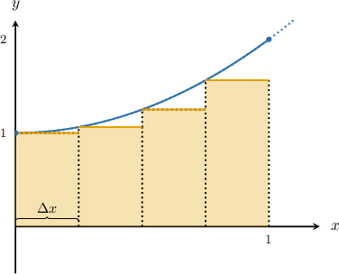
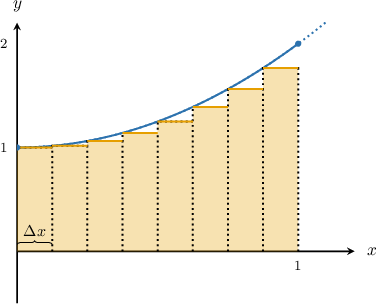
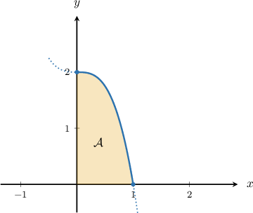

# Defining Definite Integrals Using Left and Right Riemann Sums

Source: https://www.mathacademy.com/topics/1086?courseId=136
Topic ID: 1086

## Prerequisites

- [Left and Right Riemann Sums in Sigma Notation](./1042-left-and-right-riemann-sums-in-sigma-notation.md)
- [Limits at Infinity from Graphs](../../../ap-courses/lessons/ap-calculus-ab/1873-limits-at-infinity-from-graphs.md)

## Lesson

### Introduction

Suppose that we want to approximate the area $\mathcal A$ bound by the curve $y= x^2+1$ and the lines $x=0,$ $x=1,$ and the $x$-axis. We can do this using a left Riemann sum with $n=4$ subintervals, as shown below:

A better approximation can be found by taking more subintervals. For instance, taking $n=8$ subintervals gives:

As we continue to increase $n,$ our approximation gets better and better. In fact, we can get an *exact* value for the area by taking the limit of the Riemann sum as $n\to\infty.$

Let's write down that limit. First, we need to express the left Riemann sum using sigma notation. Using $n$ subintervals between the endpoints $a=0$ and $b=1,$ we express

$$

\begin{aligned}A & ≈\underset{\underset{𝑘=0}{∑}}{\overset{}{𝑛−1}}𝑓(𝑥_{𝑘})Δ𝑥 \\ & =\underset{\underset{𝑘=0}{∑}}{\overset{}{𝑛−1}}𝑓(0+𝑘⋅Δ𝑥)Δ𝑥 \\ & =\underset{\underset{𝑘=0}{∑}}{\overset{}{𝑛−1}}𝑓(𝑘⋅Δ𝑥)Δ𝑥 \\ & =\underset{\underset{𝑘=0}{∑}}{\overset{}{𝑛−1}}((𝑘⋅Δ𝑥)^{2}+1)Δ𝑥 \\ & =\underset{\underset{𝑘=0}{∑}}{\overset{}{𝑛−1}}(𝑘^{2}⋅\frac{1}{𝑛^{2}}+1)⋅\frac{1}{𝑛} \\ & =\underset{\underset{𝑘=0}{∑}}{\overset{}{𝑛−1}}(\frac{𝑘^{2}}{𝑛^{2}}+1)⋅\frac{1}{𝑛}.\end{aligned}

$$

In the above, we used the fact that $x_k = 0 + k\Delta x = k\Delta x$ and $\Delta x = \dfrac{1 - 0}{n} = \dfrac 1 n,$ as we've seen before.

The exact area is found by computing the limit as $n\to\infty.$ So instead of using an approximation symbol $(\approx),$ we can now use an equality symbol and write

$$

A = \lim_{n\to\infty}\sum_{k=0}^{n-1}\left(\dfrac{k^2}{n^2} + 1\right)\cdot \dfrac{1}{n}.

$$

The formula above is a bit clunky, so instead of writing it using limits and sigma notation, we introduce a new notation called the **definite integral**, defined as

$$

\mathcal{A} = \lim_{n\to\infty}\sum_{k=0}^{n-1}\left(\dfrac{k^2}{n^2} + 1\right)\cdot \dfrac{1}{n}= \int_0^1 (x^2 + 1)\, \text{d}x.

$$

In our example,

$$

\displaystyle \int_0^1 (x^2+1)\, \text{d}x

$$

can be interpreted as the exact area under the graph of $y = f(x) = x^2+1$ between $x=0,$ $x=1,$ and the $x$-axis.

### General Notation

In general, for a function $f(x)$ defined on $[a,b],$ the **definite integral** of $f(x)$ between $x=a$ and $x=b$ can be defined using the limit of a left Riemann sum as

$$

\int_a^b f(x)\text{d}x = \lim_{n\rightarrow\infty}\sum_{k=0}^{n-1} f(x_k)\Delta x,

$$

where $\Delta x = \dfrac{b-a}{n}$ and $x_k = a + k\Delta x.$

The limit $x=a$ is referred to as the **lower limit**, whereas $x=b$ is called the **upper limit**.

### Example: Writing the Area Bounded by a Curve as a Definite Integral

#### Question

For the function $y = -2x^3+2$ shown above, write down an expression for the area $\mathcal{A}$ as a definite integral.

#### Explanation

We want to express the area $\mathcal{A}$ between the function $f(x) = -2x^3+2$ and the $x$-axis, between $x=0$ and $x=1.$

This can be expressed as the definite integral of $f(x) = -2x^3+2$ between the lower limit $x=0$ and the upper limit $x=1,$ as follows:

$$

\displaystyle \mathcal{A} = \int_0^1 (-2x^3+2)\,\text{d}x

$$

### Example: Expressing a Definite Integral as the Limit of a Left Riemann Sum

#### Question

Express $\displaystyle \int_1^3(4-x)\,\text{d}x$ as the limit of a left Riemann sum.

#### Explanation

The definite integral can be defined in terms of the limit of a left Riemann sum as

$$

\int_a^b f(x)\text{d}x = \lim_{n\rightarrow\infty}\sum_{k=0}^{n-1} f(x_k)\Delta x,

$$

where $\Delta x = \dfrac{b-a}{n}$ and $x_k = a + k\Delta x.$

In the definite integral

$$

\displaystyle \int_1^3(4-x)\,\text{d}x,

$$

the function is $f(x) = 4-x,$ the lower bound is $a=1,$ and the upper bound is $b=3.$ So, we have

$$

\Delta x = \dfrac{3-1}{n} = \dfrac 2 n,

$$

and therefore

$$

\begin{aligned}∫_{31}(4−𝑥)\,d𝑥 & =\underset{𝑛→∞}{lim}\underset{\underset{𝑘=0}{∑}}{\overset{}{𝑛−1}}𝑓(𝑥_{𝑘})\,Δ𝑥 \\ & =\underset{𝑛→∞}{lim}\underset{\underset{𝑘=0}{∑}}{\overset{}{𝑛−1}}[𝑓(1+𝑘⋅\frac{2}{𝑛})\,⋅\frac{2}{𝑛}] \\ & =\underset{𝑛→∞}{lim}\underset{\underset{𝑘=0}{∑}}{\overset{}{𝑛−1}}[𝑓(1+\frac{2𝑘}{𝑛})\,⋅\frac{2}{𝑛}] \\ & =\underset{𝑛→∞}{lim}\underset{\underset{𝑘=0}{∑}}{\overset{}{𝑛−1}}[(4−(1+\frac{2𝑘}{𝑛}))\,⋅\frac{2}{𝑛}] \\ & =\underset{𝑛→∞}{lim}\underset{\underset{𝑘=0}{∑}}{\overset{}{𝑛−1}}[(3−\frac{2𝑘}{𝑛})\,⋅\frac{2}{𝑛}].\end{aligned}

$$

### Example: Expressing the Limit of a Left Riemann Sum as a Definite Integral

#### Question

Find the function $f(x)$ and the value of $b,$ given that $\displaystyle \int_{3}^b f(x)\, \textrm d x =\lim_{n\to\infty}\sum_{k=0}^{n-1}\left[\left(3 + \dfrac{5k}{n}\right)^2\cdot \dfrac 5 n\right].$

#### Explanation

A definite integral can be defined as the limit of a left Riemann sum as follows:

$$

\int_a^b f(x) \, \textrm d x = \lim_{n\to\infty}\sum_{k=0}^{n-1}f\left(x_k\right)\cdot \Delta x

$$

where $\Delta x = \dfrac{b-a}{n}$ and $x_k = a + k\Delta x.$

Notice that we're given that the lower limit $a = 3.$

Comparing the given summation with the general expression above, we see that $\Delta x = \dfrac{5}{n}.$ Therefore,

$$

\dfrac{5}{n} = \dfrac{b-3}{n} \quad \Longrightarrow \quad b = 8.

$$

Consequently, $x_k = 3 + \dfrac{5k}{n}$ and $f(x_k) = x_{k}^2.$

Hence,

$$

\int_{3}^{8} x^2 \, \textrm d x =\lim_{n\to\infty}\sum_{k=0}^{n-1}\left[\left(3 + \dfrac{5k}{n}\right)^2\cdot \dfrac 5 n\right].

$$

Therefore, the correct answer is $f(x)= x^2$ and $b = 8.$

### Using a Right Riemann Sum

There's nothing special about using a left Riemann sum to define a definite integral. A definite integral can also be defined as the limit of a right Riemann sum,

$$

\int_a^b f(x)\,\textrm d x = \lim_{n\to\infty}\sum_{k=1}^n f(x_k)\cdot\Delta x,

$$

where $x_k = a + k\Delta x$ and $\Delta x = \dfrac{b-a}{n}.$

Nothing has changed, except that the index starts from $k=1$ instead of $k=0$, and goes up to $k=n.$

**Note:** In the limit as $n \to \infty,$ the left and right Riemann sums give *the exact same result*!

### Example: Expressing a Definite Integral as the Limit of a Right Riemann Sum

#### Question

Express $\displaystyle \int_1^2 x^2\,\textrm d x$ as the limit of a right Riemann sum.

#### Explanation

The definite integral can be defined in terms of the limit of a right Riemann sum as

$$

\int_a^b f(x)\,\textrm d x = \lim_{n\to\infty}\sum_{k=1}^n f(x_k)\cdot\Delta x,

$$

where $x_k = a + k\Delta x$ and $\Delta x = \dfrac{b-a}{n}.$

In the definite integral

$$

\displaystyle \int_1^2 x^2\,\textrm d x,

$$

the function is $f(x) = x^2,$ the lower bound is $a=1$ and the upper bound is $b=2.$ So, we have

$$

\Delta x = \dfrac{2-1}{n} = \dfrac 1 n.

$$

Therefore,

$$

\begin{aligned}∫_{21}𝑥^{2}\,d𝑥 & =\underset{𝑛→∞}{lim}\underset{\underset{𝑘=1}{∑}}{\overset{}{𝑛}}𝑓(𝑥_{𝑘})\,Δ𝑥 \\ & =\underset{𝑛→∞}{lim}\underset{\underset{𝑘=1}{∑}}{\overset{}{𝑛}}[𝑓(1+𝑘⋅\frac{1}{𝑛})⋅\frac{1}{𝑛}] \\ & =\underset{𝑛→∞}{lim}\underset{\underset{𝑘=1}{∑}}{\overset{}{𝑛}}[𝑓(1+\frac{𝑘}{𝑛})⋅\frac{1}{𝑛}] \\ & =\underset{𝑛→∞}{lim}\underset{\underset{𝑘=1}{∑}}{\overset{}{𝑛}}[(1+\frac{𝑘}{𝑛})^{2}\,⋅\frac{1}{𝑛}].\end{aligned}

$$
