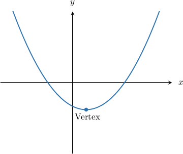
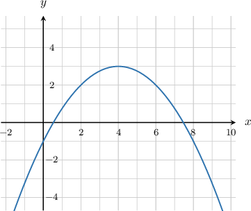
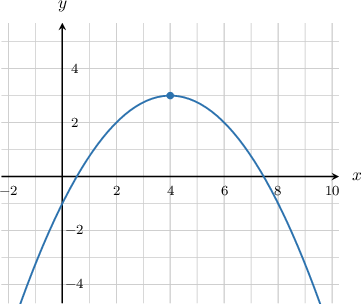
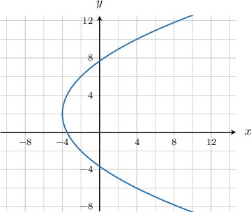
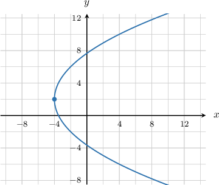

# The Vertex of a Parabola

Source: https://www.mathacademy.com/topics/1128?courseId=136
Topic ID: 1128

## Prerequisites

- [Left and Right Opening Parabolas](./1124-left-and-right-opening-parabolas.md)

## Lesson

### Introduction

The figure below shows the graph of an upward-opening parabola.

The point where the parabola makes its sharpest turn is called the **vertex**. In particular:

- The vertex of an *upward-opening* parabola (like the one above) is its *lowest* point.

- The vertex of a *downward-opening* parabola is its *highest* point.

- The vertex of a *left-opening* parabola is its *right-most* point.

- The vertex of a *right-opening* parabola is its *left-most* point.

### Example: Identifying the Vertex of a Vertical Parabola Given Its Graph

#### Question

What is the vertex of the parabola shown below?

#### Explanation

The vertex of a downward-opening parabola is the highest point of the parabola.

Therefore, the coordinates of the vertex are $(4,3).$

### Example: Identifying the Vertex of a Horizontal Parabola Given Its Graph

#### Question

What are the coordinates of the vertex of the parabola shown below?

#### Explanation

The vertex of a right-opening parabola is the left-most point of the parabola.

Therefore, the coordinates of the vertex are $(-4,2).$

### The Standard Equation of a Parabola

The standard equation of a left-opening or right-opening parabola that has its vertex at $(h,k)$ is

$$

(y-k)^2 = 4p(x-h).

$$

The standard equation of an upward-opening or downward-opening parabola that has its vertex at $(h,k)$ is

$$

(x-h)^2 = 4p(y-k).

$$

In either case, we can immediately retrieve the parabola's vertex if we're given an equation in either of these two forms.

**Note:** You might wonder why there is a $4$ in the $4p$ term. It turns out that the $4p$ term is necessary to represent a particular geometric property of the parabola, which we will learn about in the future. In this lesson, we won't do much with the value of $p,$ but it will become relevant in the future.

### Example: Stating the Vertex of a Vertical Parabola Given Its Equation in Standard Form

#### Question

What are the coordinates of the vertex of the parabola $(x+1)^2=8(y-2)?$

#### Explanation

The standard equation of an upward- or downward-opening parabola that has its vertex at $(h,k)$ is

$$

(x-h)^2 = 4p(y-k),

$$

where $p$ is a constant.

We can rewrite the given equation as

$$

\begin{aligned}(𝑥+1)^{2} & =4(2)(𝑦−2).\end{aligned}

$$

It is now clear that our equation is of the standard type with $p =2.$

Comparing our equation with the standard equation, we can see that we have $h= -1$ and $k=2.$ Therefore, the coordinates of the vertex of the parabola are $(-1,2).$

### Example: Stating the Vertex of a Horizontal Parabola Given Its Equation in Standard Form

#### Question

What are the coordinates of the vertex of the parabola $(y-2)^2=2(x+1)?$

#### Explanation

The standard equation of a left- or right-opening parabola that has its vertex at $(h,k)$ is

$$

(y-k)^2 = 4p(x-h),

$$

where $p$ is a constant.

We can rewrite the given equation as

$$

(y-2)^2 = 4\left(\dfrac{2}{4}\right)(x +1),

$$

which simplifies to

$$

(y-2)^2 = 4\left(\dfrac{1}{2}\right)(x +1),

$$

It is now clear that our equation is of the standard type with $p=\dfrac{1}{2}.$

Comparing our equation with the standard equation, we can see that we have $h=-1$ and $k=2.$ Therefore, the coordinates of the vertex of the parabola are $\left(-1,2\right).$
