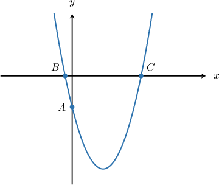
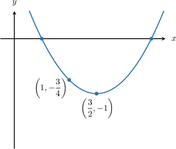
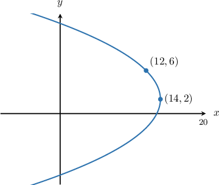
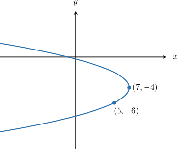

# Calculating Intercepts of Parabolas

Source: https://www.mathacademy.com/topics/1132?courseId=136
Topic ID: 1132

## Prerequisites

- [Left and Right Opening Parabolas](./1124-left-and-right-opening-parabolas.md)

## Lesson

### Introduction

Let's consider the parabola $(x-1)^2 = \dfrac 1 2 (y+3),$ shown below.

To calculate the $y$-intercept of the parabola (shown as the point $A$ in the diagram), we set $x=0$ and solve for $y.$ In our case, this gives

$$

\begin{aligned}(𝑥−1)^{2} & =\frac{1}{2}(𝑦+3) \\ (0−1)^{2} & =\frac{1}{2}(𝑦+3) \\ (−1)^{2} & =\frac{1}{2}(𝑦+3) \\ 1 & =\frac{1}{2}(𝑦+3) \\ 2 & =𝑦+3 \\ 𝑦 & =2−3 \\ 𝑦 & =−1.\end{aligned}

$$

So the coordinates of the $y$-intercept are $(0,-1).$

On the other hand, to find the $x$-intercepts (shown as the points $B$ and $C$ in the diagram), we set $y=0$ and solve for $x,$ as follows:

$$

\begin{aligned}(𝑥−1)^{2} & =\frac{1}{2}(𝑦+3) \\ (𝑥−1)^{2} & =\frac{1}{2}(0+3) \\ (𝑥−1)^{2} & =\frac{3}{2} \\ 𝑥−1 & =±\sqrt{√\frac{3}{2}} \\ 𝑥 & =1±\sqrt{√\frac{3}{2}}.\end{aligned}

$$

So, the coordinates of $B$ are $\left(1-\sqrt{\dfrac{3}{2}},0\right)$ and the coordinates of $C$ are $\left(1+\sqrt{\dfrac{3}{2}},0\right).$

### Example: Calculating the Intercepts of a Parabola Given Its Equation

#### Question

Find the points of intersection of the parabola $(y-2)^2=4(x+1)$ with the $y$-axis.

#### Explanation

To find the points of intersection of the parabola with the $y$-axis, we set $x=0$ and solve the resulting equation for $y\mathbin{:}$

$$

\begin{aligned}(𝑦−2)^{2} & =4(𝑥+1) \\ (𝑦−2)^{2} & =4(0+1) \\ (𝑦−2)^{2} & =4 \\ 𝑦−2 & =±2 \\ 𝑦 & =2±2 \\ 𝑦 & =0,4\end{aligned}

$$

Therefore, the parabola intersects the $y$-axis $(0,0)$ and $(0,4).$

### Calculating the Intercepts of a Parabola Given a Graph of the Parabola

Suppose we want to know what are the $x$-intercepts of the parabola below.

Then, we proceed as follows:

First, we find the equation of the parabola. From the diagram, we see that the parabola has its vertex at $\displaystyle\left(\frac 32, -1\right)$ and passes through the point $\displaystyle\left(1,-\frac 34\right).$

The general standard equation of an up- or down-opening parabola with vertex $(h,k)$ is given by

$$

(x-h)^2 = 4p(y-k).

$$

Substituting $(h,k) = \left(\dfrac 32, -1\right)$ into the above gives

$$

\begin{aligned}(𝑥−\frac{3}{2})^{2} & =4𝑝(𝑦+1).\end{aligned}

$$

Now, we need to find $p.$ Since the parabola passes through the point $\displaystyle\left(1,-\frac 34\right),$ we substitute $x= 1$ and $y=-\dfrac34$ into the equation and get

$$

\begin{aligned}(1−\frac{3}{2})^{2} & =4𝑝(−\frac{3}{4}+1) \\ \frac{1}{4} & =4𝑝(\frac{1}{4}) \\ 𝑝 & =\frac{1}{4}.\end{aligned}

$$

Therefore, the equation of the parabola is

$$

\begin{aligned}(𝑥−\frac{3}{2})^{2} & =(𝑦+1).\end{aligned}

$$

When the parabola intersects the $x$-axis, we must have $y= 0.$ So, we substitute $y=0$ into the equation of the parabola and solve for $x{:}$

$$

\begin{aligned}(𝑥−\frac{3}{2})^{2} & =(0+1) \\ (𝑥−\frac{3}{2})^{2} & =1 \\ 𝑥−\frac{3}{2} & =±1 \\ 𝑥 & =\frac{3}{2}±1\end{aligned}

$$

Therefore, the $x$-intercepts are $\dfrac12$ and $\dfrac52.$

### Example: Calculating the X-Intercepts of a Parabola Given Its Graph

#### Question

What is the $x$-intercept of the parabola shown above?

#### Explanation

First, we need to find the equation of the parabola. The diagram shows that the parabola has a vertex at $(14,2)$ and passes through the point $\left(12,6\right).$

The equation of a left- or right-opening parabola with vertex $(h,k)$ is given by

$$

(y-k)^2 = 4p(x-h).

$$

Substituting $(h,k) = (14,2)$ into the above gives

$$

(y-2)^2 = 4p(x-14).

$$

Now, we need to find $p.$ Since the parabola passes through the point $(12,6),$ we substitute $x=12$ and $y=6$ into the equation and get

$$

\begin{aligned}(6−2)^{2} & =4𝑝(12−14) \\ 16 & =4𝑝(−2) \\ 𝑝 & =−2.\end{aligned}

$$

Therefore, the equation of the parabola is

$$

\begin{aligned}(𝑦−2)^{2} & =−8(𝑥−14).\end{aligned}

$$

When the parabola intersects the $x$-axis, we must have $y= 0.$ So, we substitute $y=0$ into the equation of the parabola and solve for $x{:}$

$$

\begin{aligned}(𝑦−2)^{2} & =−8(𝑥−14) \\ (0−2)^{2} & =−8(𝑥−14) \\ 4 & =−8(𝑥−14) \\ 𝑥−14 & =−\frac{1}{2} \\ 𝑥 & =−\frac{1}{2}+14 \\ 𝑥 & =\frac{27}{2}\end{aligned}

$$

Therefore, the $x$-intercept is $\dfrac{27}{2}.$

### Example: Calculating the Y-Intercepts of a Parabola Given Its Graph

#### Question

What are the $y$-intercepts of the parabola shown above?

#### Explanation

First, we need to find the equation of the parabola. The diagram shows that the parabola has a vertex at $(7,-4)$ and passes through the point $\left(5,-6\right).$

The equation of a left- or right-opening parabola with vertex at $(h,k)$ is given by

$$

(y-k)^2=4p(x-h),

$$

and substituting $(h,k) = (7,-4)$ into the above gives

$$

(y+4)^2=4p(x-7).

$$

Now, we need to find $p.$ Since the parabola passes through the point $(5,-6),$ we substitute $x=5$ and $y=-6$ into the equation and get

$$

\begin{aligned}(−6+4)^{2} & =4𝑝(5−7) \\ 4 & =4𝑝(−2) \\ 𝑝 & =−\frac{1}{2}.\end{aligned}

$$

Therefore, the equation of the parabola is

$$

\begin{aligned}(𝑦+4)^{2}=−2(𝑥−7).\end{aligned}

$$

When the parabola intersects the $y$-axis, we must have $x= 0.$ So, we substitute $x= 0$ into the equation of the parabola and solve for $y{:}$

$$

\begin{aligned}(𝑦+4)^{2} & =−2(0−7) \\ (𝑦+4)^{2} & =14 \\ 𝑦+4 & =±\sqrt{√14} \\ 𝑦 & =−4±\sqrt{√14}\end{aligned}

$$

Therefore, the $y$-intercepts are $-4-\sqrt{14}$ and $-4+\sqrt{14}.$
