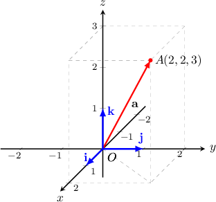
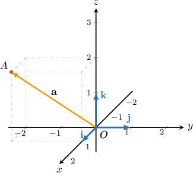

# Three-Dimensional Vectors in Component Form

Source: https://www.mathacademy.com/topics/1166?courseId=136
Topic ID: 1166

## Prerequisites

- [Two-Dimensional Vectors Expressed in Component Form](../mathematical-foundations-ii/1165-two-dimensional-vectors-expressed-in-component-form.md)

## Lesson

### Introduction

We can use Cartesian coordinates to define vectors in three-dimensional space. For example, consider a point $A(2,2,3),$ and define the origin as the point $O(0,0,0).$ The position vector of $A$ is $\overrightarrow{OA} = \mathbf{a}.$

Let's also define three special unit vectors $\mathbf{i},$ $\mathbf{j},$ and $\mathbf{k},$ where $|\,\mathbf{i}\,| = |\,\mathbf{j}\,| = |\,\mathbf{k}\,| = 1,$ as follows:

- $\mathbf{i}$ is a horizontal unit vector that points "outwards" along the positive direction of the $x$-axis,

- $\mathbf{j}$ is a horizontal unit vector that points to the right along the positive direction of the $y$-axis, and

- $\mathbf{k}$ is a vertical unit vector that points upwards along the positive direction of the $z$-axis.

All of these vectors are illustrated in the diagram shown below.

Now, we can uniquely describe our position vector using $\mathbf{i}, \mathbf{j}, \mathbf{k}$ as

$$

\begin{aligned}𝐚 & =\overset{𝑂𝐴}{}=2𝐢+2𝐣+3𝐤.\end{aligned}

$$

### Example: Expressing a Position Vector in Component Form Given Its Graph

#### Question

Given the picture below, find the position vector of the point $A(1,-2,2)$ in terms of $\mathbf{i}$, $\mathbf{j}$, and $\mathbf{k}$.

#### Explanation

Remember that in general, if a point $A$ has coordinates $(a_x,a_y,a_z),$ then its position vector is given by

$$

\overrightarrow{OA} = \mathbf{a} = a_x\mathbf{i}+a_y\mathbf{j} + a_z\mathbf{k}.

$$

Here, the point $A$ has the coordinates $(1,-2,2),$ so its position vector is given by

$$

\begin{aligned}\overset{𝑂𝐴}{} & =𝐢−2𝐣+2𝐤.\end{aligned}

$$

### Alternative Notation and the Standard Basis

In general, the position vector of a point $A(a_x,a_y,a_z)$ is the vector

$$

\begin{aligned}𝑎_{𝑥} \\ 𝑎_{𝑦} \\ 𝑎_{𝑧}\end{aligned}

$$

The unit vectors $\mathbf{i},$ $\mathbf{j},$ and $\mathbf{k}$ are usually called the **standard basis** of the three-dimensional space.

Lastly, note that a vector is defined by its components uniquely. In other words, given $\mathbf{a}=\langle a_x,a_y,a_z \rangle$ and $\mathbf{b}=\langle b_x,b_y,b_z \rangle,$ we have

$$

\begin{aligned}𝑎_{𝑥}=𝑏_{𝑥} \\ 𝑎_{𝑦}=𝑏_{𝑦} \\ 𝑎_{𝑧}=𝑏_{𝑧}.\end{aligned}

$$

### Example: Converting Between Alternative Notations

#### Question

Write the position vector of $A(-1,-2,3)$ using the following notations.

1. The angle bracket notation.

2. The column vector notation.

3. In terms of $\mathbf{i},$ $\mathbf{j},$ and $\mathbf{k}$.

#### Explanation

Remember that in general, if a point $A$ has coordinates $(a_x,a_y,a_z),$ then its position vector is given by

$$

\begin{aligned}𝑎_{𝑥} \\ 𝑎_{𝑦} \\ 𝑎_{𝑧}\end{aligned}

$$

Here, the point $A$ has the coordinates $(-1,-2,3),$ so its position vector is given by

$$

\begin{aligned}−1 \\ −2 \\ 3\end{aligned}

$$

### Example: Expressing a Position Vector in Component Form Given Its Endpoints

#### Question

Let $A(-1,4, -5)$ and $B(2,3,5)$. Find $\overrightarrow{AB}$ in column vector notation.

#### Explanation

We have

$$

\begin{aligned} & \overset{𝑂𝐴}{}=𝐚=−𝐢+4𝐣−5𝐤, \\ & \overset{𝑂𝐵}{}=𝐛=2𝐢+3𝐣+5𝐤.\end{aligned}

$$

Now, we can express $\overrightarrow{AB}$ as the difference of position vectors, as follows:

$$

\begin{aligned}\overset{𝐴𝐵}{} & =𝐛−𝐚 \\ & =(2𝐢+3𝐣+5𝐤)−(−𝐢+4𝐣−5𝐤) \\ & =3𝐢−𝐣+10𝐤 \\ & =\begin{matrix}3 \\ −1 \\ 10\end{matrix}\end{aligned}

$$
