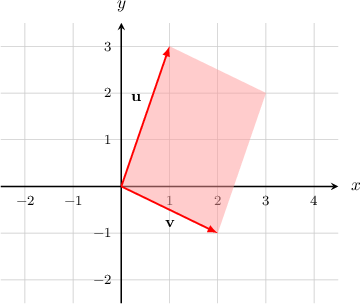
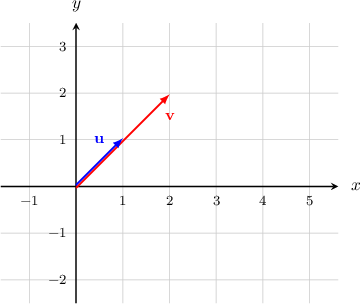
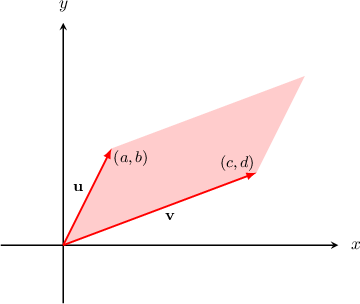
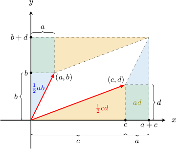

# The Geometric Interpretation of the 2x2 Determinant

Source: https://www.mathacademy.com/topics/1169?courseId=136
Topic ID: 1169

## Prerequisites

- [The Determinant of a 2x2 Matrix](./152-the-determinant-of-a-2x2-matrix.md)
- [Two-Dimensional Vectors Expressed in Component Form](../mathematical-foundations-ii/1165-two-dimensional-vectors-expressed-in-component-form.md)

## Lesson

### Introduction

Suppose we have two vectors $\textbf{u}=\langle 1, 3 \rangle$ and $\textbf{v}=\langle 2,-1 \rangle.$ The parallelogram spanned by $\textbf{u}$ and $\textbf{v}$ is shown in the picture below:

Now, we construct a new matrix

$$

[\begin{aligned}1 & 2 \\ 3 & −1\end{aligned}]

$$

where the columns are made up of the components of the corresponding vectors. Let's find the determinant of $M\mathbin{:}$

$$

\begin{aligned}det(𝑀) & =\begin{matrix}1 & 2 \\ 3 & −1\end{matrix} \\ & =1⋅(−1)−2⋅3 \\ & =−7\end{aligned}

$$

It turns out that the absolute value of $\det(M)$ gives the area $A$ of the parallelogram:

$$

\begin{aligned}𝐴 & =|det(𝑀)| \\ & =|−7| \\ & =7\end{aligned}

$$

### Example: Calculating the Area of the Parallelogram Spanned by Two Non-Parallel Vectors

#### Question

Calculate the area of the parallelogram spanned by $\textbf{u}=\langle 1,2 \rangle$ and $\textbf{v}=\langle 3, -3 \rangle.$

#### Explanation

First, we construct a matrix where the columns are made up of the components of the corresponding vectors:

$$

[\begin{aligned}1 & 3 \\ 2 & −3\end{aligned}]

$$

Then, we find the determinant:

$$

\begin{aligned}det(𝑀) & =\begin{matrix}1 & 3 \\ 2 & −3\end{matrix} \\ & =1⋅(−3)−3⋅2 \\ & =−9\end{aligned}

$$

The absolute value of $\det(M)$ gives the area $A$ of the parallelogram:

$$

A = |{-9}| = 9

$$

### The Case When Two Vectors are Parallel

When two vectors are parallel, the parallelogram does not exist. So, it has zero area.

As a result, the determinant of a matrix whose columns are parallel vectors must also be zero.

For example, in the diagram above, we have the vectors $\textbf{u} = \left< 1,1 \right>$ and $\textbf{v} = \left< 2,2 \right>.$ Constructing a matrix where the columns are made up of the components of the corresponding vectors, we have

$$

[\begin{aligned}1 & 2 \\ 1 & 2\end{aligned}]

$$

Indeed, the determinant does come out to zero:

$$

\begin{aligned}det(𝑀) & =\begin{matrix}1 & 2 \\ 1 & 2\end{matrix} \\ & =1⋅2−2⋅1 \\ & =0\end{aligned}

$$

### Example: Calculating the Area of the Parallelogram Spanned by Two Parallel Vectors

#### Question

Calculate the area of the parallelogram spanned by $\textbf{u}=\langle 3,-2 \rangle$ and $\textbf{v}=\langle 6, -4 \rangle.$

#### Explanation

First, we construct a matrix where the columns are made up of the components of the corresponding vectors:

$$

[\begin{aligned}3 & 6 \\ −2 & −4\end{aligned}]

$$

Then, we find the determinant:

$$

\begin{aligned}det(𝑀) & =\begin{matrix}3 & 6 \\ −2 & −4\end{matrix} \\ & =3⋅(−4)−6⋅(−2) \\ & =0\end{aligned}

$$

The absolute value of $\det(M)$ gives the area $A$ of the parallelogram:

$$

A = |\,0\,| = 0

$$

### General Rule

Why does the absolute value of the determinant represent the area of the parallelogram? Let's prove this result.

First, let's state the result precisely. Consider two vectors $\textbf{u}=\langle a,b \rangle$ and $\textbf{v}=\langle c,d \rangle.$ The parallelogram spanned by $\textbf{u}$ and $\textbf{v}$ is shown in the picture below:

We construct a new matrix

$$

[\begin{aligned}𝑎 & 𝑐 \\ 𝑏 & 𝑑\end{aligned}]

$$

where the columns are made up of the components of the corresponding vectors. Then the absolute value of $\det(M)$ gives the area $A$ of the parallelogram spanned by $\textbf{u}$ and $\textbf{v}\mathbin{:}$

$$

A = |\det(M)|

$$

To prove the formula, we use the following picture:

We can compute the area by starting with the area of the outer rectangle, and then subtracting off the area of the smaller triangles and rectangles surrounding the parallelogram:

$$

\begin{aligned}𝐴 & =(𝑎+𝑐)(𝑏+𝑑)−2⋅\frac{1}{2}𝑐𝑑−2⋅𝑎𝑑−2⋅\frac{1}{2}𝑎𝑏 \\ & =|𝑎𝑏+𝑎𝑑+𝑏𝑐+𝑐𝑑−𝑐𝑑−2𝑎𝑑−𝑎𝑏| \\ & =|𝑏𝑐−𝑎𝑑| \\ & =|𝑎𝑑−𝑏𝑐| \\ & =|det(𝑀)|\end{aligned}

$$
