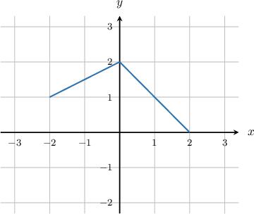
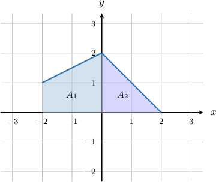
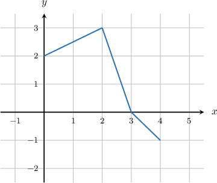
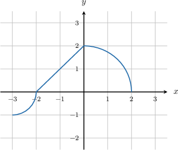

# Calculating the Definite Integral of a Function Given Its Graph

Source: https://www.mathacademy.com/topics/1200?courseId=136
Topic ID: 1200

## Prerequisites

- [Properties of Definite Integrals Involving the Limits of Integration](./632-properties-of-definite-integrals-involving-the-limits-of-integration.md)
- [The Area Bounded by a Curve and the X-Axis](./1040-the-area-bounded-by-a-curve-and-the-x-axis.md)
- [Areas of Trapezoids](../../../middle-school/lessons/grade-7/1353-areas-of-trapezoids.md)
- [Areas of Circles](../../../high-school/traditional/lessons/geometry/1745-areas-of-circles.md)

## Lesson

### Introduction

Suppose we are given the graph of the function $y=f(x)$ defined on the interval $[-2,2]$ as shown below. How can we calculate the integral $\displaystyle \int_{-2}^{2} f(x)\: \text{d}x?$

First, we notice that the graph consists of two parts: the line segment for $x \in [-2,0]$ and the line segment for $x \in [0,2].$ Therefore, using the additive property of the definite integral, we can write the integral as follows:

$$

\int_{-2}^{2} f(x)\: \text{d}x = \underbrace{\int_{-2}^{0} f(x)\: \text{d}x}_{A_1} + \underbrace{\int_{0}^{2} f(x)\: \text{d}x}_{A_2}

$$

Now, we use the fact that the area of the region between the graph and the $x$-axis can be represented using definite integrals. We divide the region between our curve and the $x$-axis as follows:

The first integral represents the signed area between the curve and the $x$-axis, where $x \in [-2,0].$ The corresponding region is a trapezoid, so we find the area using the formula

$$

\begin{aligned}𝐴_{1} & =\frac{1}{2}(𝑎+𝑏)ℎ \\ & =\frac{1}{2}(1+2)⋅2 \\ & =3.\end{aligned}

$$

The second integral represents the signed area between the curve and the $x$-axis, where $x \in [0,2].$ The corresponding region is a right triangle, so we find the area using the formula

$$

\begin{aligned}𝐴_{2} & =\frac{1}{2}𝑎𝑏 \\ & =\frac{1}{2}⋅2⋅2 \\ & =2.\end{aligned}

$$

So, we obtain

$$

\begin{aligned}∫_{2−2}𝑓(𝑥)\,d𝑥 & =𝐴_{1}+𝐴_{2} \\ & =3+2 \\ & =5.\end{aligned}

$$

### Example: Calculating the Definite Integral of a Piecewise Linear Function From Its Graph

#### Question

Consider the graph of the function $y=f(x),$ shown below. It consists of three line segments. Find the value of $\displaystyle \int_{0}^{4} f(x)\: \text{d}x.$

#### Explanation

The graph consists of $3$ parts: the line segment for $x \in [0,2],$ the line segment for $x \in [2,3],$ and the line segment for $x \in [3,4].$ Therefore, we can write the integral as follows:

$$

\int_{0}^{4} f(x)\: \text{d}x = \underbrace{\int_{0}^{2} f(x)\: \text{d}x}_{A_1} + \underbrace{\int_{2}^{3} f(x)\: \text{d}x}_{A_2} + \underbrace{\int_{3}^{4} f(x)\: \text{d}x}_{-A_3}

$$

The $1$st integral represents the signed area between the curve and the $x$-axis, where $x \in [0,2].$ The corresponding region is a trapezoid, so we find the area using the formula

$$

\begin{aligned}𝐴_{1} & =\frac{1}{2}(𝑎+𝑏)ℎ \\ & =\frac{1}{2}(2+3)⋅2 \\ & =5.\end{aligned}

$$

The $2$nd integral represents the signed area between the curve and the $x$-axis, where $x \in [2,3].$ The corresponding region is a right triangle, so we find the area using the formula

$$

\begin{aligned}𝐴_{2} & =\frac{1}{2}𝑏ℎ \\ & =\frac{1}{2}⋅1⋅3 \\ & =\frac{3}{2}.\end{aligned}

$$

The $3$rd integral represents the signed area between the curve and the $x$-axis, where $x \in [3,4].$ The corresponding region is also a right triangle, so we find the area using the formula

$$

\begin{aligned}𝐴_{3} & =\frac{1}{2}𝑏ℎ \\ & =\frac{1}{2}⋅1⋅1 \\ & =\frac{1}{2}.\end{aligned}

$$

Since the region lies below the $x$-axis, we have

$$

\int_{3}^{4} f(x)\: \text{d}x = -A_3 = -\dfrac{1}{2}.

$$

Therefore, we obtain

$$

\begin{aligned}∫_{40}𝑓(𝑥)\,d𝑥 & =𝐴_{1}+𝐴_{2}−𝐴_{3} \\ & =5+\frac{3}{2}−\frac{1}{2} \\ & =6.\end{aligned}

$$

### Example: Calculating the Definite Integral of a Piecewise Nonlinear Function From Its Graph

#### Question

Consider the graph of the function $y=f(x),$ shown below. It consists of one line segment, an arc of a quarter-circle centered at $(-3,0)$ with radius $1,$ and an arc of a quarter-circle centered at $(0,0)$ with radius $2.$ Find the value of $\displaystyle \int_{-3}^{2} f(x)\: \text{d}x.$

#### Explanation

The graph consists of $3$ parts: the arc of a quarter-circle for $x \in [-3,-2],$ the line segment for $x \in [-2,0],$ and the arc of a quarter-circle for $x \in [0,2].$ Therefore, we can write the integral as follows:

$$

\int_{-3}^{2} f(x)\: \text{d}x = \underbrace{\int_{-3}^{-2} f(x)\: \text{d}x}_{-A_1} + \underbrace{\int_{-2}^{0} f(x)\: \text{d}x}_{A_2} + \underbrace{\int_{0}^{2} f(x)\: \text{d}x}_{A_3}

$$

The $1$st integral represents the signed area between the curve and the $x$-axis, where $x \in [-3,-2].$ The corresponding region is a quarter-circle, so we find the area using the formula

$$

\begin{aligned}𝐴_{1} & =\frac{1}{4}𝜋𝑟^{2} \\ & =\frac{1}{4}𝜋⋅1^{2} \\ & =\frac{𝜋}{4}.\end{aligned}

$$

Since the region lies below the $x$-axis, we have

$$

\int_{-3}^{-2} f(x)\: \text{d}x = -A_1 = -\dfrac{\pi}{4}.

$$

The $2$nd integral represents the signed area between the curve and the $x$-axis, where $x \in [-2,0].$ The corresponding region is a right triangle, so we find the area using the formula

$$

\begin{aligned}𝐴_{2} & =\frac{1}{2}𝑏ℎ \\ & =\frac{1}{2}⋅2⋅2 \\ & =2.\end{aligned}

$$

The $3$rd integral represents the signed area between the curve and the $x$-axis, where $x \in [0,2].$ The corresponding region is a quarter-circle, so we find the area using the formula

$$

\begin{aligned}𝐴_{3} & =\frac{1}{4}𝜋𝑟^{2} \\ & =\frac{1}{4}𝜋⋅2^{2} \\ & =𝜋.\end{aligned}

$$

Therefore, we obtain

$$

\begin{aligned}∫_{4−3}𝑓(𝑥)\,d𝑥 & =−𝐴_{1}+𝐴_{2}+𝐴_{3} \\ & =−\frac{𝜋}{4}+2+𝜋 \\ & =2+\frac{3𝜋}{4}.\end{aligned}

$$
