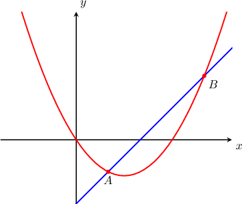
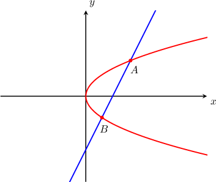

# Finding Intersections of Parametric Curves and Lines

Source: https://www.mathacademy.com/topics/1257?courseId=136
Topic ID: 1257

## Prerequisites

- [Graphing Curves Defined Parametrically](./803-graphing-curves-defined-parametrically.md)
- [Solving Trigonometric Equations Using the Sin-Cos-Tan Identity](./947-solving-trigonometric-equations-using-the-sin-cos-tan-identity.md)
- [Finding Intersections of Lines and Quadratic Functions](../../../high-school/traditional/lessons/algebra-i/6341-finding-intersections-of-lines-and-quadratic-functions.md)

## Lesson

### Introduction

In the figure below, the parametric curve $x=2t,y=t^2-3t$ and the line $x-y-4=0$ intersect at two points, $A$ and $B.$ How do we find the coordinates of these points?

To find the coordinates of the intersection points, we perform the following two steps.

**Step 1:** Take the equation of the line, replace $x$ and $y$ with the parametric formulas, and then solve for the parameter $t.$

$$

\begin{aligned}𝑥−𝑦−4 & =0 \\ (2𝑡)−(𝑡^{2}−3𝑡)−4 & =0 \\ 2𝑡−𝑡^{2}+3𝑡−4 & =0 \\ −𝑡^{2}+5𝑡−4 & =0 \\ 𝑡^{2}−5𝑡+4 & =0 \\ (𝑡−1)(𝑡−4) & =0 \\ 𝑡 & =1,4.\end{aligned}

$$

**Step 2:** Find the coordinates of the intersection points by evaluating the parametric curve at these values of $t.$

- Let's start with $t=1.$ For $x,$ we have and for $y,$ we have So the coordinates of the first intersection point are $(2,-2).$

- Next, we consider $t=4.$ For $x,$ we have and for $y,$ we have So the coordinates of the second intersection point are $(8,4).$

Therefore, the curve $x=2t,y=t^2-3t$ intersects the line $x-y-4=0$ at the points $(2,-2)$ and $(8,4).$

### Example: Finding the Intersection of a Parametric Curve and a Line

#### Question

Find the points where the curve $x=t^2,y=2t$ intersects the line $4x-2y-15=0.$

#### Explanation

Notice that the line and curve intersect twice, so we are expecting two solutions.

To find the coordinates of intersection points, we take the equation of the line, replace $x$ and $y$ with the parametric formulas, and then solve for $t.$ Upon finding $t,$ we then proceed to find the coordinates of the intersection points.

$$

\begin{aligned}4𝑥−2𝑦−15 & =0 \\ 4(𝑡^{2})−2(2𝑡)−15 & =0 \\ 4𝑡^{2}−4𝑡−15 & =0 \\ (2𝑡−5)(2𝑡+3) & =0 \\ 𝑡 & =\frac{5}{2},−\frac{3}{2}.\end{aligned}

$$

Now that we have the values of $t,$ we proceed to find $x$ and $y\mathbin{:}$

- We start with $t=\dfrac{5}{2}.$ For $x,$ we have For $y,$ we have So the coordinates of the first intersection point are $\left(\dfrac{25}{4},5\right).$

- We now move over to $t=-\dfrac{3}{2}.$ For $x,$ we have For $y,$ we have So the coordinates of the second intersection point are $\left(\dfrac{9}{4},-3\right).$

Therefore, the curve $x=t^2,y=2t$ intersects the line $4x-2y-15=0$ at the points $\left(\dfrac{25}{4},5\right)$ and $\left(\dfrac{9}{4},-3\right).$

### Example: Finding the Intersection of a Trigonometric Parametric Curve and a Line

#### Question

Find the values of $\theta$ at which the curve $x=\cos \theta, \, y = 2 \sin \theta, \, 0 \leq \theta < 2\pi$ intersects the line $2x-y=0.$

#### Explanation

To find the coordinates of the points of intersection, we take the equation of the line, replace $x$ and $y$ with the parametric formulas, and then solve for $\theta.$

$$

\begin{aligned}2𝑥−𝑦 & =0 \\ 2cos⁡𝜃−2sin⁡𝜃 & =0 \\ 2cos⁡𝜃 & =2sin⁡𝜃 \\ cos⁡𝜃 & =sin⁡𝜃 \\ 1 & =\frac{sin⁡𝜃}{cos⁡𝜃} \\ 1 & =tan⁡𝜃\end{aligned}

$$

The principal value of $\theta$ is

$$

\theta = \arctan(1) = \dfrac{\pi}{4}.

$$

This value lies inside the domain $0\leq \theta < 2\pi,$ so our first solution is $\theta_1 = \dfrac{\pi}{4}.$

To get a second solution, we add $\pi$ to $\theta_1\mathbin{:}$

$$

\theta_1 = \dfrac{\pi}{4} + \pi = \dfrac{5\pi}{4}

$$

Therefore, our solutions are $\dfrac{\pi}{4},\,\dfrac{5\pi}{4}.$
