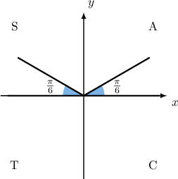
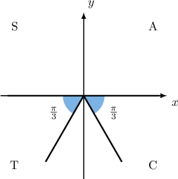
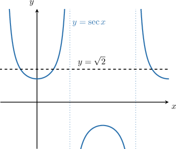

# General Solutions of Elementary Trigonometric Equations

Source: https://www.mathacademy.com/topics/1258?courseId=136
Topic ID: 1258

## Prerequisites

- [Elementary Trigonometric Equations Containing Secant](./1565-elementary-trigonometric-equations-containing-secant.md)
- [Elementary Trigonometric Equations Containing Cosecant](./1566-elementary-trigonometric-equations-containing-cosecant.md)
- [Elementary Trigonometric Equations Containing Cotangent](./1567-elementary-trigonometric-equations-containing-cotangent.md)
- [Describing Properties of the Secant Function](../../../high-school/traditional/lessons/algebra-ii/3563-describing-properties-of-the-secant-function.md)
- [Describing Properties of the Cotangent Function](../../../high-school/traditional/lessons/algebra-ii/3566-describing-properties-of-the-cotangent-function.md)
- [Describing Properties of the Cosecant Function](../../../high-school/traditional/lessons/algebra-ii/3567-describing-properties-of-the-cosecant-function.md)

## Lesson

### Introduction

How can we find *all* the solutions to the trigonometric equation

$$

\sin{x} = \dfrac{1}{2}?

$$

Notice that a domain has not been specified. This means that we should assume the domain $-\infty < x < \infty.$ In such cases, there are usually infinitely many solutions. The expression that generates all possible solutions to a trigonometric equation like this is called the **general solution.**

To find the general solution, we perform the following two steps:

1. Find two different solutions $\color{red} x_1$ and $\color{blue} x_2$ in the domain $[0, 2\pi).$

2. Write down the general solution as where the number $n$ is assumed to be any integer. This just means that the general solution consists of all angles that are coterminal to $\color{red}x_1$ or ${\color{blue}x_2}.$

In our example, we find the principal value as follows:

$$

x = \arcsin \left(\dfrac{1}{2}\right)= \dfrac{\pi}{6}

$$

This first solution lies in the first quadrant and has reference angle $\theta_R = \dfrac{\pi}{6}.$ Since $\sin x >0,$ a second solution must lie in the second quadrant and also have reference angle $\theta_R = \dfrac{\pi}{6}.$

Since the second solution $\color{blue}x_2$ lies in the $2$nd quadrant, we can find it using the reference angle, as follows:

$$

\begin{aligned}𝑥_{2} & =𝜋−𝜃_{𝑅} \\ & =𝜋−\frac{𝜋}{6} \\ & =\frac{5𝜋}{6}\end{aligned}

$$

So, the solutions for $x \in [0, 2\pi)$ are ${\color{red}x_1}={\color{red}\dfrac{\pi}{6}},$ ${\color{blue}x_2}={\color{blue}\dfrac{5\pi}{6}}.$ Therefore, the general solution for the given equation, where $n$ is an integer, is

$$

x={\color{red}\dfrac{\pi}{6}}+2n\pi, \quad x={\color{blue}\dfrac{5\pi}{6}}+2n\pi .

$$

### Example: Finding the General Solution to a Trigonometric Equation Containing Sine or Cosine

#### Question

Find the general solution to $2\cos{x} + \sqrt{2}= 0,$ where $x$ is measured in degrees.

#### Explanation

First, we rearrange the equation and isolate $\cos x \mathbin{:}$

$$

\begin{aligned}2cos⁡𝑥+\sqrt{2} & =0 \\ 2cos⁡𝑥 & =−\sqrt{2} \\ cos⁡𝑥 & =−\frac{\sqrt{2}}{2}\end{aligned}

$$

Next, we find the principal value:

$$

x_1 = \arccos\left( -\dfrac{\sqrt{2}}{2} \right)= 135^\circ

$$

Our first solution lies in the $2$nd quadrant and has a reference angle of $\theta_R = 45^\circ.$ Since $\cos x< 0,$ the second solution must lie in the third quadrant, and it also has $\theta_R = 45^\circ.$

Since the second solution $x_2$ lies in the $3$rd quadrant, we can find it using the reference angle as follows:

$$

\begin{aligned}𝑥_{2} & =180^{∘}+𝜃_{𝑅} \\ & =180^{∘}+45^{∘} \\ & =225^{∘}\end{aligned}

$$

So, the solutions for $x\in[0,360)$ are $x=135^\circ, 225^\circ.$ Therefore, the general solution for the given equation, where $n$ is an integer, is

$$

x = 135^\circ+n\cdot 360^\circ, \quad x=225^\circ+n\cdot 360^\circ.

$$

### Example: Finding the General Solution to a Trigonometric Equation Containing Secant or Cosecant

#### Question

What is the general solution to the equation $3\csc x+2\sqrt{3}=0?$

#### Explanation

First, we rearrange the equation and isolate $\csc x \mathbin{:}$

$$

\begin{aligned}3csc⁡𝑥+2\sqrt{3} & =0 \\ 3csc⁡𝑥 & =−2\sqrt{3} \\ csc⁡𝑥 & =−\frac{2\sqrt{3}}{3}\end{aligned}

$$

Recall that $\csc{x}=\dfrac{1}{\sin{x}}.$ Therefore, the given equation is equivalent to

$$

\sin{x} =-\dfrac{3}{2\sqrt{3}}=-\dfrac{\sqrt{3}}{2}.

$$

Now, we find the principal value:

$$

\begin{aligned}𝑥_{1}=arcsin⁡(−\frac{\sqrt{3}}{2})=\frac{5𝜋}{3}\end{aligned}

$$

Our first solution lies in the $4$th quadrant and has a reference angle of $\theta_R = \dfrac{\pi}{3}.$ Since $\sin x< 0,$ the second solution must lie in the third quadrant, and it also has $\theta_R = \dfrac{\pi}{3}.$

Since the second solution $x_2$ lies in the $3$rd quadrant, we can find it using the reference angle as follows:

$$

\begin{aligned}𝑥_{2} & =𝜋+𝜃_{𝑅} \\ & =𝜋+\frac{𝜋}{3} \\ & =\frac{4𝜋}{3}\end{aligned}

$$

So, the solutions for $x\in[0,2\pi)$ are $x=\dfrac{4\pi}{3}, \dfrac{5\pi}{3}.$ Therefore, the general solution for the given equation is

$$

x = \dfrac{4\pi}{3}+2n\pi, \quad x=\dfrac{5\pi}{3}+2n\pi,

$$

where $n$ is any integer.

### Finding General Solutions of Elementary Trigonometric Equations Containing Tangent

The function $\tan x$ has a period that is equal to $180^\circ.$ This fact makes it very easy to construct the general solution to a trigonometric equation containing tangent.

To find the general solution of an equation like $\tan x = \alpha,$ we perform the following steps:

1. Find the principal value ${\color{blue}x_1} = \arctan \alpha.$

2. Write down the general solution as where $n$ is any integer.

And that's all there is to it!

For instance, let's find the general solution of the equation

$$

\tan x = \sqrt{3}.

$$

First, we find the principal value:

$$

{\color{blue}x_1} = \arctan\left({\sqrt{3}}\right)= {\color{blue}60^\circ}

$$

The tangent function has a period of $180^\circ.$ Therefore, the general solution for the given equation is

$$

x = {\color{blue}60^\circ} +n\cdot 180^\circ,

$$

where $n$ is any integer.

### Example: Finding the General Solution to a Trigonometric Equation Containing Tangent or Cotangent

#### Question

What is the general solution to the equation $\cot{x}=1?$

#### Explanation

Recall that $\cot{x}=\dfrac{1}{\tan{x}}.$ Therefore, the given equation is equivalent to

$$

\begin{aligned}tan⁡𝑥 & =1.\end{aligned}

$$

Now, we find the principal value:

$$

x_1 = \arctan \left( 1 \right)= \dfrac{\pi}{4}

$$

The tangent function has a period of $\pi.$ Therefore, the general solution for the given equation is:

$$

x=\dfrac{\pi}{4}+n\pi ,

$$

where $n$ is any integer.

### Example: Finding the Coordinates of the Points of Intersection of a Trigonometric Curve and a Horizontal Line

#### Question

The graph shows a portion of the curve $y=\sec{x}$ and the line $y=\sqrt{2}.$ What is the general solution for the $x$-values of all of their points of intersection?

#### Explanation

At the intersection points, the $y$-values are the same for both graphs. This gives the equation $\sec x =\sqrt{2}.$

Recall that $\sec{x} = \dfrac{1}{\cos{x}}.$ Therefore, the given equation is equivalent to

$$

\begin{aligned}\frac{1}{cos⁡𝑥} & =\sqrt{2} \\ cos⁡𝑥 & =\frac{1}{\sqrt{2}} \\ & =\frac{\sqrt{2}}{2}.\end{aligned}

$$

First, we find the principal value:

$$

x_1 = \arccos \left(\dfrac{\sqrt{2}}{2} \right)= 45^\circ

$$

Our first solution lies in the $1$st quadrant and has a reference angle of $\theta_R = 45^\circ.$ Since $\cos x > 0,$ the second solution must lie in the $4$th quadrant, and it also has $\theta_R = 45^\circ.$

Since the second solution $x_2$ lies in the $4$th quadrant, we can find it using the reference angle, as follows:

$$

\begin{aligned}𝑥_{2} & =360^{∘}−𝜃_{𝑅} \\ & =360^{∘}−45^{∘} \\ & =315^{∘}\end{aligned}

$$

So, the solutions for $x\in\left[0^\circ,360^\circ\right)$ are $x=45^\circ, 315^\circ.$ Therefore, the general solution for the given equation is

$$

x = 45^\circ+n\cdot 360^\circ , \quad x=315^\circ+n\cdot 360^\circ ,

$$

where $n$ is any integer.
