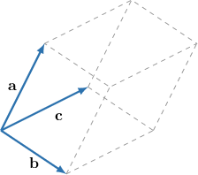
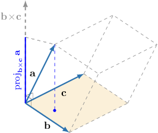

# Volumes of Parallelepipeds

Source: https://www.mathacademy.com/topics/1287?courseId=136
Topic ID: 1287

## Prerequisites

- [The Scalar Triple Product](./1286-the-scalar-triple-product.md)
- [Calculating a Vector Projection](./1295-calculating-a-vector-projection.md)

## Lesson

### Introduction

Geometrically, the absolute value of the scalar triple product $\mathbf{a} \cdot (\mathbf{b} \times \mathbf{c})$ represents the volume enclosed by the parallelepiped whose sides are formed by the three vectors $\mathbf{a},$ $\mathbf{b},$ and $\mathbf{c}.$

To illustrate, consider the parallelepiped shown below. The sides of this parallelepiped are formed by the vectors $\mathbf{a},$ $\mathbf{b},$ and $\mathbf{c}.$

The volume of this parallelepiped is given by the absolute value of the triple product:

$$

V = |\mathbf{a} \cdot (\mathbf{b} \times \mathbf{c})|

$$

A proof of this result will be given at the end of this lesson.

### Example: Calculating the Volume of a Parallelepiped Spanned by Three Vectors

#### Question

Calculate the volume of the parallelepiped spanned by $\mathbf{a}=\langle 1,-4,2 \rangle,$ $\mathbf{b}=\langle 0,-2,1 \rangle,$ and $\mathbf{c}=\langle -1,0,3 \rangle.$

#### Explanation

The volume of the parallelepiped spanned by three vectors is given by the absolute value of their triple product.

First, we compute the triple product:

$$

\begin{aligned}𝐚⋅(𝐛×𝐜) & =\begin{matrix}1 & −4 & 2 \\ 0 & −2 & 1 \\ −1 & 0 & 3\end{matrix} \\ & =1⋅\begin{matrix}−2 & 1 \\ 0 & 3\end{matrix}−(−4)⋅\begin{matrix}0 & 1 \\ −1 & 3\end{matrix}+2⋅\begin{matrix}0 & −2 \\ −1 & 0\end{matrix} \\ & =(−2⋅3−1⋅0)+4(0⋅3−1⋅(−1))+2(0⋅0−(−1)⋅(−2)) \\ & =−6+4−4 \\ & =−6\end{aligned}

$$

Finally, we take the absolute value. So the volume of the corresponding parallelepiped is

$$

V = |-6| = 6.

$$

### The Volume Spanned by Coplanar Vectors

Three vectors are said to be **coplanar** if they are parallel to the same plane.

When we have three coplanar vectors, the parallelepiped they span is *flat* on the plane, and therefore its volume is zero. Consequently, the triple product of the vectors is zero as well.

So, if three vectors are coplanar, then their triple product is zero. The converse is also true: if the triple product of three nonzero vectors is zero, then the vectors are coplanar.

Therefore, we have the following statement:

$\mathbf{a}, \mathbf{b},$ and $\mathbf{c}$ are coplanar $\quad\Leftrightarrow\quad$ $\mathbf{a} \cdot (\mathbf{b} \times \mathbf{c}) = 0$

### Example: Determining Whether Three Vectors are Coplanar

#### Question

Find $k$ given that the vectors $\mathbf{a}=\langle k,2,1 \rangle,$ $\mathbf{b}=\langle -2,-1,1 \rangle,$ and $\mathbf{c}=\langle -1,1,2 \rangle$ are coplanar.

#### Explanation

Computing the triple product, we get

$$

\begin{aligned}𝐚⋅(𝐛×𝐜) & =\begin{matrix}𝑘 & 2 & 1 \\ −2 & −1 & 1 \\ −1 & 1 & 2\end{matrix} \\ & =𝑘⋅\begin{matrix}−1 & 1 \\ 1 & 2\end{matrix}−2⋅\begin{matrix}−2 & 1 \\ −1 & 2\end{matrix}+1⋅\begin{matrix}−2 & −1 \\ −1 & 1\end{matrix} \\ & =𝑘(−1⋅2−1⋅1)−2(−2⋅2−(−1)⋅1)+(−2⋅1−(−1)⋅(−1)) \\ & =−3𝑘+6−3 \\ & =−3𝑘+3.\end{aligned}

$$

Three vectors are coplanar if and only if their triple product is zero:

$$

\begin{aligned}𝐚⋅(𝐛×𝐜) & =0 \\ −3𝑘+3 & =0 \\ 𝑘 & =1\end{aligned}

$$

Therefore, the three vectors are coplanar if and only if $k=1$.

### Calculating the Volume of a Parallelepiped Given the Coordinates of the Vertices

Sometimes, we are not given the vectors that represent the sides of a parallelepiped. Instead, we might be given the points at which the vertices lie.

To compute the volume of a parallelepiped given the vertices, we can still use a similar process as before. The only difference is that we have to start by computing the displacement vectors between the points.

Once we have the displacement vectors, then we can find the desired volume by computing the absolute value of their triple product.

Let's see an example of this.

### Example: Calculating the Volume of a Parallelepiped Spanned by Three Position Vectors Given Their Coordinates

#### Question

Calculate the volume of the parallelepiped spanned by $\overrightarrow{AB},$ $\overrightarrow{AC},$ and $\overrightarrow{AD},$ given the points $A(3,-1,2),$ $B(2,1,1),$ $C(-1,2,1),$ and $D(4,4,2).$

#### Explanation

First, we find the displacement vectors $\overrightarrow{AB},$ $\overrightarrow{AC},$ and $\overrightarrow{AD}$ that span the parallelepiped:

$$

\begin{aligned}\overset{𝐴𝐵}{} & =𝐛−𝐚 \\ & =(2𝐢+𝐣+𝐤)−(3𝐢−𝐣+2𝐤) \\ & =−𝐢+2𝐣−𝐤 \\ & =⟨−1,2,−1⟩ \\ \overset{𝐴𝐶}{} & =𝐜−𝐚 \\ & =(−𝐢+2𝐣+𝐤)−(3𝐢−𝐣+2𝐤) \\ & =−4𝐢+3𝐣−𝐤 \\ & =⟨−4,3,−1⟩ \\ \overset{𝐴𝐷}{} & =𝐝−𝐚 \\ & =(4𝐢+4𝐣+2𝐤)−(3𝐢−𝐣+2𝐤) \\ & =𝐢+5𝐣 \\ & =⟨1,5,0⟩\end{aligned}

$$

Now, to find the volume of the parallelepiped, we need to take the absolute value of the triple product of the above vectors.

Computing the triple product, we have

$$

\begin{aligned}\overset{𝐴𝐵}{}⋅(\overset{𝐴𝐶}{}×\overset{𝐴𝐷}{}) & =\begin{matrix}−1 & 2 & −1 \\ −4 & 3 & −1 \\ 1 & 5 & 0\end{matrix} \\ & =(−1)⋅\begin{matrix}3 & −1 \\ 5 & 0\end{matrix}−2⋅\begin{matrix}−4 & −1 \\ 1 & 0\end{matrix}+(−1)⋅\begin{matrix}−4 & 3 \\ 1 & 5\end{matrix} \\ & =−(3⋅0−5⋅(−1))−2((−4)⋅0−1⋅(−1))−((−4)⋅5−1⋅3) \\ & =−5−2+23 \\ & =16.\end{aligned}

$$

Therefore, the volume of the corresponding parallelepiped spanned by $\overrightarrow{AB},$ $\overrightarrow{AC},$ and $\overrightarrow{AD}$ is

$$

V=|16|=16.

$$

### Proof That the Volume of a Parallelepiped is Given by the Absolute Value of the Triple Product

We have been using the fact that the volume of a parallelepiped spanned by the vectors $\mathbf{a},$ $\mathbf{b},$ and $\mathbf{c}$ is given by the absolute value of the triple product:

$$

V = |\mathbf{a} \cdot (\mathbf{b} \times \mathbf{c})|

$$

But why is this formula true? To understand why, remember that the volume of a parallelepiped can be obtained by multiplying the area of the base by the height.

As we can see in the diagram below,

- the area of the base is given by $A = | \mathbf{b} \times \mathbf{c} |,$ and

- the height is given by $h = |\text{proj}_{\mathbf{b}\times\mathbf{c}}\:\mathbf{a}|.$

To compute the volume, we will multiply the area of the base by the height. First, though, let's write down the expression for the height:

$$

\begin{aligned}ℎ & =|proj_{𝐛×𝐜}\,𝐚| \\ & =\frac{𝐚⋅(𝐛×𝐜)}{|𝐛×𝐜|} \\ & =\frac{|𝐚⋅(𝐛×𝐜)|}{|𝐛×𝐜|}\end{aligned}

$$

Now, multiplying the area of the base by the height, we get

$$

\begin{aligned}𝑉 & =𝐴⋅ℎ \\ & =|𝐛×𝐜|⋅\frac{|𝐚⋅(𝐛×𝐜)|}{|𝐛×𝐜|} \\ & =|𝐚⋅(𝐛×𝐜)|.\end{aligned}

$$
