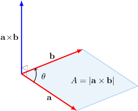

# Finding Areas Using the Cross Product

Source: https://www.mathacademy.com/topics/1299?courseId=136
Topic ID: 1299

## Prerequisites

- [Calculating the Cross Product Using Determinants](./245-calculating-the-cross-product-using-determinants.md)
- [The Area of a General Triangle](../../../high-school/traditional/lessons/algebra-ii/1275-the-area-of-a-general-triangle.md)

## Lesson

### Introduction

Suppose that the vector $\mathbf{a}$ has magnitude $7,$ the vector $\mathbf{b}$ has magnitude $6,$ and the angle between the vectors is $\theta=45^\circ.$ Then the magnitude of the cross product $\mathbf{a}\times\mathbf{b}$ is

$$

\begin{aligned}|\,𝐚×𝐛\,| & =|\,𝐚\,||\,𝐛\,|sin⁡𝜃 \\ & =7⋅6⋅sin⁡45^{∘} \\ & =7⋅6⋅\frac{\sqrt{√2}}{2} \\ & =21\sqrt{√2}.\end{aligned}

$$

Geometrically, $|\,\mathbf{a}\,| |\,\mathbf{b}\,| \sin\theta$ is the formula for the area of the parallelogram with sides $|\,\mathbf{a}\,|$ and $|\,\mathbf{b}\,|$ and the angle $\theta$ between the sides. So the magnitude of the cross product represents the area of the parallelogram spanned by the vectors $\mathbf{a}$ and $\mathbf{b},$ as shown in the picture below.

**Note:** Since in the formula for the area, we are interested only in the magnitude of the cross product, it does not matter whether we take $|\,\mathbf{a}\times\mathbf{b}\,|$ or $|\,\mathbf{b}\times\mathbf{a}\,|$ as these vectors have the same magnitude (but opposite directions).

### Example: Calculating the Area of the Triangle Spanned by Two Vectors

#### Question

Calculate the area of the triangle spanned by $\mathbf{a}=\langle 4,0,-3 \rangle$ and $\mathbf{b}=\langle 5,-1,2 \rangle.$

#### Explanation

Using the formula, we have

$$

\begin{aligned}𝐚×𝐛 & =\begin{aligned}𝐢 & 𝐣 & 𝐤 \\ 4 & 0 & −3 \\ 5 & −1 & 2\end{aligned} \\ & =\begin{aligned}0 & −3 \\ −1 & 2\end{aligned}𝐢−\begin{aligned}4 & −3 \\ 5 & 2\end{aligned}𝐣+\begin{aligned}4 & 0 \\ 5 & −1\end{aligned}𝐤 \\ & =(0⋅2−(−3)⋅(−1))𝐢−(4⋅2−(−3)⋅5)𝐣+(4⋅(−1)−0⋅5)𝐤 \\ & =−3𝐢−23𝐣−4𝐤 \\ & =⟨−3,−23,−4⟩.\end{aligned}

$$

Therefore, the area of the corresponding parallelogram is

$$

\begin{aligned}𝐴 & =|\,𝐚×𝐛\,| \\ & =\sqrt{√(−3)^{2}+(−23)^{2}+(−4)^{2}} \\ & =\sqrt{√554}.\end{aligned}

$$

The area of the triangle is half of the area of the respective parallelogram. So, the area of the triangle is

$$

A_{\triangle} = \dfrac{1}{2}A = \dfrac{\sqrt{554}}{2}.

$$

### Example: Calculating the Area of a Triangle Given Its Vertices

#### Question

Calculate the area of the $\bigtriangleup\!ABC,$ if $A(1,0,-2),$ $B(-2,0,1),$ $C(1,1,-1).$

#### Explanation

First, we find the vectors $\overrightarrow{AB}$ and $\overrightarrow{AC}\mathbin{:}$

$$

\begin{aligned}\overset{𝐴𝐵}{} & =𝐛−𝐚 \\ & =(−2𝐢+𝐤)−(𝐢−2𝐤) \\ & =−3𝐢+3𝐤 \\ & =⟨−3,0,3⟩ \\ \overset{𝐴𝐶}{} & =𝐜−𝐚 \\ & =(𝐢+𝐣−𝐤)−(𝐢−2𝐤) \\ & =𝐣+𝐤 \\ & =⟨0,1,1⟩\end{aligned}

$$

Now, using the formula to compute the cross product, we get

$$

\begin{aligned}\overset{𝐴𝐵}{}×\overset{𝐴𝐶}{} & =\begin{aligned}𝐢 & 𝐣 & 𝐤 \\ −3 & 0 & 3 \\ 0 & 1 & 1\end{aligned} \\ & =\begin{aligned}0 & 3 \\ 1 & 1\end{aligned}𝐢−\begin{aligned}−3 & 3 \\ 0 & 1\end{aligned}𝐣+\begin{aligned}−3 & 0 \\ 0 & 1\end{aligned}𝐤 \\ & =(0⋅1−3⋅1)𝐢−(−3⋅1−3⋅0)𝐣+(−3⋅1−0⋅0)𝐤 \\ & =−3𝐢+3𝐣−3𝐤 \\ & =⟨−3,3,−3⟩.\end{aligned}

$$

Therefore, the area of the parallelogram spanned by $\overrightarrow{AB}$ and $\overrightarrow{AC}$ is

$$

\begin{aligned}𝐴 & =|\overset{𝐴𝐵}{}×\overset{𝐴𝐶}{}| \\ & =\sqrt{√(−3)^{2}+3^{2}+(−3)^{2}} \\ & =3\sqrt{√3}.\end{aligned}

$$

Finally, the area of the triangle is half of the area of the respective parallelogram. So, the area of $\bigtriangleup\!ABC$ is

$$

A_{\bigtriangleup} = \dfrac{1}{2}A = \dfrac{3\sqrt{3}}{2}.

$$

### Example: Calculating the Altitude of a Triangle Given Its Vertices

#### Question

Calculate the length of the altitude $CH$ of the $\bigtriangleup\!ABC$ if $A(-1,1,0),$ $B(1,1,2),$ $C(1,-1,1).$

#### Explanation

Note that the length of the altitude (height) can be related to the area of the triangle as follows:

$$

A_{\bigtriangleup} = \dfrac{b \cdot h}{2},

$$

where $b$ is a base and $h$ is the corresponding altitude of the triangle.

For the $\bigtriangleup\!ABC,$ we have $h=CH,$ and $b=AB.$ So, we have

$$

A_{\bigtriangleup} = \dfrac{1}{2} CH \cdot AB.

$$

So, to find $CH,$ we first find $A_{\bigtriangleup}.$ To start, we find the vectors $\overrightarrow{AB}$ and $\overrightarrow{AC}\mathbin{:}$

$$

\begin{aligned}\overset{𝐴𝐵}{} & =𝐛−𝐚 \\ & =(𝐢+𝐣+2𝐤)−(−𝐢+𝐣) \\ & =2𝐢+2𝐤 \\ & =⟨2,0,2⟩ \\ \overset{𝐴𝐶}{} & =𝐜−𝐚 \\ & =(𝐢−𝐣+𝐤)−(−𝐢+𝐣) \\ & =2𝐢−2𝐣+𝐤 \\ & =⟨2,−2,1⟩\end{aligned}

$$

Now, we have

$$

\begin{aligned}\overset{𝐴𝐵}{}×\overset{𝐴𝐶}{} & =\begin{aligned}𝐢 & 𝐣 & 𝐤 \\ 2 & 0 & 2 \\ 2 & −2 & 1\end{aligned} \\ & =\begin{aligned}0 & 2 \\ −2 & 1\end{aligned}𝐢−\begin{aligned}2 & 2 \\ 2 & 1\end{aligned}𝐣+\begin{aligned}2 & 0 \\ 2 & −2\end{aligned}𝐤 \\ & =(0⋅1−2⋅(−2))𝐢−(2⋅1−2⋅2)𝐣+(2⋅(−2)−0⋅2)𝐤 \\ & =4𝐢+2𝐣−4𝐤 \\ & =⟨4,2,−4⟩.\end{aligned}

$$

Therefore, the area of the parallelogram spanned by $\overrightarrow{AB}$ and $\overrightarrow{AC}$ is

$$

\begin{aligned}𝐴 & =|\overset{𝐴𝐵}{}×\overset{𝐴𝐶}{}| \\ & =\sqrt{√4^{2}+2^{2}+(−4)^{2}} \\ & =\sqrt{√36} \\ & =6.\end{aligned}

$$

The area of the triangle is half of the area of the respective parallelogram. So, the area of $\bigtriangleup\!ABC$ is

$$

A_{\bigtriangleup} = \dfrac{1}{2}A = \dfrac{1}{2} \cdot 6 = 3.

$$

Let's also compute $AB$ since it appears in the formula:

$$

\begin{aligned}𝐴𝐵 & =|\overset{𝐴𝐵}{}| \\ & =\sqrt{√2^{2}+0^{2}+2^{2}} \\ & =\sqrt{√8} \\ & =2\sqrt{√2}\end{aligned}

$$

Finally, using the formula $A_{\bigtriangleup} = \dfrac{1}{2} CH \cdot AB,$ we get

$$

\begin{aligned}𝐴_{△} & =\frac{1}{2}𝐶𝐻⋅𝐴𝐵 \\ 3 & =\frac{1}{2}𝐶𝐻⋅2\sqrt{√2} \\ 3 & =𝐶𝐻⋅\sqrt{√2} \\ 𝐶𝐻 & =\frac{3}{\sqrt{√2}} \\ 𝐶𝐻 & =\frac{3\sqrt{√2}}{2}.\end{aligned}

$$
