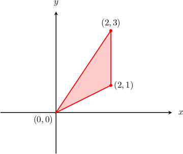
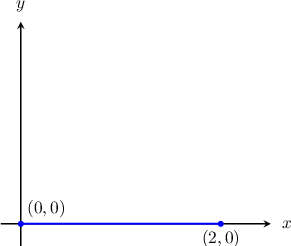
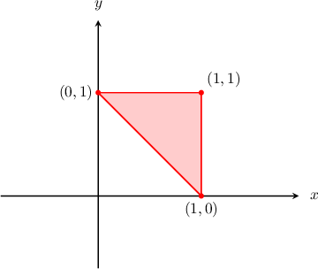
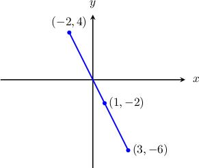
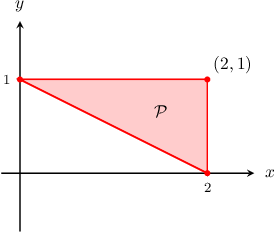
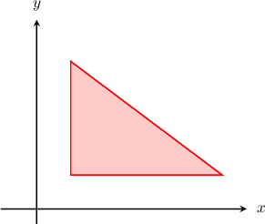

# Singular Linear Transformations in the Plane

Source: https://www.mathacademy.com/topics/1351?courseId=136
Topic ID: 1351

## Prerequisites

- [Inverting Linear Transformations](./988-inverting-linear-transformations.md)
- [Area Scale Factors of Linear Transformations](./989-area-scale-factors-of-linear-transformations.md)

## Lesson

### Introduction

Consider the triangle below with vertices $(0,0),$ $(2,1)$ and $(2,3).$

What is the image of this triangle under the action of the transformation $\mathbf{T}$ represented by the matrix

$$

[\begin{aligned}1 & 0 \\ 0 & 0\end{aligned}]

$$

To find the image of the triangle under the action of $\mathbf T,$ we first create a matrix $X$ containing all vertices of our triangle written as columns:

$$

[\begin{aligned}0 & 2 & 2 \\ 0 & 1 & 3\end{aligned}]

$$

Now, we compute the image of $X$ under the action of $\mathbf T$ by calculating the matrix product $TX\mathbin{:}$

$$

\begin{aligned}𝑇𝑋 & =[\begin{aligned}1 & 0 \\ 0 & 0\end{aligned}][\begin{aligned}0 & 2 & 2 \\ 0 & 1 & 3\end{aligned}] \\ & =[\begin{aligned}0 & 2 & 2 \\ 0 & 0 & 0\end{aligned}]\end{aligned}

$$

Therefore, the coordinates of the image's vertices are $(0,0),$ $(2,0),$ $(2,0).$ Notice that these points lie on the same line. Two of them even coincide!

So, the image of our triangle under the action of $\mathbf T$ is the following line segment:

Note the following:

- Recall that for any linear transformation $\mathbf T$ and region $D,$ we have Since $|\det(T)| = 0$ in this case, any object applied to $\mathbf T$ collapses to an object with zero area.

- Also, the fact that $|\det(T)| = 0$ tells us that $\mathbf T$ has no inverse transformation. Therefore, it is impossible to recover the original triangle knowing only its image and the matrix $T.$

### Example: Calculating the Coordinates of an Image Formed by a Singular Transformation

#### Question

Consider the linear transformation $\mathbf T$ with matrix representation $T,$ given by

$$

[\begin{aligned}2 & 0 \\ 0 & 0\end{aligned}]

$$

A triangle $S$ has vertices at $(-1,2), (0,1)$ and $(1,1).$ Which of the following are coordinates of the vertices of $S',$ the image of $S$ under the action of $\mathbf T?$

1. $(-2,0)$

2. $(0,0)$

3. $(2,0)$

#### Explanation

To find the image of $S$ under the action of $\mathbf T$, we first create a matrix $X$ containing all of the vertices of $S\mathbin{:}$

$$

[\begin{aligned}−1 & 0 & 1 \\ 2 & 1 & 1\end{aligned}]

$$

Now, we compute the image of $X$ under $\mathbf T$ by calculating the matrix product $TX\mathbin{:}$

$$

\begin{aligned}𝑇𝑋 & =[\begin{aligned}2 & 0 \\ 0 & 0\end{aligned}][\begin{aligned}−1 & 0 & 1 \\ 2 & 1 & 1\end{aligned}] \\ & =[\begin{aligned}−2 & 0 & 2 \\ 0 & 0 & 0\end{aligned}]\end{aligned}

$$

Therefore, the coordinates of the respective vertices of $S'$ are $(-2,0),$ $(0,0),$ and $(2,0).$

So, the correct answer is "I, II, and III."

### Example: Determining the Image of an Object Formed by a Singular Transformation

#### Question

Consider the linear transformation $\mathbf T$ with matrix representation $T,$ given by

$$

[\begin{aligned}3 & −2 \\ −6 & 4\end{aligned}]

$$

Find the image of the triangle shown below under the action of $\mathbf T.$

#### Explanation

To find the image of the triangle under the action of $\mathbf T$, we first create a matrix $X$ containing all of the vertices of the triangle:

$$

[\begin{aligned}1 & 1 & 0 \\ 0 & 1 & 1\end{aligned}]

$$

Now, we compute the image of $X$ under the action of $\mathbf T$ by calculating the matrix product $TX\mathbin{:}$

$$

\begin{aligned}𝑇𝑋 & =[\begin{aligned}3 & −2 \\ −6 & 4\end{aligned}][\begin{aligned}1 & 1 & 0 \\ 0 & 1 & 1\end{aligned}] \\ & =[\begin{aligned}3 & 1 & −2 \\ −6 & −2 & 4\end{aligned}]\end{aligned}

$$

Therefore, the coordinates of the image's vertices are $(3,-6), (1,-2),$ and $(-2,4).$ Notice that all three points lie on the same line.

### Image Types Formed by Linear Transformations

Given a linear transformation $\mathbf T$ with an associated $2\times 2$ matrix $T,$ there are three possibilities regarding the type of object formed under the action of $\mathbf{T}$ by a two-dimensional preimage.

To demonstrate, consider the three-sided polygon $\mathcal P$ with vertices $(0,1)$, $(2,0)$ and $(2,1),$ as shown below.

Let's describe the three possible types of object formed by the image of $\mathcal P{:}$

- Case where $T$ is non-singular: Let $\mathbf T$ be the linear transformation with the following matrix representation: We can easily check that $T$ is non-singular by computing its determinant: To find the image of $\mathcal P$ under the action of $\mathbf T$, we create a matrix $X$ containing all of the vertices of $\mathcal P$ and then compute the product $TX{:}$ Therefore, the image of $\mathcal P$ under the action of $\mathbf{T}$ is a triangle.

- Case where $\mathbf{T}$ is singular and has at least one nonzero entry: Let $\mathbf T$ be the linear transformation with the following matrix representation: We can easily check that $T$ is singular by computing its determinant: Now, computing the image of $\mathcal P$ under the action of $\mathbf T,$ we get Consequently, the image of $\mathcal P$ under the action of $\mathbf{T}$ is a line segment.

- Case where $T$ is the zero matrix: Let $\mathbf T$ be the linear transformation represented by the zero matrix: Clearly, $T$ is singular. Now, computing the image of $\mathcal P$ under the action of $\mathbf T$, we get Therefore, the coordinates of the image's vertices are all $(0,0)$, the origin $O$ of the coordinate system.

### A Summary of Image Types

In general, for any linear transformation $\mathbf{T}$ with associated $2 \times 2$ matrix $T,$ we have one of the following three possibilities:

- If $\mathbf{T}$ is non-singular, i.e., $\det(T) \neq 0,$ then the image of a two-dimensional object is a two-dimensional object. In particular, the image of a polygon with $n$ vertices is a polygon with $n$ vertices.

- If $\mathbf{T}$ is singular, i.e., $\det(T) = 0,$ we have two additional subcases: If $T$ has at least one nonzero entry, then the image of a two-dimensional object is a one-dimensional line segment. If $T$ is the zero matrix, then the image of a two-dimensional object is the point $(0,0),$ the origin of the coordinate system.

### Example: Identifying the Type of Image Formed by a Linear Transformation

#### Question

Consider the linear transformation $\mathbf T$ with matrix representation $T,$ given by

$$

[\begin{aligned}0 & 0 \\ 0 & 0\end{aligned}]

$$

What would be the image of the triangle shown above under the action of $\mathbf{T}?$

#### Explanation

Recall that for any linear transformation $\mathbf{T}$ with associated $2 \times 2$ matrix $T,$ we have one of the following three possibilities:

- If $\mathbf{T}$ is non-singular, i.e., $\det(T) \neq 0,$ then the image of a two-dimensional object is a two-dimensional object. In particular, the image of a polygon with $n$ vertices is a polygon with $n$ vertices.

- If $\mathbf{T}$ is singular, i.e., $\det(T) = 0,$ we have two additional subcases: If $T$ has at least one nonzero entry, then the image of a two-dimensional object is a one-dimensional line segment. If $T$ is the zero matrix, then the image of a two-dimensional object is the point $(0,0),$ the origin of the coordinate system.

Since $T$ is the zero matrix, the image of our object under the action of $\mathbf{T}$ is the origin.
