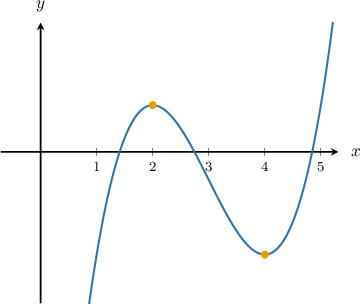
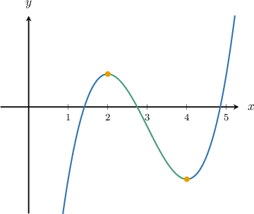
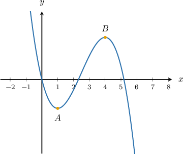
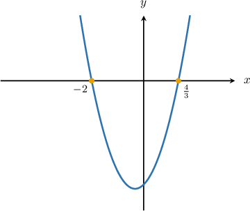
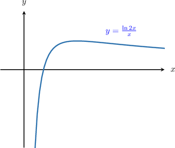
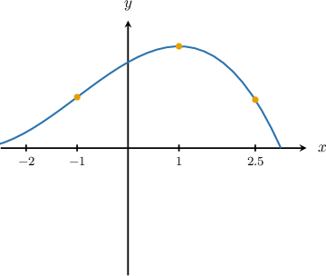

# Determining Intervals on Which a Function Is Increasing or Decreasing

Source: https://www.mathacademy.com/topics/1359?courseId=136
Topic ID: 1359

## Prerequisites

- [Using Differentiation to Calculate Critical Points](./752-using-differentiation-to-calculate-critical-points.md)
- [Solving Polynomial Inequalities Using a Graphical Method](./2147-solving-polynomial-inequalities-using-a-graphical-method.md)
- [Solving Inequalities Involving Exponential Functions and Polynomials](./2859-solving-inequalities-involving-exponential-functions-and-polynomials.md)

## Lesson

### Introduction

Consider the graph of the continuous function $y=f(x)$ below. How can we determine the intervals where $f'(x)$ is positive or negative?

The first step is to identify the points where the derivative is zero. Here, the critical points are $x=2$ (a local maximum) and $x=4$ (a local minimum), and $f'(x) = 0$ at these points.

The next step is to identify where the function is increasing and decreasing. Below, the intervals where $f(x)$ is increasing are shown in blue, and the intervals where $f(x)$ is decreasing are shown in green.

Since we know where the function is increasing or decreasing, we can determine where $f'(x)$ is positive or negative.

- When $f(x)$ is strictly increasing, the slopes of the tangent lines are positive, so we have

- When $f(x)$ is strictly decreasing, the slopes of the tangent lines are negative, so we have

The information about $f'(x)$ can be summarized in the following table:

$$

\begin{aligned}𝑥 & (−∞,2) & 2 & (2,4) & 4 & (4,+∞) \\ 𝑓 & ↗ & max & ↘ & min & ↗ \\ 𝑓^{′} & + & 0 & − & 0 & +\end{aligned}

$$

In other words,

- $f'(x)>0$ on $(-\infty,2) \cup (4,+\infty),$ while

- $f'(x)<0$ on $(2,4).$

### Example: Determining Intervals on Which the Derivative of a Graphed Function Is Positive or Negative

#### Question

The graph of the continuous function $y=f(x)$ is shown below. The points $A$ and $B$ lie on the curve and have $x$-coordinates $x=1$ and $x=4.$ Given that $f'(x) = 0$ at both $A$ and $B,$ find the intervals where $f'(x)>0.$

#### Explanation

We have $f'(x)=0$ at the critical points $A$ and $B.$ Note the following:

- If $f(x)$ is strictly increasing, then $f'(x)>0.$

- If $f(x)$ is strictly decreasing, then $f'(x)<0.$

The information about $f'(x)$ can be summarized in the following table:

$$

\begin{aligned}𝑥 & (−∞,1) & 1 & (1,4) & 4 & (4,+∞) \\ 𝑓 & ↘ & min & ↗ & max & ↘ \\ 𝑓^{′} & − & 0 & + & 0 & −\end{aligned}

$$

Therefore, $f'(x)>0$ on the interval $(1,4).$

### Calculating Intervals on Which a Function Is Increasing or Decreasing Using Differentiation

To determine whether a function $f(x)$ is increasing or decreasing, we can calculate the derivative and then solve the appropriate inequality.

- To find where $f(x)$ is strictly increasing, we solve the inequality $f'(x)>0.$

- To find where $f(x)$ is strictly decreasing, we solve the inequality $f'(x) < 0.$

### Example: Determining the Intervals on Which a Function Is Decreasing Using Differentiation

#### Question

Find the values of $x$ for which the function $f(x) = x^3 + x^2 - 8x$ is strictly decreasing.

#### Explanation

To find where $f(x)$ is strictly decreasing, we need to solve the inequality $f'(x) < 0.$

Differentiating $f(x),$ we get

$$

\begin{aligned}𝑓^{′}(𝑥) & =3𝑥^{2}+2𝑥−8,\end{aligned}

$$

so we need to solve the inequality

$$

\begin{aligned}3𝑥^{2}+2𝑥−8<0.\end{aligned}

$$

The above inequality factors as

$$

3(x + 2)\left(x -\dfrac 4 3\right) < 0,

$$

and the graph of $y=3(x+2)\left(x -\dfrac 4 3\right)$ has roots at $x=-2$ and $x=\dfrac 4 3,$ as shown below.

The graph is negative on the interval $\left(-2, \dfrac{4}{3} \right)$ between the roots, so we conclude that $f'(x) < 0$ on the interval $\left(-2, \dfrac{4}{3} \right).$

Therefore, $f(x)$ is strictly decreasing on the interval $\left(-2, \dfrac{4}{3} \right).$

### Example: Determining the Intervals on Which a Function Is Increasing Using Differentiation

#### Question

Find the values of $x$ for which the function $f(x)=\dfrac{\ln{2x}}{x}$ (plotted below) is strictly increasing.

#### Explanation

To find where $f(x)$ is strictly increasing, we need to solve the inequality $f'(x) > 0.$

Differentiating $f(x)$ using the quotient rule, we get

$$

\begin{aligned}𝑓^{′}(𝑥) & =\frac{(\frac{1}{𝑥})⋅𝑥−ln⁡(2𝑥)⋅1}{𝑥} \\ & =\frac{1−ln⁡2𝑥}{𝑥^{2}},\end{aligned}

$$

so we need to solve the inequality

$$

\dfrac{1-\ln{2x}}{x^2} > 0.

$$

The denominator is always positive, so this reduces to

$$

\begin{aligned}1−ln⁡2𝑥>0\,⟹\,ln⁡2𝑥<1.\end{aligned}

$$

Solving $\ln{2x} = 1$ gives the critical point

$$

2x = e\quad \Longrightarrow\quad x = \dfrac{1}{2}e.

$$

From the graph, we see that this critical point is a maximum. We also see that the slope of the tangent lines is positive to the left of the critical point and negative to the right of the critical point.

We summarize this information in the following table:

$$

\begin{aligned}𝑥 & (0,\frac{1}{2}𝑒) & \frac{1}{2}𝑒 & (\frac{1}{2}𝑒,∞) \\ 𝑓 & ↗ & max & ↘ \\ 𝑓^{′} & + & 0 & −\end{aligned}

$$

Finally, we conclude that the function is strictly increasing on the interval $\left(0,\frac 1 2 e\right),$ which can also be written as $0 < x < \dfrac 1 2 e.$

### Example: Comparing Slopes of Functions at Different Points

#### Question

Consider the graph of $y=f(x)$ below.

Which of the following statements is true?

1. $f'(2.5) < f'(1) < f'(-1)$

2. $f'(-1) < f'(1) < f'(2.5)$

3. $f'(1) < f'(-1) < f'(2.5)$

#### Explanation

From the graph, we see that

- the slope of the tangent at $x=-1$ is positive, so $f'(-1) > 0.$

- the slope of the tangent at $x=1$ is zero, so $f'(1) = 0.$

- the slope of the tangent at $x=2.5$ is negative, and so $f'(2.5) < 0.$

Therefore, only statement I is correct.
