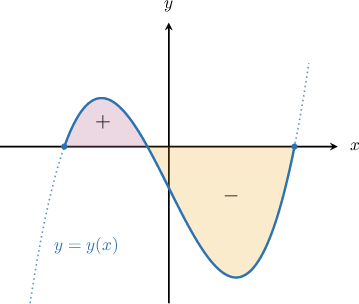
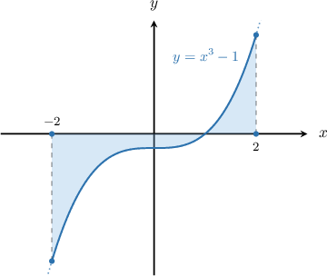
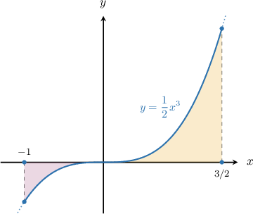
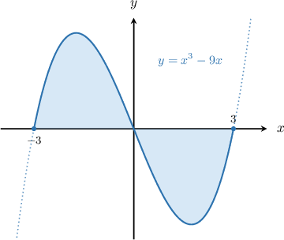

# Finding the Area Between a Curve and the X-Axis When They Intersect

Source: https://www.mathacademy.com/topics/1432?courseId=136
Topic ID: 1432

## Prerequisites

- [Factoring Higher-Order Polynomials as a Difference of Squares](../../../high-school/traditional/lessons/algebra-ii/660-factoring-higher-order-polynomials-as-a-difference-of-squares.md)
- [The Area Bounded by a Curve and the X-Axis](./1040-the-area-bounded-by-a-curve-and-the-x-axis.md)
- [Solving Equations With Even Exponents Using the Nth Root Method](../../../high-school/traditional/lessons/algebra-i/1587-solving-equations-with-even-exponents-using-the-nth-root-method.md)
- [Graphing General Polynomials](../../../high-school/traditional/lessons/algebra-ii/2049-graphing-general-polynomials.md)
- [Solving Equations With Odd Exponents Using the Nth Root Method](../../../high-school/traditional/lessons/algebra-i/3748-solving-equations-with-odd-exponents-using-the-nth-root-method.md)

## Lesson

### Introduction

When we compute the area between a curve $y=y(x)$ and the $x$-axis using integration, we must bear the following in mind:

- definite integrals that correspond to areas above the $x$-axis are positive,

- definite integrals that correspond to areas below the $x$-axis are negative.

The facts above become crucial when we attempt to find the area bounded by a curve that crosses the $x$-axis.

### Example: Constructing an Integral That Gives the Area Bounded by a Curve

#### Question

The total area $A$ of the region between the curve $y=x^3-1$ and the $x$-axis from $x=-2$ to $x=2$ is given by the integral expression below. What is the value of $a?$

$$

A = \displaystyle -\int_{-2}^{a} (x^3-1) \:\textrm{d}x + \int_{a}^{2} (x^3-1) \:\textrm{d}x

$$

#### Explanation

To determine the missing limit of integration, we need to find the $x$-intercept of the curve $y=x^3-1.$ So, we set $y=0$ and solve for $x$ as follows:

$$

\begin{aligned}𝑦 & =𝑥^{3}−1 \\ (0) & =𝑥^{3}−1 \\ 𝑥^{3} & =1 \\ 𝑥 & =1.\end{aligned}

$$

Since $1 \in [-2,2]$, we have two regions:

- The area between the curve and the $x$-axis from $x=-2$ to $x={\color{blue}{1}}.$

- The area between the curve and the $x$-axis from $x={\color{blue}{1}}$ to $x=2.$

So, $a={\color{blue}1}$ and the final expression will be

$$

A = \displaystyle -\int_{-2}^{\color{blue}1} (x^3-1) \:\textrm{d}x + \int_{\color{blue}1}^{2} (x^3-1) \:\textrm{d}x.

$$

### Example: Finding the Total Area Bounded Between the X-Axis and a Curve

#### Question

Find the total area of the region between the curve $y=\dfrac{1}{2}x^3$ and the $x$-axis from $x=-1$ to $x=\dfrac{3}{2}.$

#### Explanation

First, we find the intersections of the curve with the $x$-axis:

$$

\begin{aligned}\frac{1}{2}𝑥^{3} & =0 \\ 𝑥^{3} & =0 \\ 𝑥 & =0.\end{aligned}

$$

Since $0 \in \left[-1,\dfrac{3}{2}\right]$, we have two regions:

- The area between the curve and the $x$-axis from $x=-1$ to $x=0.$

- The area between the curve and the $x$-axis from $x=0$ to $x=\dfrac{3}{2}.$

Notice that for $x \in [-1,0]$ the region lies completely below the $x$-axis. Hence, the value of

$$

\int_{a}^{b} y(x) \:\textrm{d}x = \int_{-1}^{0} \dfrac{x^3}{2} \:\textrm{d}x

$$

will be negative. Therefore, the area that we want is given by

$$

A_1 = -\int_{-1}^{0} \dfrac{x^3}{2} \:\textrm{d}x .

$$

For $x \in\left[0,\dfrac{3}{2}\right]$, we have

$$

A_2 = \int_{0}^{3/2}\dfrac{x^3}{2} \:\textrm{d}x.

$$

The total area is

$$

A = A_1+A_2 = - \int_{-1}^{0} \dfrac{x^3}{2} \:\textrm{d}x + \int_{0}^{3/2} \dfrac{x^3}{2} \:\textrm{d}x .

$$

Finally, we carry out the integration:

$$

\begin{aligned}𝐴 & =−∫_{0−1}^{}\frac{𝑥^{3}}{2}\,d𝑥+∫_{3/20}^{}\frac{𝑥^{3}}{2}\,d𝑥 \\ & =−[\frac{𝑥^{4}}{8}]_{0−1}^{}+[\frac{𝑥^{4}}{8}]_{3/20}^{} \\ & =−[0−\frac{1}{8}]+[\frac{81}{128}−0] \\ & =\frac{1}{8}+\frac{81}{128} \\ & =\frac{97}{128}\end{aligned}

$$

### Example: Finding the Total Area Bounded By a Curve When It Crosses the X-Axis Several Times

#### Question

Find the total area of the region between the curve $y=x^3-9x$ and the $x$-axis from $x=-3$ to $x=3.$

#### Explanation

First, we find the intersections of the curve with the $x$-axis:

$$

\begin{aligned}𝑥^{3}−9𝑥 & =0 \\ 𝑥(𝑥^{2}−9) & =0 \\ 𝑥(𝑥−3)(𝑥+3) & =0\end{aligned}

$$

Therefore, $x=0,$ $x=-3,$ and $x=3$ are our real solutions. Since $0 \in [-3,3]$, we have two regions:

- The area between the curve and the $x$-axis from $x=-3$ to $x=0.$

- The area between the curve and the $x$-axis from $x=0$ to $x=3.$

For $x \in [-3,0]$, we obtain

$$

\begin{aligned}𝐴_{1} & =∫_{𝑏𝑎}^{}𝑦(𝑥)\,d𝑥 \\ & =∫_{0−3}^{}(𝑥^{3}−9𝑥)\,d𝑥 \\ & =∫_{0−3}^{}𝑥^{3}\,d𝑥−9∫_{0−3}^{}𝑥\,d𝑥 \\ & =\frac{𝑥^{4}}{4}_{0−3}^{}−\frac{9𝑥^{2}}{2}_{0−3}^{} \\ & =[0−\frac{(−3)^{4}}{4}]−9[0−\frac{(−3)^{2}}{2}] \\ & =−\frac{81}{4}+\frac{81}{2} \\ & =\frac{81}{4}.\end{aligned}

$$

Notice that for $x \in [0,3]$ the region lies completely below the $x$-axis. Hence, the value of

$$

\int_{a}^{b} y(x) \:\textrm{d}x = \int_{0}^{3} \left(x^3-9x\right) \:\textrm{d}x

$$

will be negative. Therefore, the area that we want is given by

$$

\begin{aligned}𝐴_{2} & =−∫_{30}^{}(𝑥^{3}−9𝑥)\,d𝑥 \\ & =−∫_{30}^{}𝑥^{3}\,d𝑥+9∫_{30}^{}𝑥\,d𝑥 \\ & =−\frac{𝑥^{4}}{4}_{30}^{}+\frac{9𝑥^{2}}{2}_{30}^{} \\ & =−[\frac{(3)^{4}}{4}−0]+9[\frac{(3)^{2}}{2}−0] \\ & =−\frac{81}{4}+\frac{81}{2} \\ & =\frac{81}{4}.\end{aligned}

$$

Finally, the total area is

$$

A = A_1+A_2 = \dfrac{81}{4} + \dfrac{81}{4} = \dfrac{81}{2}.

$$
