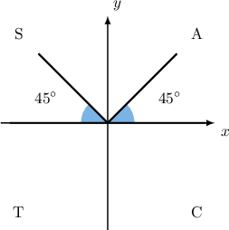
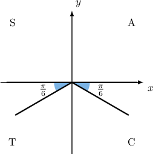
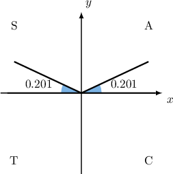

# Elementary Trigonometric Equations Containing Cosecant

Source: https://www.mathacademy.com/topics/1566?courseId=136
Topic ID: 1566

## Prerequisites

- [Elementary Trigonometric Equations Containing Sine](./913-elementary-trigonometric-equations-containing-sine.md)
- [Graphing Secant and Cosecant](../../../high-school/traditional/lessons/algebra-ii/1573-graphing-secant-and-cosecant.md)

## Lesson

### Introduction

Suppose we want to solve the equation

$$

\csc x = \sqrt{2}, \qquad 0^\circ \leq x < 360^\circ.

$$

Most calculators don't have an $\textrm{arccsc}$ button, so we can't get a principal value immediately. However, by rewriting the equation in terms of $\sin x,$ we can get a principal value:

$$

\begin{aligned}csc⁡𝑥 & =\sqrt{√2} \\ \frac{1}{sin⁡𝑥} & =\sqrt{√2} \\ sin⁡𝑥 & =\frac{1}{\sqrt{√2}}\end{aligned}

$$

Now, we can proceed as usual. Our principal value is

$$

x = \arcsin \left(\dfrac{1}{\sqrt{2}} \right)= 45^\circ.

$$

Since $45^\circ$ lies inside the required domain, our first solution is $x_1=45^\circ.$ It is in the first quadrant and has a reference angle $\theta_R = 45^\circ.$

Since $\sin{x} > 0,$ the second solution must lie in the second quadrant, and it also has a reference angle $\theta_R = 45^\circ.$

Since the second solution $x_2$ lies in the $2$nd quadrant, we can find it using the reference angle as follows:

$$

x_2 = 180^\circ - 45^\circ = 135^\circ .

$$

So, the solutions are $x=45^\circ, 135^\circ.$

### Example: Solving Trigonometric Equations Involving Cosecant with Special Angles

#### Question

Solve the equation $2\csc x+4=0$ for $0 < x < 2\pi.$

#### Explanation

First, we rearrange the equation, isolating $\csc {x} \mathbin{:}$

$$

\begin{aligned}2csc⁡𝑥+4 & =0 \\ 2csc⁡𝑥 & =−4 \\ csc⁡𝑥 & =−2.\end{aligned}

$$

Recall that $\csc{x} = \dfrac{1}{\sin{x}}.$ Therefore the given equation is equivalent to

$$

\sin{x} = \dfrac{1}{(-2)} = -\frac{1}{2}.

$$

Now, we find the principal value:

$$

x = \arcsin\left(-\dfrac{1}{2}\right) = -\dfrac{\pi}{6}

$$

This value is outside the required domain $0 < x < 2\pi.$ To get a value inside the required domain, we add $2\pi\mathbin{:}$

$$

x_1 = x + 2\pi = -\dfrac \pi 6 + 2\pi = \dfrac{11\pi}6

$$

So, our first solution is $x_1 = \dfrac{11\pi}6.$

Our first solution lies in the fourth quadrant and has a reference angle of $\theta_R = \dfrac{\pi}{6}.$ Since $\sin{x}< 0,$ the second solution must lie in the third quadrant, and it also has a reference angle $\theta_R = \dfrac{\pi}{6}.$

Since the second solution $x_2$ lies in the $3$rd quadrant, we can find it using the reference angle as follows:

$$

\begin{aligned}𝑥_{2} & =𝜋+𝜃_{𝑅} \\ & =𝜋+\frac{𝜋}{6} \\ & =\frac{7𝜋}{6}\end{aligned}

$$

So, the solutions are $x=\dfrac{7\pi}{6}, \dfrac{11\pi}{6}.$

### Example: Solving Trigonometric Equations Involving Cosecant with Non-Special Angles

#### Question

Find, in radians to $1$ decimal place, all of the solutions to the equation $\dfrac{\csc x}{5} -1 = 0$ for $0 \leq x < 2\pi.$

#### Explanation

First, we rearrange the equation, isolating $\csc {x} \mathbin{:}$

$$

\begin{aligned}\frac{csc⁡𝑥}{5}−1 & =0 \\ \frac{csc⁡𝑥}{5} & =1 \\ csc⁡𝑥 & =5\end{aligned}

$$

Recall that $\csc{x} = \dfrac{1}{\sin{x}},$ therefore the given equation is equivalent to

$$

\sin{x} = \frac{1}{5}.

$$

Now, we find the principal value:

$$

\begin{aligned}𝑥=arcsin⁡(\frac{1}{5})=0.201\,357…≈0.201\end{aligned}

$$

Since $0.201$ lies inside the given domain, our first solution is $x_1 = 0.201.$

Our first solution lies in the first quadrant and has a reference angle of $\theta_R = 0.201.$ Since $\sin{x} > 0,$ the second solution must lie in the second quadrant, and it also has a reference angle $\theta_R = 0.201.$

Since the second solution $x_2$ lies in the $2$nd quadrant, we can find it using the reference angle as follows:

$$

\begin{aligned}𝑥_{2} & =𝜋−𝜃_{𝑅} \\ & =𝜋−0.201 \\ & ≈2.941\end{aligned}

$$

So, the solutions (rounded to one decimal place) are $x = 0.2, 2.9.$

### Solving a Trigonometric Equation Involving Cosecant Under a Modified Domain

The same method also works for solving an equation involving the cosecant function over a modified domain. Let's solve

$$

\csc x = \sqrt{2}, \qquad -360^\circ < x < 360^\circ.

$$

Recall that $\csc{x} = \dfrac{1}{\sin{x}}.$ Therefore, the given equation is equivalent to

$$

\sin{x} = \frac{1}{\sqrt 2}.

$$

Now, we find a principal value:

$$

x = \arcsin \left(\dfrac{1}{\sqrt{2}} \right)= 45^\circ.

$$

Since $45^\circ$ lies inside the required domain, our first solution is ${\color{red}x_1}=45^\circ.$ It is in the first quadrant and has a reference angle $\theta_R = 45^\circ.$

Since $\sin{x} > 0,$ the second solution must lie in the second quadrant, and it also has a reference angle $\theta_R = 45^\circ.$

Since the second solution $\color{blue}x_2$ lies in the $2$nd quadrant, we can find it using the reference angle as follows:

$$

{\color{blue}x_2} = 180^\circ - 45^\circ = 135^\circ

$$

However, we're not done yet. The domain $-360^\circ < x < 360^\circ$ is larger than one period, so there are more than two solutions.

To get the remaining solutions in the desired domain, we need to find angles that are coterminal with ${\color{red}x_1}$ or ${\color{blue}x_2}.$ So, we subtract integer multiples of $360^\circ$ until all possible solutions are found:

$$

\begin{aligned}𝑥_{3} & =𝑥_{1}−360^{∘}=45^{∘}−360^{∘}=−315^{∘} \\ 𝑥_{4} & =𝑥_{2}−360^{∘}=135^{∘}−360^{∘}=−225^{∘}\end{aligned}

$$

Adding or subtracting any more multiples of $360^\circ$ would result in solutions outside the desired domain. So, we have found all the solutions.

Therefore, the solutions are $x= 45^\circ, 135^\circ, -315^\circ, -225^\circ.$

### Example: Solving Trigonometric Equations Involving Cosecant Under a Modified Domain

#### Question

Solve the equation $2\csc x + 4 = 0$ for $0 < x \leq \dfrac{7\pi}{2}.$

#### Explanation

First, we rearrange the equation, isolating $\csc {x} \mathbin{:}$

$$

\begin{aligned}2csc⁡𝑥+4 & =0 \\ 2csc⁡𝑥 & =−4 \\ csc⁡𝑥 & =−2.\end{aligned}

$$

Recall that $\csc{x} = \dfrac{1}{\sin{x}}.$ Therefore, the given equation is equivalent to

$$

\sin{x} = \dfrac{1}{(-2)} = -\frac{1}{2}.

$$

Now, we find the principal value:

$$

x = \arcsin\left(-\dfrac{1}{2}\right) = -\dfrac{\pi}{6}

$$

This value is outside the required domain. To get a value inside the required domain, we add $2\pi.$

$$

x_1 = x+2\pi = -\dfrac{\pi}{6} + 2\pi = \dfrac{11\pi}6.

$$

So, our first solution is $x_1 = \dfrac{11\pi}{6}.$

Our first solution lies in the fourth quadrant and has a reference angle of $\theta_R = \dfrac{\pi}{6}.$ Since $\sin{x}<0,$ the second solution must lie in the third quadrant, and it also has a reference angle $\theta_R =\dfrac{\pi}{6}.$

Since the second solution $x_2$ lies in the $2$nd quadrant, we can find it using the reference angle as follows:

$$

\begin{aligned}𝑥_{2} & =𝜋+𝜃_{𝑅} \\ & =𝜋+\frac{𝜋}{6} \\ & =\frac{7𝜋}{6}\end{aligned}

$$

To get the remaining solutions in the given interval, we need to find angles that are coterminal with $x_1$ or $x_2.$ To do this, we add integer multiples of $2\pi$ until all solutions are found:

$$

\begin{aligned}𝑥_{3} & =𝑥_{1}+2𝜋=\frac{11𝜋}{6}+2𝜋=\frac{23𝜋}{6} \\ 𝑥_{4} & =𝑥_{2}+2𝜋=\frac{7𝜋}{6}+2𝜋=\frac{19𝜋}{6}\end{aligned}

$$

Note that $\dfrac{23\pi}{6}$ is outside the required domain, so we ignore it.

Therefore, the solutions are $x=\dfrac{7\pi}{6},\dfrac{11\pi}{6}, \dfrac{19\pi}{6}.$

### Equations Involving the Cosecant Function With No Solutions

Can we find any solutions to the equation

$$

\csc{x} = \dfrac{1}{2}, \qquad 0 \leq x < 2\pi?

$$

Recall that $\csc{x}= \dfrac{1}{\sin{x}}.$ Therefore, the given equation is equivalent to

$$

\sin{x} = 2.

$$

This equation has no solution because we always have $-1 \leq \sin{x} \leq 1,$ and the number $2$ is outside of this range. Therefore, $\csc{x} = \dfrac{1}{2}$ has no solution.

In general, when $-1 < a < 1$, there are no values of $x$ such that $\csc x = a.$

### Example: Solving Trigonometric Equations Outside of the Range of Cosecant

#### Question

Solve the equation $\csc{x} = \dfrac{2}{5}$ for $-2\pi \leq x < 2\pi.$

#### Explanation

Recall that $\csc{x} = \dfrac{1}{\sin{x}}.$ Therefore, the given equation is equivalent to

$$

\sin{x} =\dfrac{5}{2}.

$$

The equation above has no solution because the sine function always satisfies $-1 \leq \sin{x} \leq 1,$ and the value $\dfrac{5}{2}$ is outside of this range.

Therefore, the equation $\csc{x} = \dfrac{2}{5}$ has no solution.
