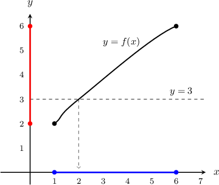
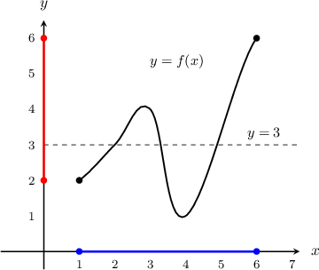
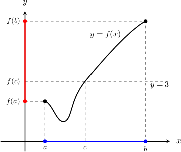
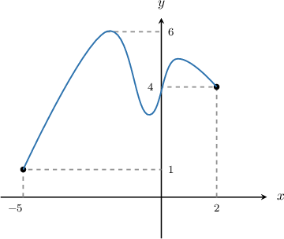
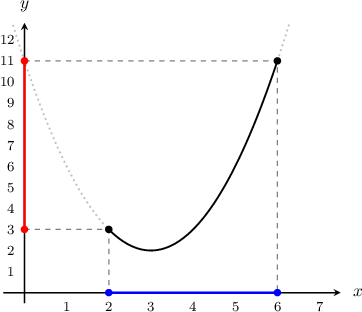
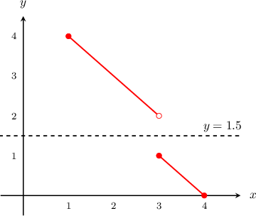

# The Intermediate Value Theorem

Source: https://www.mathacademy.com/topics/2150?courseId=136
Topic ID: 2150

## Prerequisites

- [Continuity of Functions](./2006-continuity-of-functions.md)

## Lesson

### Introduction

The **intermediate value theorem (IVT)** states that:

*If $f(x)$ is continuous on $\color{blue}[a,b],$ and $k$ is a number between $\color{red}{f(a)}$ and $\color{red}{f(b)}$ inclusively, then there exists a number $c \in \color{blue}{[a,b]}$ such that $f(c)=k.$*

The intuition behind the IVT is that if a function is continuous between two inputs, then between those two inputs, we must be able to draw the function without picking up our pen off the page, so the function must cover all values between the two corresponding outputs.

The IVT is often used to prove that some equation has a solution. For example, if we want to prove that there is a solution to $f(x)=3,$ and we know that $f(x)$ is a continuous function with $f({\color{blue}{1}})={\color{red}{2}}$ and $f({\color{blue}{6}})={\color{red}{6}},$ then the IVT tells us that there exists some solution $c \in \color{blue}{[1,6]}$ such that $f(c)=3.$

We can gain further intuition by visualizing the situation. First, let's plot what $y=f(x)$ *might* look like.

For this particular $f(x)$ there is one solution to $f(x)=3$, which is $x\approx 2.$ Note that our solution lies inside the interval $\color{blue}[1,6].$

Now let's consider another *possible* $f(x).$

This time, there are three solutions to $f(x)=3$ which lie in the interval $\color{blue}[1,6].$

We can keep changing our $f(x),$ but no matter how we draw it, we will always have some solution to $f(x)=3$ which lies in the interval $\color{blue}[1,6].$

### Example: Completing a Statement On the Intermediate Value Theorem

#### Question

The function $y=f(x)$ above is defined and continuous on the closed interval $x\in [-5,2].$ By filling the blank spaces in the sentence below, complete the statement of the intermediate value theorem:

**

#### Explanation

The function $f(x)$ is continuous on $[-5,2],$ so the intermediate value theorem guarantees that $f(x)=k$ has a solution for each value of $k$ between $f(-5)$ and $f(2).$

Since $f(-5)=1$ and $f(2)=4$, we must have $k\in[1,4].$

Therefore, the missing part is "$1$ and $4$". The complete sentence is:

**

### Example: Selecting a Specific Value For Which a Solution Is Guaranteed

#### Question

Consider the function $f(x)=(x-3)^2+2.$ According to the intermediate value theorem, for which values of $k$ does the equation $f(x)=k$ have a guaranteed solution on the interval $[2,6]?$

#### Explanation

Let's start by plotting the function.

The function $f(x)$ is continuous on $[2,6],$ so the intermediate value theorem guarantees that $f(x)=k$ has a solution for each value of $k$ between $f(2)$ and $f(6).$

Since $f(2)=3$ and $f(6)=11$, we must have $k\in[3,11].$

**** According to the graph of this particular function, $f(x)=k$ may have solutions for $k < 3,$ but these are ** guaranteed by the intermediate value theorem. The theorem only guarantees the solutions for $k$ between $f(a)$ and $f(b).$

### Example: Determining the Number of Solutions Given a Table of Values of a Continuous Function

#### Question

The function $g(x)$ is continuous over $x\in[-2,2].$ Some values of $g(x)$ are given in the table below.

What is the smallest possible number of solutions to the equation $g(x)=-2?$

#### Explanation

Since $g$ is a continuous function on $[-2,2]$, we can apply the intermediate value theorem (IVT) in any subinterval of $[-2,2].$

So, we will go through each subinterval of $[-2,2]$ and check if the IVT guarantees a solution to the equation $g(x)=-2$ on this interval.

- On the subinterval $[{\color{blue}-2},{\color{blue}-1}],$ we have $g({\color{blue}-2})={\color{red}4}$ and $g({\color{blue}-1})={\color{red}-1}.$ Since $-2 \not \in [{\color{red}-1},{\color{red}4}],$ the IVT does ** guarantee a solution to the equation $g(x)=-2$ on this subinterval.

- On the subinterval $[{\color{blue}-1},{\color{blue}0}],$ we have $g({\color{blue}-1})={\color{red}-1}$ and $g({\color{blue}0})={\color{red}-3}.$ Since $-2 \in [{\color{red}-3},{\color{red}-1}],$ the IVT ** guarantee a solution to the equation $g(x)=-2$ on this subinterval.

- On the subinterval $[{\color{blue}0},{\color{blue}1}],$ we have $g({\color{blue}0})={\color{red}-3}$ and $g({\color{blue}1})={\color{red}5}.$ Since $-2 \in [{\color{red}-3},{\color{red}5}],$ the IVT ** guarantee a solution to the equation $g(x)=-2$ on this subinterval.

- On the subinterval $[{\color{blue}1},{\color{blue}2}],$ we have $g({\color{blue}1})={\color{red}5}$ and $g({\color{blue}2})={\color{red}3}.$ Since $-2 \not \in[{\color{red}3},{\color{red}5}],$ the IVT does ** guarantee a solution to the equation $g(x)=-2$ on this subinterval.

The IVT guarantees solutions to $g(x)=-2$ on the subintervals $[-1,0]$ and $[0,1].$ Therefore, $g(x)=-2$ has at least two solutions.

### Why Does the Function Have to Be Continuous?

Consider the function $f(x)$ given below.

$$

\begin{aligned}−𝑥+5, & 1≤𝑥<3 \\ −𝑥+4, & 3≤𝑥<4\,.\end{aligned}

$$

Can we apply the intermediate value theorem to $f(x)$ on the interval $[1,4]?$

Remember, the intermediate value theorem assumes that the function is continuous. Here, the function $f(x)$ not continuous on $[1,4].$ So, we cannot apply the intermediate value theorem.

If we plot the function, we can get an idea of why the intermediate value theorem cannot be applied.

The graph shows that, for example, the equation $f(x)=1.5$ has no solution on $[1,4]$ despite the fact that $1.5$ lies between $f(1)=4$ and $f(4)=0.$ So, the intermediate value theorem does not hold.

**Watch out!** The interval on which we apply the intermediate value theorem must *always* be closed. For example, we can't apply the theorem on an interval like $[1,3).$

### Example: Identifying Intervals On Which the IVT Can Be Applied

#### Question

On which type of closed intervals can the intermediate value theorem be applied to the function

$$

f(x)= \dfrac{x^2+1}{x^2-1} \, ?

$$

#### Explanation

The intermediate value theorem can be applied to closed intervals on which the function is continuous.

The function is discontinuous at the values of $x$ which make the denominator equal to zero.

Setting the denominator equal to zero, we have $x^2-1=0,$ which corresponds to $x=1$ or $x=-1.$

We conclude that the intermediate value theorem can be applied to the function $f(x)$ only on closed intervals that do not contain points $x=1$ or $x=-1.$

For instance, the intervals $[2,4]$ or $[-0.5,0.5]$ are allowed, but the intervals $[-2,0]$ and $[0.5, 1.5]$ are not.
