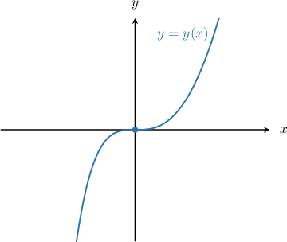

# Qualitative Analysis of First-Order ODEs

Source: https://www.mathacademy.com/topics/2976?courseId=136
Topic ID: 2976

## Prerequisites

- [Implicit Differentiation](./57-implicit-differentiation.md)
- [The Second Derivative Test](./339-the-second-derivative-test.md)
- [Points of Inflection](./1046-points-of-inflection.md)
- [Verifying Solutions of Differential Equations](./1181-verifying-solutions-of-differential-equations.md)

## Lesson

### Introduction

Suppose we have the following differential equation:

$$

\dfrac{\textrm d y}{\textrm d x} = x^2-y

$$

We can deduce a lot of information about the solutions to this equation without necessarily solving it.

For example, suppose we're interested in the solution curve $y = y(x)$ that passes through the point $P(0,0).$ We can find the slope of the solution curve at this point by substituting the coordinates of $P$ into the right-hand side of the equation:

$$

\begin{aligned}\frac{d𝑦}{d𝑥}_{(0,0)} & =(𝑥^{2}−𝑦)_{(0,0)} \\ & =0^{2}−0 \\ & =0\end{aligned}

$$

Since the derivative is zero at $P,$ we conclude that $P$ is a stationary point. We can confirm that this is the case by using a computer package to plot the particular solution $y=y(x),$ shown below.

Many differential equations are difficult to integrate. Therefore, it is important to be able to deduce information about the solutions without integrating the equation.

### Example: Determining Whether a Point on a Solution Curve Is a Stationary Point

#### Question

Consider the solution curves of the differential equation

$$

\dfrac{\textrm{d}y}{\textrm{d}x} =(y + x)^3.

$$

Which of the following are stationary points of their respective solution curve?

1. $(0,0)$

2. $(1,1)$

3. $(-4,4)$

#### Explanation

Recall that a stationary point of $f(x)$ is a point $x=c$ in the domain of $f$ such that $f'(c)=0.$

With that in mind, let's examine each of the given points. We substitute the coordinates of our points into the differential equation and calculate the value of the derivative:

$$

\begin{aligned}\frac{d𝑦}{d𝑥}_{(0,0)} & =(𝑦+𝑥)^{3}|_{(0,0)} \\ & =(0+0)^{3} \\ & =0\,✓ \\ \frac{d𝑦}{d𝑥}_{(1,1)} & =(𝑦+𝑥)^{3}|_{(1,1)} \\ & =(1+1)^{3} \\ & =8 \\ & ≠0\,× \\ \frac{d𝑦}{d𝑥}_{(−4,4)} & =(𝑦+𝑥)^{3}|_{(−4,4)} \\ & =(4+(−4))^{3} \\ & =0\,✓\end{aligned}

$$

Therefore, the correct answer is "I and III only."

### Example: Calculating the Second Derivative at a Point on a Solution Curve

#### Question

The function $y=f(x)$ satisfies the differential equation

$$

\dfrac{\textrm{d}y}{\textrm{d}x} = 4y - e^{3x}.

$$

Given that the point $P(0,1)$ lies on the graph of the function, evaluate $\dfrac{\textrm{d}^2y}{\textrm{d}x^2}$ at $P.$

#### Explanation

To find an expression for the second derivative, we differentiate the equation with respect to $x,$ as follows:

$$

\begin{aligned}\frac{d}{d𝑥}(\frac{d𝑦}{d𝑥}) & =\frac{d}{d𝑥}(4𝑦−𝑒^{3𝑥}) \\ \frac{d^{2}𝑦}{d𝑥^{2}} & =\frac{d}{d𝑥}(4𝑦)−\frac{d}{d𝑥}(𝑒^{3𝑥}) \\ \frac{d^{2}𝑦}{d𝑥^{2}} & =4\frac{d𝑦}{d𝑥}−\frac{d}{d𝑥}(𝑒^{3𝑥}) \\ \frac{d^{2}𝑦}{d𝑥^{2}} & =4\frac{d𝑦}{d𝑥}−3𝑒^{3𝑥}\end{aligned}

$$

Now, we substitute the given expression for $\dfrac{\textrm d y}{\textrm d x}$ into the above and simplify the resulting expression:

$$

\begin{aligned}\frac{d^{2}𝑦}{d𝑥^{2}} & =4(4𝑦−𝑒^{3𝑥})−3𝑒^{3𝑥} \\ \frac{d^{2}𝑦}{d𝑥^{2}} & =16𝑦−7𝑒^{3𝑥}\end{aligned}

$$

Finally, we substitute the coordinates of our point into the above expression for the second derivative:

$$

\begin{aligned}\frac{d^{2}𝑦}{d𝑥^{2}}_{(0,1)} & =(16𝑦−7𝑒^{3𝑥})_{(0,1)} \\ & =16(1)−7𝑒^{3(0)} \\ & =9\end{aligned}

$$

### Example: Using the Second Derivative Test To Classify a Point on a Solution Curve

#### Question

The function $y=f(x)$ satisfies the differential equation

$$

\dfrac{\textrm{d}y}{\textrm{d}x} = x^2 - 4 - y.

$$

Given that the point $(2,0)$ lies on the graph of $y=f(x),$ which of the following statements are true?

1. $(2,0)$ is a stationary point of the function $f$

2. $(2,0)$ is a local minimum point of the function $f$

3. $(2,0)$ is an inflection point of the function $f$

#### Explanation

First, we find the value of the first and second derivatives of the function at the given point.

To find the first derivative of $f$ at $(2,0),$ we substitute the coordinates of our point into the differential equation:

$$

\begin{aligned}\frac{d𝑦}{d𝑥}_{(2,0)} & =(𝑥^{2}−4−𝑦)_{(2,0)} \\ & =2^{2}−4−(0) \\ & =0\end{aligned}

$$

To find the second derivative, we first need to differentiate the equation and then substitute the coordinates of the point:

$$

\begin{aligned}\frac{d^{2}𝑦}{d𝑥^{2}} & =\frac{d}{d𝑥}(\frac{d𝑦}{d𝑥}) \\ & =\frac{d}{d𝑥}(𝑥^{2}−4−𝑦) \\ & =\frac{d}{d𝑥}(𝑥^{2})−\frac{d}{d𝑥}(4)−\frac{d}{d𝑥}(𝑦) \\ & =2𝑥−\frac{d𝑦}{d𝑥} \\ & =2𝑥−(𝑥^{2}−4−𝑦) \\ & =−𝑥^{2}+2𝑥+4+𝑦 \\ \frac{d^{2}𝑦}{d𝑥^{2}}_{(2,0)} & =(−𝑥^{2}+2𝑥+4+𝑦)_{(2,0)} \\ & =−(2)^{2}+2(2)+4+(0) \\ & =4 \\ & >0\end{aligned}

$$

With that in mind, let's examine the statements in turn.

- Statement I is true. Indeed, since we obtain that $(2,0)$ is a stationary point of the function $f.$

- Statement II is true. There is a critical point at $(2,0).$ So, according to the second derivative test, since we have a local minimum at that point.

- Statement III is false. Since the second derivative is not zero, there is no inflection point at $(2,0).$

Therefore, the correct answer is "I and II only."
