# Conditional Probabilities From Venn Diagrams

Source: https://www.mathacademy.com/topics/324?courseId=136
Topic ID: 324

## Prerequisites

- [Computing Probabilities of Events Containing Complements Using Venn Diagrams](../../../high-school/traditional/lessons/geometry/4361-computing-probabilities-of-events-containing-complements-using-venn-diagrams.md)

## Lesson

### Introduction

Suppose we have surveyed $100$ students regarding their sports preferences, asking them whether they like baseball or volleyball. The results of our survey are shown in the Venn diagram below.

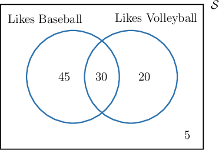

Now, suppose that we wish to calculate the probability that a randomly selected student who likes volleyball also likes baseball. We represent this probability symbolically as

$$

P(\text{ student likes baseball } | \text{ student likes volleyball }).

$$

Said in words, we would read the above as "the probability that a student likes baseball **given that** they like volleyball." This type of probability is called a **conditional probability.** In this case, we can think of this probability as the proportion of volleyball-liking students who also like baseball.

Since we assume that the student likes volleyball, we only need to look at the area of the Venn diagram that is inside the right-hand circle.

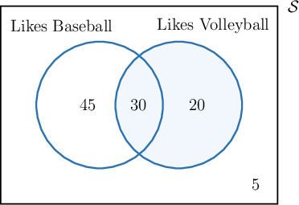

In total, the number of students who like volleyball is

$$

30+20=50.

$$

Of these $50$ students, only $30$ of them also like baseball. This is represented by the area where the circles $A$ and $B$ overlap.

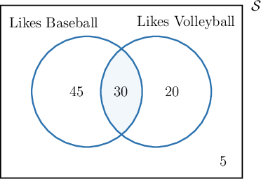

Therefore, the probability that a randomly selected student likes baseball *given that* they like volleyball, is

$$

P(\text{ student likes baseball } | \text{ student likes volleyball }) = \dfrac{30}{50} = \dfrac35.

$$

### Example: Computing a Conditional Probability Using a Venn Diagram

#### Question

The Venn diagram below represents two events $A$ and $B$ and the probabilities of each event. Calculate $P(B|A).$

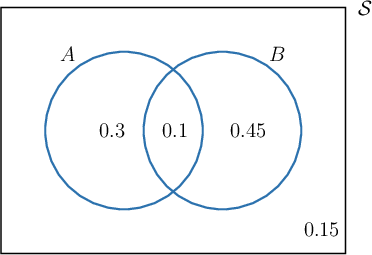

#### Explanation

To compute $P(B|A),$ we need to ask, "what is the probability of $B$ occurring given that $A$ has occurred."

Since we are assuming $A$ has occurred, we only consider the probabilities inside $A.$

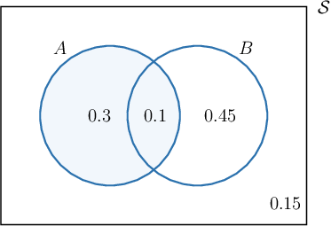

The probability of event $A$ occurring is

$$

P(A)=0.3+0.1=0.4.

$$

Now, $P(B|A)$ can be interpreted as the proportion of $B$ that lies inside $A,$ relative to the size of $A.$ So, we have

$$

P(B|A) = \dfrac{0.1}{0.4} = 0.25.

$$

### Example: Computing a Conditional Probability Using a Venn Diagram: Word Problems

#### Question

Consider the Venn diagram below. The set $T$ represents all of the customers of a cafe who like tea, and $C$ represents all of the customers who like coffee. Find the probability that a randomly selected customer who likes coffee also likes tea.

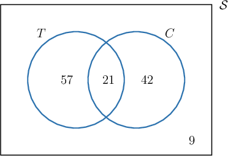

#### Explanation

We wish to compute the probability that a customer likes tea ** they like coffee. Therefore, we need to compute $P(T|C).$

To compute $P(T|C),$ we need to ask, "what is the probability of $T$ occurring given that $C$ has occurred?"

Since we are assuming that $C$ has occurred, we only consider the customers inside $C.$

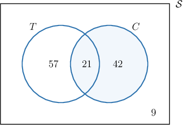

In total, the number of customers that lie in the set $C$ is

$$

21+42=63.

$$

Of these $63$ customers, $21$ lie inside $T.$

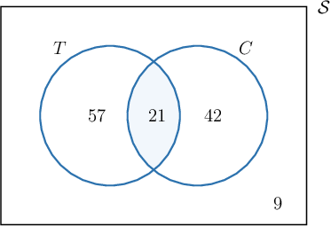

Since each outcome is equally likely, $P(T|C)$ can be interpreted as the proportion of $T$ that lies inside $C,$ relative to the size of $C.$ Therefore, we have

$$

P(T|C) = \dfrac{21}{63} = \dfrac13.

$$

### Example: Computing a Conditional Probability Involving the Complement of an Event Using a Venn Diagram

#### Question

Consider the Venn diagram below. The set $A$ represents all of the students in a school that play sports, and $G$ represents all of the students in the same school that play computer games. Find the probability that a randomly selected student who doesn't play computer games plays sports.

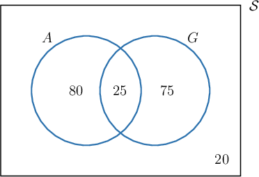

#### Explanation

We wish to compute the probability that a student plays sports ** they don't play computer games. Therefore, we need to compute $P(A|G').$

To compute $P(A|G'),$ we need to ask, "what is the probability of $A$ occurring given that $G'$ has occurred?"

Since we are assuming that $G'$ has occurred, we only consider the students inside $G'.$

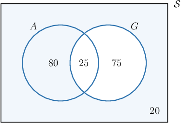

In total, the number of students in the set $G'$ is

$$

80+20=100.

$$

Of these $100$ students, $80$ lie inside $A.$

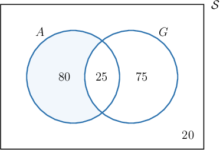

Since each outcome is equally likely, $P(A|G')$ can be interpreted as the proportion of $A$ that lies inside $G',$ relative to the size of $G.'$ Therefore, we have

$$

P(A|G') = \dfrac{80}{100} = \dfrac45.

$$
