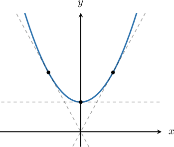
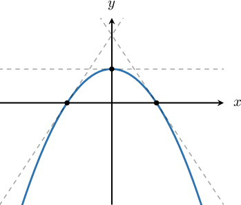
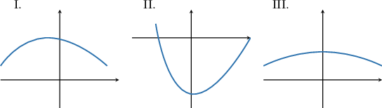
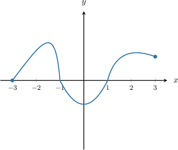
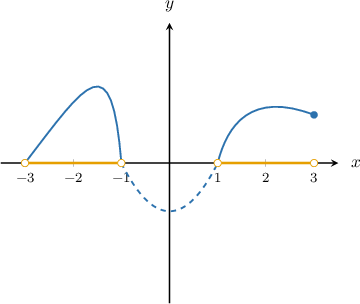
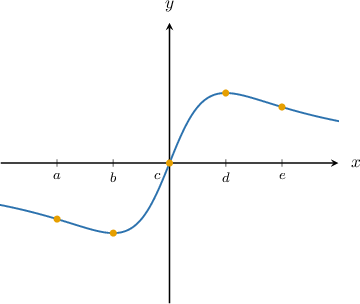
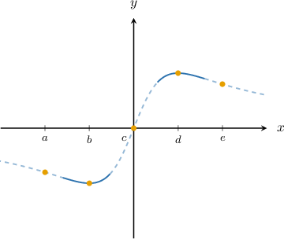

# Intervals of Concavity

Source: https://www.mathacademy.com/topics/363?courseId=136
Topic ID: 363

## Prerequisites

- [Determining Intervals on Which a Function Is Increasing or Decreasing](./1359-determining-intervals-on-which-a-function-is-increasing-or-decreasing.md)

## Lesson

### Introduction

The **concavity** of a function refers to the direction in which its graph curves.

- If the graph curves upwards, like a smile, then the graph is said to be **concave up** ($\color{black}{\smile}$).

- If the graph curves downwards, like a frown, then the graph is said to be **concave down** ($\color{black}{\frown}$).

Try to remember the phrase "concave down like a frown."

As an example, let's consider the graph of $f(x)=x^2+1,$ shown below.

This graph is concave up ($\color{black}{\smile}$) everywhere. Notice that:

- The slopes of the tangent lines increase as we go from left to right, which means that $f'(x)$ is *increasing*.

- The tangent lines sit *below* the graph itself.

Let's compare this the graph of $g(x) = -x^2+1,$ shown below.

This graph is concave down ($\color{black}{\frown}$). Notice that:

- The slopes of the tangent lines decrease as we go from left to right, which means that $g'(x)$ is *decreasing*.

- The tangent lines sit *above* the graph itself.

### Example: Determining Concave Up and Concave Down Curves

#### Question

Which of the curves above are concave up?

#### Explanation

The concavity of a function refers to the direction in which its graph curves.

- If the graph curves upward, like a "smile" ($\smile$), then the graph is said to be **.

- If the graph curves downward, like a "frown" ($\frown$), then the graph is said to be **.

It's helpful to remember the mnemonic "concave down like a frown."

Only graph II curves upward (like a "smile") among the given graphs.

### Example: Determining Intervals of Concavity From the Graph of a Function

#### Question

The graph above shows the function $y=f(x),$ defined on $[-3,3].$ Find the intervals on which the function $f(x)$ is concave down.

#### Explanation

The concavity of a function refers to the direction in which its graph curves.

- If the graph curves upward, like a "smile" ($\smile$), then the graph is said to be **.

- If the graph curves downward, like a "frown" ($\frown$), then the graph is said to be **.

It's helpful to remember the mnemonic "concave down like a frown."

We can see that the function is curved downward like a frown ($\color{black}{\frown}$) over the intervals $(-3,-1)$ and $(1,3).$

### Example: Determining Concavity and the Sign of the Derivative at a Point

#### Question

The graph of $y=f(x)$ is shown above. For which of the following values of $x$ is $f(x)$ concave up ** $f'(x) = 0?$

#### Explanation

The derivative $f'(x)$ is zero when $x$ is a stationary point (the tangent line is horizontal).

From the given graph, we see that only $x=b$ and $x=d$ are stationary points.

The concavity of a function refers to the direction in which its graph curves.

- If the graph curves upward, like a "smile" ($\smile$), then the graph is said to be **.

- If the graph curves downward, like a "frown" ($\frown$), then the graph is said to be **.

It's helpful to remember the mnemonic "concave down like a frown."

Of the points $x=b$ and $x=d,$ the graph is concave up ($\smile$) at $x=b$ only.
