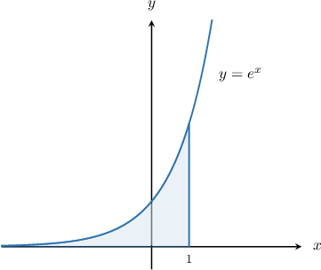
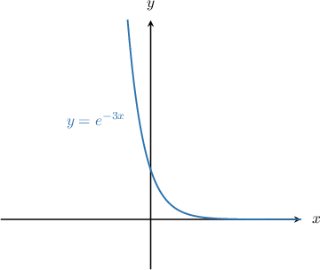
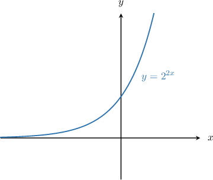
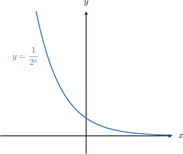

# Improper Integrals Involving Exponential Functions

Source: https://www.mathacademy.com/topics/4004?courseId=136
Topic ID: 4004

## Prerequisites

- [Improper Integrals](./758-improper-integrals.md)
- [Integrating Exponential Functions Using Substitution](./3770-integrating-exponential-functions-using-substitution.md)

## Lesson

### Introduction

A common type of improper integral is one where the integrand (i.e., the function being integrated) is an exponential function.

For example, let's consider the following integral:

$$

\int_{-\infty}^{1} e^{x} \,\textrm{d}x

$$

This is an improper integral because the lower limit is unbounded. It can be interpreted as the shaded area under the curve $y=e^{x}$ shown below.

We proceed as we would with any other improper integral. We set the lower bound equal to some parameter $a$, integrate, and take the limit as $a \to -\infty{:}$

$$

\begin{aligned}∫_{1−∞}^{}𝑒^{𝑥}\,d𝑥 & =\underset{𝑎→−∞}{lim}∫_{1𝑎}^{}𝑒^{𝑥}\,d𝑥 \\ & =\underset{𝑎→−∞}{lim}[𝑒^{𝑥}]_{1𝑎}^{} \\ & =\underset{𝑎→−∞}{lim}(𝑒^{1}−𝑒^{𝑎}) \\ & =\underset{𝑎→−∞}{lim}(𝑒−𝑒^{𝑎})\end{aligned}

$$

Now, recall the end behavior of the function $y=e^x,$ shown in the graph above:

- $\lim\limits_{x \to -\infty} e^x = 0$

- $\lim\limits_{x \to \infty} e^x = \infty$

Knowing this, we can solve our integral by evaluating the limit:

$$

\begin{aligned}∫_{1−∞}^{}𝑒^{𝑥}\,d𝑥 & =\underset{𝑎→−∞}{lim}(𝑒−𝑒^{𝑎}) \\ & =𝑒−0 \\ & =𝑒\end{aligned}

$$

### A Reminder of Some Useful Results

When evaluating improper integrals involving exponential functions, we often make use of the following results:

$$

\begin{aligned}∫𝑒^{𝑝𝑥+𝑞}\,d𝑥 & =\frac{1}{𝑝}𝑒^{𝑝𝑥+𝑞}+𝐶 \\ ∫𝑏^{𝑝𝑥+𝑞}\,d𝑥 & =\frac{1}{𝑝ln⁡𝑏}𝑏^{𝑝𝑥+𝑞}+𝐶\end{aligned}

$$

Let's see another example.

### Example: Improper Integral Involving the Exponential Function

#### Question

Evaluate $\displaystyle \int_{-1}^\infty e^{-3x} \,\textrm{d}x.$

#### Explanation

First, let's recall the following result:

$$

\int e^{px + q}\,\textrm d x = \dfrac1p e^{px+q} + C

$$

We proceed by setting the upper bound equal to some parameter $a,$ integrating as usual, and then taking the limit as $a\to\infty.$

$$

\begin{aligned}∫_{∞−1}^{}𝑒^{−3𝑥}\,d𝑥 & =\underset{𝑎→∞}{lim}∫_{𝑎−1}^{}𝑒^{−3𝑥}\,d𝑥 \\ & =\underset{𝑎→∞}{lim}[−\frac{𝑒^{−3𝑥}}{3}\,]_{𝑎−1}^{} \\ & =−\frac{1}{3}⋅\underset{𝑎→∞}{lim}[𝑒^{−3𝑥}]_{𝑎−1}^{} \\ & =−\frac{1}{3}⋅(\underset{𝑎→∞}{lim}𝑒^{−3𝑎}−𝑒^{3})\end{aligned}

$$

Now, recall the end behavior of the function $y=e^{-3x}$ shown in the graph below:

- $\lim\limits_{x \to -\infty} e^{-3x} = \infty$

- $\lim\limits_{x \to \infty} e^{-3x} =0$

Using this to evaluate our integral, we conclude that

$$

\begin{aligned}∫_{∞−1}^{}𝑒^{−3𝑥} & =−\frac{1}{3}⋅(\underset{𝑎→∞}{lim}𝑒^{−3𝑎}−𝑒^{3}) \\ & =−\frac{1}{3}⋅(0−𝑒^{3}) \\ & =\frac{𝑒^{3}}{3}.\end{aligned}

$$

### Example: Improper Integral Involving Other Exponential Functions

#### Question

Evaluate $\displaystyle \int_{-\infty}^{0} 3\cdot 2^{2x+1} \,\textrm{d}x.$

#### Explanation

First, let's recall the following result:

$$

\int b^{\,px + q}\,\textrm d x = \dfrac1{p\ln(b)} b^{\,px+q} + C

$$

We proceed by setting the lower bound equal to some parameter $a,$ integrating as usual, and then taking the limit as $a\to-\infty.$

$$

\begin{aligned}∫_{0−∞}^{}3⋅2^{2𝑥+1}\,d𝑥 & =3⋅\underset{𝑎→−∞}{lim}∫_{0𝑎}^{}2^{2𝑥+1}\,d𝑥 \\ & =3⋅\underset{𝑎→−∞}{lim}[\frac{2^{2𝑥+1}}{2ln⁡(2)}]_{0𝑎}^{} \\ & =\frac{3⋅2^{1}}{2ln⁡(2)}⋅\underset{𝑎→−∞}{lim}[2^{2𝑥}]_{0𝑎}^{} \\ & =\frac{3}{ln⁡(2)}⋅\underset{𝑎→−∞}{lim}(2^{0}−2^{2𝑎}) \\ & =\frac{3}{ln⁡(2)}⋅(1−\underset{𝑎→−∞}{lim}2^{2𝑎})\end{aligned}

$$

Now, recall the end behavior of the function $y=2^{2x}$ shown in the graph below:

- $\lim\limits_{x \to -\infty} 2^{2x} = 0$

- $\lim\limits_{x \to \infty} 2^{2x} = \infty$

Using this to evaluate our integral, we conclude that

$$

\begin{aligned}∫_{0−∞}^{}3⋅2^{2𝑥+1}\,d𝑥 & =\frac{3}{ln⁡(2)}⋅(1−\underset{𝑎→−∞}{lim}2^{2𝑎}) \\ & =\frac{3}{ln⁡(2)}⋅(1−0) \\ & =\frac{3}{ln⁡(2)}.\end{aligned}

$$

### Example: Calculating an Improper Integral Using a Substitution

#### Question

Evaluate the integral $\displaystyle \int_1^\infty x^3\cdot 2^{-x^4} \,\textrm{d}x.$

#### Explanation

First, we substitute $u=x^4.$ Differentiating, we get

$$

\dfrac{\textrm{d}u}{\textrm{d}x}= 4x^3 \quad\Longrightarrow\quad \dfrac 14 \textrm{d}u =x^3\textrm{d}x.

$$

Since $u\to \infty$ when $x\to \infty,$ the table for the limits of integration using the rule $u=x^4$ is as follows:

So, the integral in terms of the new variable $u$ is

$$

\begin{aligned}∫_{∞1}^{}𝑥^{3}⋅2^{−𝑥^{4}}\,d𝑥 & =\frac{1}{4}∫_{∞1}^{}2^{−𝑢}\,d𝑢.\end{aligned}

$$

Now, we proceed by setting the upper bound equal to some parameter $a,$ integrating as usual, and then taking the limit as $a\to\infty.$

$$

\begin{aligned}∫_{∞1}^{}𝑥^{3}⋅2^{−𝑥^{4}}\,d𝑥 & =\frac{1}{4}∫_{∞1}^{}2^{−𝑢}\,d𝑢 \\ & =\frac{1}{4}⋅\underset{𝑎→∞}{lim}∫_{𝑎1}^{}2^{−𝑢}\,d𝑢 \\ & =\frac{1}{4}⋅\underset{𝑎→∞}{lim}[−\frac{2^{−𝑢}}{ln⁡2}]_{𝑎1}^{} \\ & =−\frac{1}{4ln⁡2}⋅\underset{𝑎→∞}{lim}[2^{−𝑢}]_{𝑎1}^{} \\ & =−\frac{1}{4ln⁡2}⋅(\underset{𝑎→∞}{lim}\frac{1}{2^{𝑎}}−\frac{1}{2})\end{aligned}

$$

Next, recall the end behavior of the function $y=\dfrac{1}{2^x},$ shown in the graph below:

- $\lim\limits_{x \to -\infty} \dfrac{1}{2^{x}} = \infty$

- $\lim\limits_{x \to \infty} \dfrac{1}{2^{x}} = 0$

Using this to evaluate our integral, we conclude that

$$

\begin{aligned}∫_{∞1}^{}𝑥^{3}⋅2^{−𝑥^{4}}\,d𝑥 & =−\frac{1}{4ln⁡2}⋅(\underset{𝑎→∞}{lim}\frac{1}{2^{𝑎}}−\frac{1}{2}) \\ & =−\frac{1}{4ln⁡2}⋅(0−\frac{1}{2}) \\ & =\frac{1}{8ln⁡2}.\end{aligned}

$$
