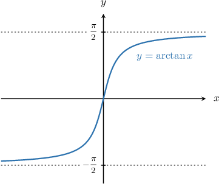
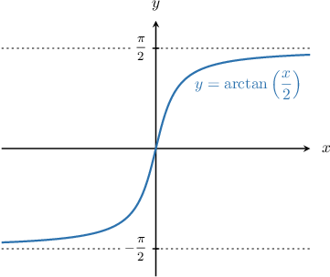

# Improper Integrals Involving Arctangent

Source: https://www.mathacademy.com/topics/4005?courseId=136
Topic ID: 4005

## Prerequisites

- [Integration by Substitution With Inverse Trigonometric Functions](./315-integration-by-substitution-with-inverse-trigonometric-functions.md)
- [Improper Integrals](./758-improper-integrals.md)
- [Limits of Inverse Trigonometric Functions](./3811-limits-of-inverse-trigonometric-functions.md)

## Lesson

### Introduction

An important class of improper integrals concerns those involving arctangent.

To demonstrate, let's consider the following improper integral:

$$

\displaystyle{\int_{0}^{\infty} \dfrac{1}{1+x^2} \, \textrm{d}x}

$$

First, we recall that

$$

\int \dfrac{1}{1+x^2} \, \textrm{d}x = \arctan(x) + C.

$$

So, to evaluate our improper integral, we follow the usual procedure:

- First, we set the upper bound equal to some parameter $a.$

- Then, we integrate as usual.

- Finally, we take the limit as $a \to \infty.$

So, we obtain

$$

\begin{aligned}∫_{∞0}^{}\frac{1}{1+𝑥^{2}}\,d𝑥 & =\underset{𝑎→∞}{lim}∫_{𝑎0}^{}\frac{1}{1+𝑥^{2}}\,d𝑥 \\ & =\underset{𝑎→∞}{lim}[arctan⁡(𝑥)]_{𝑎0}^{} \\ & =\underset{𝑎→∞}{lim}[arctan⁡(𝑎)−arctan⁡(0)] \\ & =\underset{𝑎→∞}{lim}[arctan⁡(𝑎)].\end{aligned}

$$

Now, recall the end behavior of the function $y = \arctan{x},$ shown in the graph below:

- $\lim\limits_{x \to -\infty} \big[\arctan(x) \big] = -\dfrac{\pi}{2}$

- $\lim\limits_{x \to \infty} \big[\arctan(x) \big] = \dfrac{\pi}{2}$

Using this to evaluate our integral, we conclude that

$$

\int_{0}^{\infty} \dfrac{1}{1+x^2} \,\textrm{d}x = \dfrac{\pi}{2}.

$$

### Example: Evaluating an Improper Integral by Applying the Basic Result

#### Question

Evaluate $\displaystyle \int_{-\infty}^0 \dfrac{4}{1+x^2} \, \textrm{d}x.$

#### Explanation

First, let's recall the following result:

$$

\int \dfrac{1}{1+x^2} \, \textrm{d}x = \arctan(x) + C

$$

We proceed by setting the lower bound equal to some parameter $a,$ integrating as usual, and then taking the limit as $a \to -\infty.$

$$

\begin{aligned}∫_{0−∞}^{}\frac{4}{1+𝑥^{2}}\,d𝑥 & =4⋅\underset{𝑎→−∞}{lim}∫_{0𝑎}^{}\frac{1}{1+𝑥^{2}}\,d𝑥 \\ & =4⋅\underset{𝑎→−∞}{lim}[arctan⁡(𝑥)]_{0𝑎}^{} \\ & =4⋅\underset{𝑎→−∞}{lim}[arctan⁡(0)−arctan⁡(𝑎)] \\ & =4⋅(0−\underset{𝑎→−∞}{lim}[arctan⁡(𝑎)]) \\ & =−4\underset{𝑎→−∞}{lim}[arctan⁡(𝑎)]\end{aligned}

$$

Now, recall the end behavior of the function $y = \arctan{x},$ shown in the graph below:

- $\lim\limits_{x \to -\infty} \left[\arctan{x}\right] = -\dfrac{\pi}{2}$

- $\lim\limits_{x \to \infty} \left[\arctan{x}\right] = \dfrac{\pi}{2}$

Using this to evaluate our integral, we conclude that

$$

\begin{aligned}∫_{0−∞}^{}\frac{4}{1+𝑥^{2}}\,d𝑥 & =−4\underset{𝑎→−∞}{lim}[arctan⁡(𝑎)] \\ & =−4(−\frac{𝜋}{2}) \\ & =2𝜋.\end{aligned}

$$

### A Reminder of Some Useful Results

We can evaluate more complex integrals involving arctangent by making use of the following results:

$$

\begin{aligned}∫\frac{1}{1+(𝑘𝑥)^{2}}\,d𝑥 & =\frac{1}{𝑘}arctan⁡(𝑘𝑥)+𝐶 \\ ∫\frac{1}{𝑘^{2}+𝑥^{2}}\,d𝑥 & =\frac{1}{𝑘}arctan⁡(\frac{𝑥}{𝑘})+𝐶\end{aligned}

$$

Let's see some examples.

### Example: Improper Integrals Involving Arctangent Using the First Result

#### Question

Evaluate the integral $\displaystyle \int_{-1/4}^\infty \dfrac {2}{1+16x^2} \,\textrm{d}x.$

#### Explanation

First, let's recall the following result:

$$

\int \dfrac{1}{1+(kx)^2} \, \textrm dx = \dfrac{1}{k} \arctan \left(kx \right) + C

$$

We proceed by setting the upper bound equal to some parameter $a,$ integrating as usual, and then taking the limit as $a\to\infty.$

$$

\begin{aligned}∫_{∞−1/4}^{}\frac{2}{1+16𝑥^{2}}\,d𝑥 & =2⋅\underset{𝑎→∞}{lim}∫_{𝑎−1/4}^{}\frac{1}{1+16𝑥^{2}}\,d𝑥 \\ & =2⋅\underset{𝑎→∞}{lim}∫_{𝑎−1/4}^{}\frac{1}{1+(4𝑥)^{2}}\,d𝑥 \\ & =2⋅\underset{𝑎→∞}{lim}[\frac{1}{4}arctan⁡(4𝑥)]_{𝑎−1/4}^{} \\ & =\frac{1}{2}⋅\underset{𝑎→∞}{lim}(arctan⁡(4𝑎)−arctan⁡(−1)) \\ & =\frac{1}{2}⋅(\underset{𝑎→∞}{lim}[arctan⁡(4𝑎)]−(−\frac{𝜋}{4})) \\ & =\frac{1}{2}⋅(\underset{𝑎→∞}{lim}[arctan⁡(4𝑎)]+\frac{𝜋}{4})\end{aligned}

$$

Now, recall the end behavior of the function $y=\arctan{(4x)},$ shown in the graph below:

- $\lim\limits_{x \to -\infty} \left[\arctan{(4x)}\right] = -\dfrac{\pi}{2}$

- $\lim\limits_{x \to \infty} \left[\arctan{(4x)}\right] = \dfrac{\pi}{2}$

Using this to evaluate our integral, we conclude that

$$

\begin{aligned}∫_{∞−1/4}^{}\frac{2}{1+16𝑥^{2}}\,d𝑥 & =\frac{1}{2}⋅(\underset{𝑎→∞}{lim}[arctan⁡(4𝑎)]+\frac{𝜋}{4}) \\ & =\frac{1}{2}⋅(\frac{𝜋}{2}+\frac{𝜋}{4}) \\ & =\frac{3𝜋}{8}.\end{aligned}

$$

### Example: Improper Integrals Involving Arctangent Using the Second Result

#### Question

Evaluate the integral $\displaystyle \int_{2\sqrt{3}}^\infty \dfrac{6}{x^2+4} \,\textrm{d}x.$

#### Explanation

First, let's recall the following result:

$$

\int \dfrac{1}{k^2 + x^2} \, \textrm dx = \dfrac{1}{k} \arctan \left( \dfrac{x}{k} \right) + C

$$

We proceed by setting the upper bound equal to some parameter $a,$ integrating as usual, and then taking the limit as $a\to\infty.$

$$

\begin{aligned}∫_{∞2\sqrt{√3}}^{}\frac{6}{𝑥^{2}+4}\,d𝑥 & =6⋅\underset{𝑎→∞}{lim}∫_{𝑎2\sqrt{√3}}^{}\frac{1}{𝑥^{2}+4}\,d𝑥 \\ & =6⋅\underset{𝑎→∞}{lim}∫_{𝑎2\sqrt{√3}}^{}\frac{1}{𝑥^{2}+2^{2}}\,d𝑥 \\ & =6⋅\underset{𝑎→∞}{lim}[\frac{1}{2}arctan⁡(\frac{𝑥}{2})]_{𝑎2\sqrt{√3}}^{} \\ & =3\underset{𝑎→∞}{lim}(arctan⁡(\frac{𝑎}{2})−arctan⁡(\sqrt{√3})) \\ & =3\underset{𝑎→∞}{lim}(arctan⁡(\frac{𝑎}{2})−\frac{𝜋}{3}) \\ & =3\underset{𝑎→∞}{lim}[arctan⁡(\frac{𝑎}{2})]−𝜋\end{aligned}

$$

Now, recall the end behavior of the function $y=\arctan\left(\dfrac{x}{2}\right),$ shown in the graph below:

- $\lim\limits_{x \to -\infty} \left[\arctan\left(\dfrac{x}{2}\right)\right] = -\dfrac{\pi}{2}$

- $\lim\limits_{x \to \infty} \left[\arctan\left(\dfrac{x}{2}\right)\right] = \dfrac{\pi}{2}$

Using this to evaluate our integral, we conclude that

$$

\begin{aligned}∫_{∞2\sqrt{√3}}^{}\frac{6}{𝑥^{2}+4}\,d𝑥 & =3\underset{𝑎→∞}{lim}[arctan⁡(\frac{𝑎}{2})]−𝜋 \\ & =3⋅\frac{𝜋}{2}−𝜋 \\ & =\frac{𝜋}{2}.\end{aligned}

$$

### Example: Calculating Improper Integrals Involving Arctangent Using Substitution

#### Question

Use the substitution $u = x^2$ to evaluate $\displaystyle{\int}_{1}^{\infty} \dfrac{2x}{1 + x^4} \,\textrm{d}x.$

#### Explanation

First, we substitute $u = x^2.$ Differentiating, we get

$$

\dfrac{\textrm{d}u}{\textrm{d}x} = 2x \quad\Longrightarrow\quad \textrm{d}u =2x \, \textrm{d}x.

$$

Since $u \to \infty$ when $x \to \infty,$ the table for the limits of integration using the rule $u = x^2$ is as follows:

So, the integral in terms of the new variable $u$ is

$$

\begin{aligned}∫_{∞1}^{}\frac{2𝑥}{1+𝑥^{4}}\,d𝑥 & =∫_{∞1}^{}\frac{1}{1+𝑢^{2}}\,d𝑢.\end{aligned}

$$

Now, we proceed by setting the upper bound equal to some parameter $a,$ integrating as usual, and then taking the limit as $a\to\infty.$

$$

\begin{aligned}∫_{∞1}^{}\frac{2𝑥}{1+𝑥^{4}}\,d𝑥 & =∫_{∞1}^{}\frac{1}{1+𝑢^{2}}\,d𝑢 \\ & =\underset{𝑎→∞}{lim}∫_{𝑎1}^{}\frac{1}{1+𝑢^{2}}\,d𝑢 \\ & =\underset{𝑎→∞}{lim}[arctan⁡(𝑢)]_{𝑎1}^{} \\ & =\underset{𝑎→∞}{lim}[arctan⁡(𝑎)−arctan⁡(1)] \\ & =\underset{𝑎→∞}{lim}[arctan⁡(𝑎)]−\frac{𝜋}{4}\end{aligned}

$$

Finally, recall the end behavior of the function $y=\arctan(x),$ shown in the graph below:

- $\lim\limits_{x \to -\infty} \left[\arctan(x) \right] = -\dfrac{\pi}{2}$

- $\lim\limits_{x \to \infty} \left[\arctan(x) \right] = \dfrac{\pi}{2}$

Using this to evaluate our integral, we conclude that

$$

\begin{aligned}∫_{∞1}^{}\frac{2𝑥}{1+𝑥^{4}}\,d𝑥 & =\underset{𝑎→∞}{lim}[arctan⁡(𝑎)]−\frac{𝜋}{4} \\ & =\frac{𝜋}{2}−\frac{𝜋}{4} \\ & =\frac{𝜋}{4}.\end{aligned}

$$
