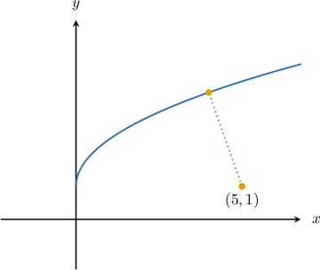
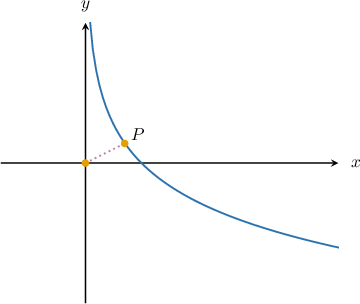
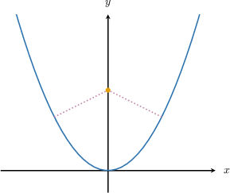
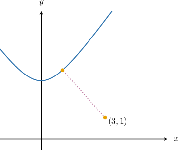

# Optimizing Distances to Curves

Source: https://www.mathacademy.com/topics/4218?courseId=136
Topic ID: 4218

## Prerequisites

- [Optimizing Distances](./1216-optimizing-distances.md)

## Lesson

### Introduction

We can use differentiation to find the shortest distance between a point and a curve.

For example, let's find the smallest distance between the curve $y=\sqrt{2x}+1$ and the point $(5,1),$ shown below.

To solve this problem, we follow three steps:

**Step 1.** Use the distance formula to create a function $S(x,y)$ representing the *squared* distance between $(5,1)$ and a general point $P(x, y){:}$

$$

S = (x-5)^2 + (y-1)^2

$$

We require that the point $P$ lies on the curve $y=\sqrt{2x}+1.$ Substituting this into the above gives

$$

\begin{aligned}𝑆(𝑥) & =(𝑥−5)^{2}+(𝑦−1)^{2} \\ & =(𝑥−5)^{2}+(\sqrt{2𝑥}+1−1)^{2} \\ & =(𝑥−5)^{2}+(\sqrt{2𝑥})^{2} \\ & =(𝑥−5)^{2}+2𝑥 \\ & =𝑥^{2}−10𝑥+25+2𝑥 \\ & =𝑥^{2}−8𝑥+25.\end{aligned}

$$

**Step 2.** Calculate the first derivative $S'(x)$ and solve $S'(x) = 0$ to find the stationary point(s).

Computing the derivative $S'(x),$ we get

$$

\begin{aligned}𝑆^{′}(𝑥) & =2𝑥−8.\end{aligned}

$$

The stationary points of $S(x)$ are the points where $S'(x) = 0.$ Solving this equation, we get

$$

\begin{aligned}𝑆^{′}(𝑥) & =0 \\ 2𝑥−8 & =0 \\ 𝑥 & =4.\end{aligned}

$$

**Step 3.** Use the first or second derivative tests to confirm that the stationary point minimizes the squared distance.

Computing the second derivative, we have

$$

S''(4) = 2.

$$

Since $S''(4) > 0,$ the point $x=4$ is a minimum of $S(x)$ by the second derivative test.

Therefore, we conclude that the squared distance (and therefore the actual distance) reaches a minimum when $x = 4.$

Finally, since $S$ gives the squared distance between the two points, the actual distance $d$ between the two points when $x=4$ is given by

$$

\begin{aligned}𝑑 & =\sqrt{𝑆(4)} \\ & =\sqrt{(4)^{2}−8(4)+25} \\ & =\sqrt{9} \\ & =3.\end{aligned}

$$

### Example: Finding an Equation That Determines a Minimum Distance

#### Question

The $x$-coordinate of the point $P$ on the curve $y=\ln \left(\dfrac{1}{x}\right)$ that is closest to the origin (as shown above) satisfies the equation

$$

2x + \boxed{\phantom{AAAA^2}}=0.

$$

What is the missing expression?

#### Explanation

Let's consider the ** distance $S$ between $(0,0)$ and a general point $P(x, y)\mathbin{:}$

$$

\begin{aligned}𝑆(𝑥,𝑦) & =(𝑥−0)^{2}+(𝑦−0)^{2} \\ & =𝑥^{2}+𝑦^{2}\end{aligned}

$$

We require that the point $P$ lies on the curve $y=\ln \left(\dfrac{1}{x}\right).$ Substituting this into the above gives

$$

\begin{aligned}𝑆 & =𝑥^{2}+𝑦^{2} \\ & =𝑥^{2}+(ln⁡(\frac{1}{𝑥}))^{2} \\ & =𝑥^{2}+ln^{2}⁡(\frac{1}{𝑥})\end{aligned}

$$

To find the minimum distance, we take the first derivative of $S(x)$ and equate it to zero. This gives the following:

$$

\begin{aligned}𝑆^{′}(𝑥)=2𝑥+2ln⁡(\frac{1}{𝑥})⋅\frac{1}{(\frac{1}{𝑥})}⋅(−\frac{1}{𝑥^{2}}) & =0 \\ 2𝑥−\frac{2}{𝑥}ln⁡(\frac{1}{𝑥}) & =0 \\ 2𝑥−\frac{2}{𝑥}(ln⁡1−ln⁡𝑥) & =0 \\ 2𝑥+\frac{2ln⁡𝑥}{𝑥} & =0\end{aligned}

$$

Therefore, the missing expression is $\dfrac{2\ln x}{x}.$

### The Candidates Test For Multiple Stationary Points

If the squared distance function has multiple stationary points, we must use the candidates test for *global* extrema to identify which stationary point corresponds to the smallest distance.

To do that, we evaluate the squared distance at each stationary point and compare the results.

Multiple critical points may correspond to the same squared distance. In such cases, like that shown in the graph below, there would be multiple points of minimum distance.

### Example: Determining the Closest Points on a Curve to a Point

#### Question

Find the $x$-coordinates of the points on the curve $y=x^2$ that are closest to the point $\left(0, \dfrac{3}{2} \right).$

#### Explanation

Let us consider the ** distance $S$ between $\left(0, \dfrac{3}{2} \right)$ and a general point $P(x, y)$:

$$

S = x^2 + \left(y- \dfrac{3}{2} \right)^2

$$

We require that the point $P$ lies on the curve $y=x^2.$ Substituting this into the above gives

$$

\begin{aligned} S(x) &= x^2 + \left(y- \dfrac{3}{2} \right)^2 \\[5pt] &= x^2 + \left( x^2 - \dfrac{3}{2} \right)^2 \\[5pt] &= x^2 + x^4 -3x^2 + \dfrac{9}{4}\\[5pt] &= x^4 - 2 x^2 + \dfrac{9}{4}.\\\end{aligned}

$$

To find the minimum distance, we take the first derivative of $S(x)$ and equate it to zero. This gives the following:

$$

\begin{aligned}𝑆^{′}(𝑥)=4𝑥^{3}−4𝑥 & =0 \\ 4𝑥(𝑥^{2}−1) & =0 \\ 𝑥 & =0,±1\end{aligned}

$$

Since there are multiple stationary points, we need to use the candidates test to identify the points of minimum distance. We compute the squared distances for each of the stationary points as follows:

$$

\begin{aligned}𝑆(0) & =(0)^{4}−2(0)^{2}+\frac{9}{4}=\frac{9}{4} \\ 𝑆(−1) & =(−1)^{4}−2(−1)^{2}+\frac{9}{4}=\frac{5}{4} \\ 𝑆(1) & =(1)^{4}−2(1)^{2}+\frac{9}{4}=\frac{5}{4}\end{aligned}

$$

So, the squared distance (and therefore the actual distance) is minimized when $x=\pm 1.$

### Example: Determining the Smallest Distance From a Point to a Curve

#### Question

What is the least distance between the curve $y=\sqrt{2x^2+3}+1$ and the point $(3,1)?$

#### Explanation

Let us consider the ** distance $S$ between $(3,1)$ and a general point $P(x, y){:}$

$$

\begin{aligned}𝑆 & =(𝑥−3)^{2}+(𝑦−1)^{2}\end{aligned}

$$

We require that the point $P$ lies on the curve $y=\sqrt{2x^2+3}+1.$ Substituting this into the above gives

$$

\begin{aligned}𝑆 & =(𝑥−3)^{2}+(𝑦−1)^{2} \\ & =(𝑥−3)^{2}+(\sqrt{2𝑥^{2}+3}+1−1)^{2} \\ & =(𝑥−3)^{2}+(\sqrt{2𝑥^{2}+3})^{2} \\ & =𝑥^{2}−6𝑥+9+2𝑥^{2}+3 \\ & =3𝑥^{2}−6𝑥+12.\end{aligned}

$$

To find the minimum distance, we take the first derivative of $S(x)$ and equate it to zero. This gives the following:

$$

\begin{aligned}𝑆^{′}(𝑥)=6𝑥−6 & =0 \\ 6𝑥 & =6 \\ 𝑥 & =1\end{aligned}

$$

We can see that $S''(1) =6 > 0.$ Therefore, $x = 1$ is a minimum of $S.$

Since $S$ gives the squared distance between the two points, the actual distance $d$ between the two points when $x=1$ is given by

$$

d = \sqrt{S(1)}.

$$

Computing this quantity, we get

$$

\begin{aligned}𝑑 & =\sqrt{𝑆(1)} \\ & =\sqrt{3(1)^{2}−6(1)+12} \\ & =\sqrt{9} \\ & =3.\end{aligned}

$$
