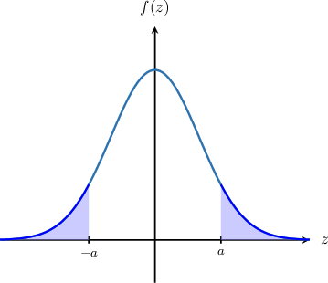
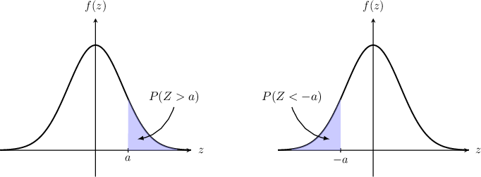
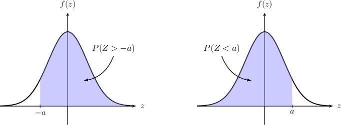
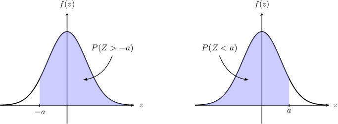
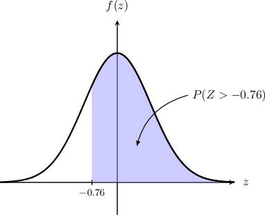
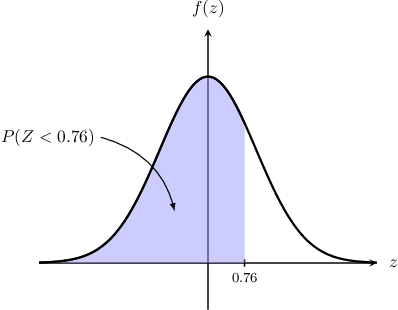
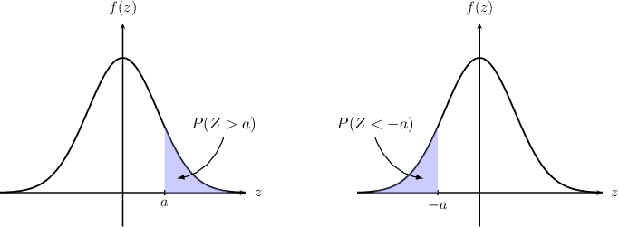
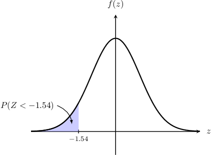
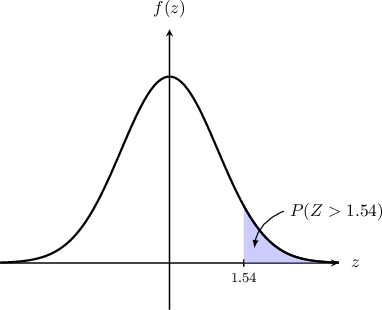
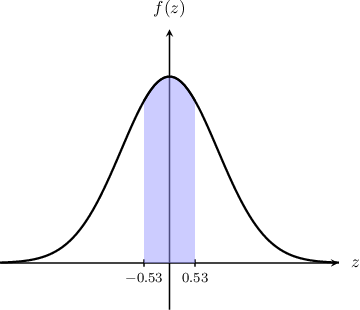

# Symmetry Properties of the Standard Normal Distribution

Source: https://www.mathacademy.com/topics/4420?courseId=136
Topic ID: 4420

## Prerequisites

- [The Standard Normal Distribution](./265-the-standard-normal-distribution.md)

## Lesson

### Introduction

Suppose that the continuous random variable $Z$ follows a standard normal distribution:

$$

Z\sim N(0,1)

$$

The standard normal distribution is *symmetric* about the vertical axis. We can use this fact to help us calculate probabilities.

For example, the two shaded areas below are equal.

Note that

- the shaded area on the left corresponds to $P(Z \lt -a),$ and

- the shaded area on the right corresponds to $P(Z \gt a).$

Since these two areas are equal by symmetry, we have the following rule:

$$

P(Z \gt a) = P(Z \lt -a)

$$

Similarly, we have that

$$

P(Z \gt -a) = P(Z \lt a) = \Phi(a),

$$

as shown below. Recall that $\Phi(z)$ is the cumulative distribution function of the standard normal distribution.

Let's take a look at some concrete examples.

### Example: Computing a Probability on an Unbounded Interval

#### Question

The data below is taken from the table of values of the cumulative distribution function $\Phi(z)$ for the standard normal distribution. Given that $Z \sim N(0,1),$ compute $P(Z \gt -0.76).$

#### Explanation

For a random variable $Z \sim N(0,1)$ we have the following symmetry property for $a > 0{:}$

$$

P(Z \gt -a) = P(Z \lt a) = \Phi(a)

$$

We're given that $Z\sim N(0,1),$ and we wish to compute $P(Z > -0.76).$ The required probability is represented by the area shown below.

By symmetry, this equals the area corresponding to the probability $P(Z \lt 0.76).$

Therefore,

$$

P(Z > -0.76) = P(Z < 0.76) = \Phi(0.76) = 0.7764.

$$

### Example: Computing a Probability on an Unbounded Interval Using the Complement

#### Question

The data below is taken from the table of values of the cumulative distribution function $\Phi(z)$ for the standard normal distribution. Given that $Z \sim N(0,1),$ compute $P(Z \lt -1.54).$

#### Explanation

For a random variable $Z \sim N(0,1),$ we have the following symmetry property for $a > 0{:}$

$$

P(Z \gt a) = P(Z \lt -a) = \Phi(-a)

$$

We're given that $Z\sim N(0,1),$ and we wish to compute $P(Z \lt -1.54).$ The required probability is represented by the area shown below.

By symmetry, this equals the area corresponding to the probability $P(Z \gt 1.54).$

Therefore,

$$

\begin{aligned}𝑃(𝑍<−1.54) & =𝑃(𝑍>1.54) \\ & =1−𝑃(𝑍<1.54) \\ & =1−Φ(1.54) \\ & =1−0.9382 \\ & =0.0618.\end{aligned}

$$

### Example: Computing a Probability on a Bounded Interval

#### Question

The data below is taken from the table of values of the cumulative distribution function $\Phi(z)$ for the standard normal distribution. Given that $Z \sim N(0,1),$ compute $P(-0.53 < Z < 0.53).$

#### Explanation

We're given that $Z\sim N(0,1),$ and we wish to compute $P(-0.53 < Z < 0.53).$ The required probability is represented by the area shown below.

By the definition of the cumulative distribution function $\Phi(z),$

$$

P(Z \leq z) = \Phi(z).

$$

So, we express the required probability in terms of $\Phi(z)$:

$$

\begin{aligned}𝑃(−0.53<𝑍<0.53) & =𝑃(𝑍<0.53)−𝑃(𝑍≤−0.53) \\ & =𝑃(𝑍≤0.53)−𝑃(𝑍≤−0.53) \\ & =Φ(0.53)−Φ(−0.53)\end{aligned}

$$

From the table, we know that

$$

\Phi(0.53) = 0.7019,

$$

but we are not given $\Phi(-0.53).$ However, we can compute this using symmetry:

$$

\begin{aligned}Φ(−0.53) & =𝑃(𝑍≤−0.53) \\ & =𝑃(𝑍≥0.53) \\ & =1−𝑃(𝑍<0.53) \\ & =1−𝑃(𝑍≤0.53) \\ & =1−Φ(0.53) \\ & =1−0.7019 \\ & =0.2981\end{aligned}

$$

Therefore, we have

$$

\begin{aligned}𝑃(−0.53<𝑍<0.53) & =Φ(0.53)−Φ(−0.53) \\ & =0.7019−0.2981 \\ & =0.4038.\end{aligned}

$$
