# Graphing Strict Two-Variable Linear Inequalities

Source: https://www.mathacademy.com/topics/665?courseId=136
Topic ID: 665

## Prerequisites

- [Verifying Solutions of Linear Inequalities](../../../middle-school/lessons/grade-7/387-verifying-solutions-of-linear-inequalities.md)
- [Equations of Lines in Slope-Intercept Form](../../../high-school/traditional/lessons/algebra-i/1240-equations-of-lines-in-slope-intercept-form.md)

## Lesson

### Introduction

Let's think about how to graph the solutions to the following two-variable inequality:

Since this is a two-variable inequality, we must represent its solutions in the -plane.

We start by replacing the inequality symbol with an equals sign and plot the resulting line. In this case, we get the line

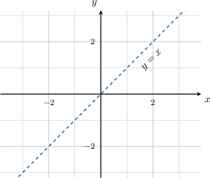

Notice that we have a "*greater than*" inequality. Therefore, we draw a *dashed* line to denote that points on the line are *not* solutions to our inequality.

Now, since we're solving we need to shade all points whose -value is *greater than* its -value. This is given by all of the points that lie *above* our dashed line. So, let's shade these in.

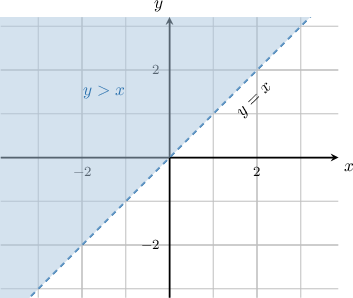

And we're done! All of the points in the shaded region satisfy the inequality

### Testing the Solution

When solving two-variable inequalities, it's often helpful to test to ensure we've shaded the correct region.

To demonstrate, let's go back to the following inequality:

The solution to this inequality is indicated by the shaded region below.

To check that we've shaded the correct region, we pick a point inside the shaded region and verify that it satisfies the original inequality. Let's pick the point

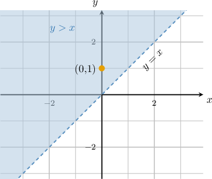

When we substitute the coordinates into our inequality, we get a true statement:

This indicates that we have shaded the correct region.

### Example: Sketching the Solution to a “Strictly Greater Than” Inequality

#### Question

Sketch the solution to the inequality

#### Explanation

First, we draw the corresponding straight line Since the inequality involves a 'strictly greater than' sign, the line itself is ** part of the solution. Therefore, we draw a ****

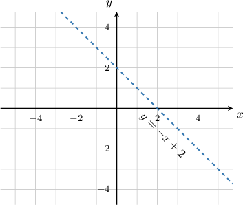

Then, we must decide whether to shade above or below the line. The inequality refers to the -values that are ** those on the line so we shade ** the line.

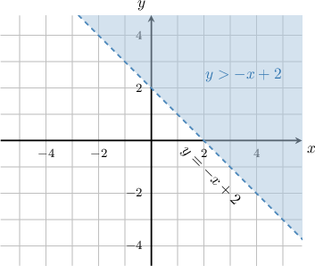

Let's now check that we've shaded the correct part. First, we consider a point in the shaded region, say

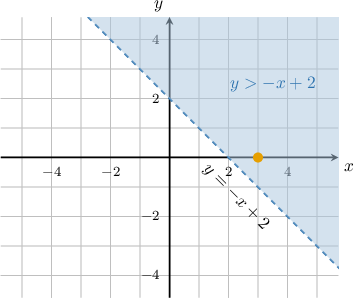

When we substitute the coordinates of this point into our inequality, we get a true statement:

This indicates that we have shaded the correct region.

### Solving "Strictly Less Than" Inequalities

Let's now think about how to graph the solutions to the inequality

As before, we start by replacing the inequality symbol with an equals sign and plot the resulting line

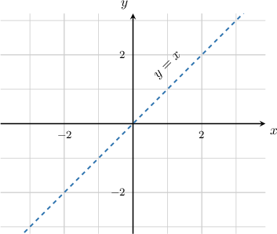

Notice that we have a "*less than*" inequality. Therefore, we draw a *dashed* line.

Now, since we're solving we need to shade all points whose -value is *smaller than* its -value. This is given by all of the points that lie *below* our dashed line.

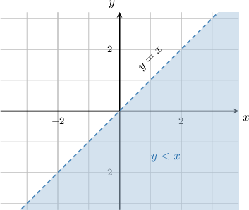

And we're done! All of the points in the shaded region satisfy the inequality

To check that we've shaded the correct region, we pick a point inside the shaded region and check that it satisfies the original inequality. Let's pick the point

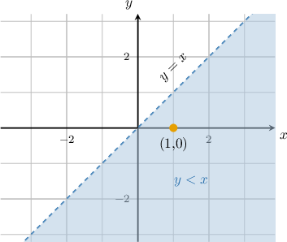

When we substitute the coordinates into our inequality, we get a true statement:

This indicates that we have shaded the correct region.

### Example: Sketching the Solution to a “Strictly Less Than” Inequality

#### Question

Sketch the solution to the inequality.

#### Explanation

First, we draw the corresponding straight line Since the inequality involves a 'strictly less than' sign, the line itself is ** part of the solution. Therefore, we draw a ****

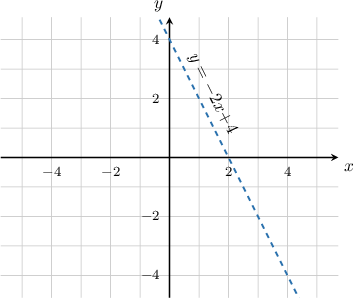

Then, we must decide whether to shade above or below the line. The inequality refers to the -values that are ** those on the line so we shade ** the line.

Let's now check that we've shaded the correct part. First, we consider a point in the shaded region, say

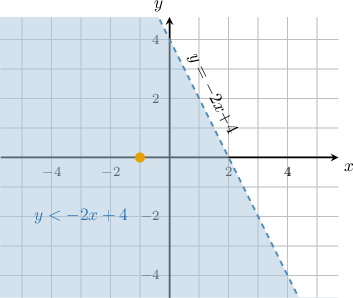

When we substitute the coordinates of this point into our inequality, we get a true statement:

This indicates that we have shaded the correct region.

### Example: Finding an Inequality Corresponding to a Given Graph

#### Question

Which inequality generates the shaded region shown below?

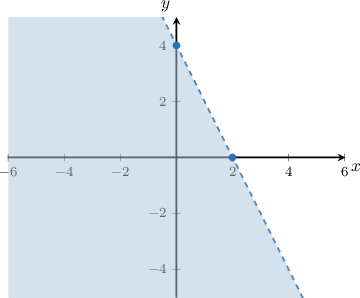

#### Explanation

First, we find the equation of the corresponding line in the slope-intercept form

- The line intersects the -axis at, so the -intercept is

- The line passes through the points and, so its slope is

Therefore, the equation of the line is

Finally, we need to decide which inequality symbol to use. Since the line is dashed, we will use a strict inequality. Since the shaded region is ** the line, the inequality refers to the -values that are ** those on the line.

So, the corresponding inequality is
