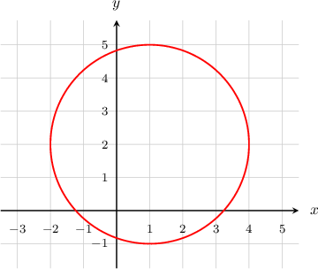

# Determining Circle Properties by Completing the Square

Source: https://www.mathacademy.com/topics/666?courseId=136
Topic ID: 666

## Prerequisites

- [Equations of Circles](./843-equations-of-circles.md)
- [Completing the Square With Odd Linear Terms](../../../high-school/traditional/lessons/algebra-i/3842-completing-the-square-with-odd-linear-terms.md)

## Lesson

### Introduction

Consider the equation

$$

x^2 + y^2 - 2x - 4y = 4.

$$

Believe it or not, this equation actually represents a circle! Its graph is given below:

Clearly, this is a circle of radius $3$ centered at $(1,2).$ But how can we determine the center and radius from the given circle equation?

Let's start with the equation

$$

x^2 + y^2 - 2x - 4y = 4.

$$

By grouping the $x$ and $y$ terms and completing the squares, we can write the equation in the standard form

$$

(x-a)^2 + (y-b)^2 = r^2.

$$

We carry out the process with the following steps:

**Step 1.**Group the $x$ and $y$ terms.

$$

\begin{aligned}𝑥^{2}+𝑦^{2}−2𝑥−4𝑦 & =4 \\ (𝑥^{2}−2𝑥)+(𝑦^{2}−4𝑦) & =4\end{aligned}

$$

**Step 2.** In each group, add the square of half the linear coefficient to both sides of the equation.

- Here, the $x$ coefficient is $-2,$ so we add $\left(\dfrac{-2}{2} \right)^2 = (-1)^2 = 1$ to both sides.

- Likewise, the $y$ coefficient is $-4,$ so we add $\left(\dfrac{-4}{2} \right)^2 = (-2)^2 = 4$ to both sides.

So, we have

$$

\begin{aligned}(𝑥^{2}−2𝑥+1)+(𝑦^{2}−4𝑦+4) & =4+1+4 \\ (𝑥^{2}−2𝑥+1)+(𝑦^{2}−4𝑦+4) & =9.\end{aligned}

$$

**Step 3.** Finally, we factor each group into a perfect square, and we get

$$

\begin{aligned}(𝑥−1)^{2}+(𝑦−2)^{2} & =9 \\ (𝑥−1)^{2}+(𝑦−2)^{2} & =3^{2}.\end{aligned}

$$

Now, we can see that the equation represents a circle centered at $(1,2)$ with radius $3.$

### Example: Finding the Center and Radius of a Circle by Completing the Square

#### Question

Find the center and radius of the circle whose equation is $x^2 + y^2 - 4x + 6y = 12.$

#### Explanation

To find the center and radius of the circle, we need to group $x$ and $y$ terms and complete the squares.

$$

\begin{aligned}𝑥^{2}+𝑦^{2}−4𝑥+6𝑦 & =12 \\ (𝑥^{2}−4𝑥)+(𝑦^{2}+6𝑦) & =12 \\ (𝑥^{2}−2⋅2𝑥+2^{2})+(𝑦^{2}+2⋅3𝑦+3^{2}) & =12+2^{2}+3^{2} \\ (𝑥^{2}−2⋅2𝑥+2^{2})+(𝑦^{2}+2⋅3𝑦+3^{2}) & =25\end{aligned}

$$

Now, we can factor the perfect squares and get

$$

\begin{aligned}(𝑥−2)^{2}+(𝑦+3)^{2} & =5^{2} \\ (𝑥−2)^{2}+(𝑦−(−3))^{2} & =5^{2}.\end{aligned}

$$

Therefore, the circle is centered at $(2,-3)$ and its radius is $5.$

### Example: Finding the Center and Radius of a Circle by Completing the Square with Fractions

#### Question

Find the center and radius of the circle whose equation is $x^2 + y^2 - x = 6.$

#### Explanation

To find the center and radius of the circle, we need to group $x$ and $y$ terms and complete the squares.

$$

\begin{aligned}𝑥^{2}+𝑦^{2}−𝑥 & =6 \\ (𝑥^{2}−𝑥)+𝑦^{2} & =6 \\ (𝑥^{2}−2⋅\frac{1}{2}𝑥+(\frac{1}{2})^{2})+𝑦^{2} & =6+(\frac{1}{2})^{2} \\ (𝑥^{2}−2⋅\frac{1}{2}𝑥+(\frac{1}{2})^{2})+𝑦^{2} & =\frac{25}{4}\end{aligned}

$$

Now, we can factor the perfect square and get

$$

\begin{aligned}(𝑥−\frac{1}{2})^{2}+𝑦^{2} & =(\frac{5}{2})^{2} \\ (𝑥−\frac{1}{2})^{2}+(𝑦−0)^{2} & =(\frac{5}{2})^{2}.\end{aligned}

$$

Therefore, the circle is centered at $\left(\dfrac{1}{2}, 0 \right)$ and its radius is $\dfrac{5}{2}.$
