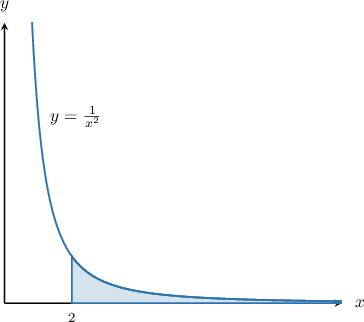

# Improper Integrals

Source: https://www.mathacademy.com/topics/758?courseId=136
Topic ID: 758

## Prerequisites

- [Calculating Definite Integrals Using Substitution](./1159-calculating-definite-integrals-using-substitution.md)

## Lesson

### Introduction

An **improper integral** is an integral where at least one limit of integration is unbounded.

For example, the integral

$$

\displaystyle\int_2^\infty \dfrac{1}{x^2}\,\textrm d x

$$

is an improper integral because the upper limit is unbounded (i.e., is infinite).

This improper integral can be interpreted as the shaded area under the curve $y=\dfrac{1}{x^2}$ shown below.

To compute an improper integral, we need to compute the limit of the integral as the upper limit approaches infinity. So, in this case, we have

$$

\int_2^\infty \dfrac{1}{x^2}\,\textrm d x = \lim_{a\to\infty} \int_2^a \dfrac{1}{x^2}\,\textrm d x.

$$

To compute this improper integral, we start by integrating as usual:

$$

\begin{aligned}\underset{𝑎→∞}{lim}∫_{𝑎2}^{}\frac{1}{𝑥^{2}}\,d𝑥 & =\underset{𝑎→∞}{lim}∫_{𝑎2}^{}𝑥^{−2}\,d𝑥 \\ & =\underset{𝑎→∞}{lim}[\frac{𝑥^{−1}}{−1}]_{𝑎2}^{} \\ & =\underset{𝑎→∞}{lim}[−\frac{1}{𝑥}]_{𝑎2}^{} \\ & =\underset{𝑎→∞}{lim}([−\frac{1}{𝑎}]−[−\frac{1}{2}]) \\ & =\underset{𝑎→∞}{lim}(\frac{1}{2}−\frac{1}{𝑎})\end{aligned}

$$

Now, we take the limits as $a\to \infty{:}$

$$

\begin{aligned}\underset{𝑎→∞}{lim}(\frac{1}{2}−\frac{1}{𝑎}) & =\frac{1}{2}−0 \\ & =\frac{1}{2}\end{aligned}

$$

Therefore, we conclude that

$$

\int_2^\infty \dfrac{1}{x^2}\,\textrm d x = \dfrac12.

$$

### Example: Calculating Improper Integrals With an Unbounded Upper Limit

#### Question

Evaluate $\displaystyle \int_2^\infty \dfrac {8}{t^5} \,\textrm{d}t.$

#### Explanation

We proceed by setting the upper bound equal to some parameter $a,$ integrating as usual, and then taking the limit as $a\to\infty.$

$$

\begin{aligned}∫_{∞2}^{}\frac{8}{𝑡^{5}}\,d𝑡 & =\underset{𝑎→∞}{lim}∫_{𝑎2}^{}\frac{8}{𝑡^{5}}\,d𝑡 \\ & =8\underset{𝑎→∞}{lim}∫_{𝑎2}^{}𝑡^{−5}\,d𝑡 \\ & =8\underset{𝑎→∞}{lim}[−\frac{1}{4}𝑡^{−4}]_{𝑎2}^{} \\ & =−2⋅\underset{𝑎→∞}{lim}[\frac{1}{𝑡^{4}}]_{𝑎2}^{} \\ & =−2⋅\underset{𝑎→∞}{lim}(\frac{1}{𝑎^{4}}−\frac{1}{2^{4}}) \\ & =−2(0−\frac{1}{16}) \\ & =\frac{1}{8}\end{aligned}

$$

### Example: Calculating Improper Integrals With an Unbounded Upper Limit Using Substitution

#### Question

Evaluate $\displaystyle\int_0^\infty \dfrac{1}{(x+1)^2} \,\textrm{d}x.$

#### Explanation

First, we substitute $u=x+1.$ Differentiating, we get

$$

\dfrac{\textrm{d}u}{\textrm{d}x} = 1 \quad\Longrightarrow\quad \textrm{d}u =\textrm{d}x.

$$

Since $u \to \infty$ when $x \to \infty,$ the table for the limits of integration using the rule $u=x+1$ is as follows:

So, the integral in terms of the new variable $u$ is

$$

\int_0^\infty \dfrac{1}{(x+1)^2} \,\textrm{d}x = \int_1^\infty \dfrac{1}{u^2} \,\textrm{d}u.

$$

Finally, we proceed by setting the upper bound equal to some parameter $a,$ integrating as usual, and then taking the limit as $a\to\infty.$

$$

\begin{aligned}∫_{∞0}^{}\frac{1}{(𝑥+1)^{2}}\,d𝑥 & =∫_{∞1}^{}\frac{1}{𝑢^{2}}\,d𝑢 \\ & =∫_{∞1}^{}𝑢^{−2}\,d𝑢 \\ & =\underset{𝑎→∞}{lim}∫_{𝑎1}^{}𝑢^{−2}\,d𝑢 \\ & =\underset{𝑎→∞}{lim}[−𝑢^{−1}]_{𝑎1}^{} \\ & =−\underset{𝑎→∞}{lim}[\frac{1}{𝑢}]_{𝑎1}^{} \\ & =−1⋅\underset{𝑎→∞}{lim}[\frac{1}{𝑎}−\frac{1}{1}] \\ & =−1⋅(0−1) \\ & =1\end{aligned}

$$

### Example: Calculating Improper Integrals With an Unbounded Lower Limit

#### Question

Evaluate $\displaystyle \int_{-\infty}^{0} \dfrac{1}{(x-4)^2} \,\textrm{d}x.$

#### Explanation

Notice that, this time, it's the ** limit of integration that's unbounded.

First, we substitute $u=x-4.$ Differentiating, we get

$$

\dfrac{\textrm{d}u}{\textrm{d}x}= 1 \quad\Longrightarrow\quad \textrm{d}u =\textrm{d}x.

$$

Since $u\to -\infty$ when $x\to -\infty,$ the table for the limits of integration using the rule $u=x-4$ is as follows:

So, the integral in terms of the new variable $u$ is

$$

\displaystyle \int_{-\infty}^{0} \dfrac{1}{(x-4)^2} \,\textrm{d}x =\int_{-\infty}^{-4} \dfrac{1}{u^2} \,\textrm{d}u.

$$

Finally, we proceed by setting the lower bound equal to some parameter $a,$ integrating as usual, and then taking the limit as $a\to-\infty.$

$$

\begin{aligned}∫_{0−∞}^{}\frac{1}{(𝑥−4)^{2}}\,d𝑥 & =∫_{−4−∞}^{}\frac{1}{𝑢^{2}}\,d𝑢 \\ & =∫_{−4−∞}^{}𝑢^{−2}\,d𝑢 \\ & =\underset{𝑎→−∞}{lim}∫_{−4𝑎}^{}𝑢^{−2}\,d𝑢 \\ & =\underset{𝑎→−∞}{lim}[−𝑢^{−1}]_{−4𝑎}^{} \\ & =−1⋅\underset{𝑎→−∞}{lim}[\frac{1}{𝑢}]_{−4𝑎}^{} \\ & =−1⋅\underset{𝑎→−∞}{lim}[\frac{1}{(−4)}−\frac{1}{𝑎}] \\ & =−1⋅\underset{𝑎→−∞}{lim}(−\frac{1}{4}−\frac{1}{𝑎}) \\ & =−1⋅(−\frac{1}{4}−0) \\ & =\frac{1}{4}\end{aligned}

$$

### Divergent Improper Integrals

As we've seen, calculating an improper integral involves taking a limit.

When computing this limit, we typically have two possible cases:

- If the limit exists, as it has in the previous examples, we say that the integral is **convergent**.

- However, if the limit does not exist or is infinite, we say that the integral is **divergent**.

Let's discuss a concrete example of a divergent improper integral. Consider the following:

$$

I = \int_1^\infty \frac{1}{x}\,\textrm{d}x

$$

We can attempt to work out $I$ by integrating over $x\in[1,a]$ as usual and taking the limit as $a$ tends to positive infinity. So, we have

$$

\begin{aligned}∫_{∞1}^{}\frac{1}{𝑥}d𝑥 & =\underset{𝑎→∞}{lim}∫_{𝑎1}^{}\frac{1}{𝑥}d𝑥 \\ & =\underset{𝑎→∞}{lim}[ln⁡|𝑥|]_{𝑎1}^{} \\ & =\underset{𝑎→∞}{lim}([ln⁡𝑎]−[ln⁡1]) \\ & =\underset{𝑎→∞}{lim}([ln⁡𝑎]−[0]) \\ & =\underset{𝑎→∞}{lim}(ln⁡𝑎) \\ & =∞.\end{aligned}

$$

The limit of $I$ as $a\rightarrow \infty$ is infinite. Therefore, the integral $I$ is *divergent*.

### Example: Identifying Divergent Improper Integrals

#### Question

Which of the following improper integrals are divergent?

1. $\displaystyle \int_1^\infty \frac{1}{\sqrt{x}}\,\textrm{d}x$

2. $\displaystyle \int_{-\infty}^{-2} \frac{1}{(1+x)^2}\,\textrm{d}x$

3. $\displaystyle \int_{1}^\infty \dfrac{1}{x^3} \,\textrm{d}x$

#### Explanation

Let's work out each integral.

- For the first integral, we have so the integral diverges.

- For the second integral, we have so the integral is convergent (not divergent).

- For the third integral, we have so the integral is convergent (not divergent).

In conclusion, only integral I is divergent.
