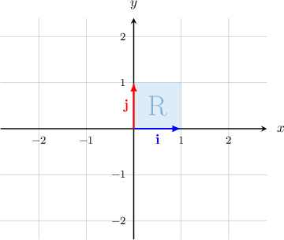
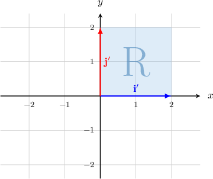
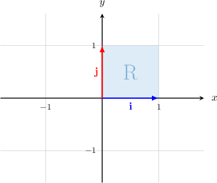
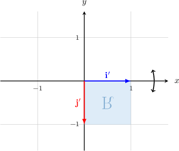
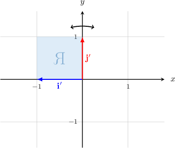
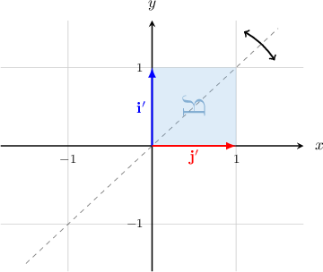
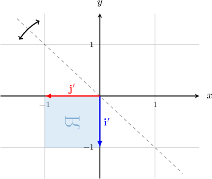

# Dilations and Reflections as Linear Transformations

Source: https://www.mathacademy.com/topics/867?courseId=136
Topic ID: 867

## Prerequisites

- [Dilations of Figures in the Coordinate Plane](../../../high-school/traditional/lessons/geometry/577-dilations-of-figures-in-the-coordinate-plane.md)
- [Linear Transformations of Objects in the Plane](./866-linear-transformations-of-objects-in-the-plane.md)

## Lesson

### Introduction

A **dilation** of scale factor $k$ with the center at the origin is a linear transformation that multiplies the standard basis vectors by $k.$ It is represented by the matrix

$$

[\begin{aligned}𝑘 & 0 \\ 0 & 𝑘\end{aligned}]

$$

For example, let

$$

[\begin{aligned}2 & 0 \\ 0 & 2\end{aligned}]

$$

be the matrix of a linear transformation $\mathbf{T}.$ This transformation is a dilation of scale factor $2.$

To visualize the dilation $\mathbf{T},$ consider the standard basis $\{\mathbf{i},\mathbf{j} \}$ of the Euclidean plane $\mathbb{R}^2$ and the unit square $\mathrm{R}$ spanned by the vectors, as shown below.

We can find the images of $\{\mathbf{i},\mathbf{j} \}$ under $T,$ as follows:

$$

\begin{aligned}𝐢^{′} & =𝑇𝐢=[\begin{matrix}2 & 0 \\ 0 & 2\end{matrix}][\begin{matrix}1 \\ 0\end{matrix}]=[\begin{matrix}2 \\ 0\end{matrix}]=2𝐢, \\ 𝐣^{′} & =𝑇𝐣=[\begin{matrix}2 & 0 \\ 0 & 2\end{matrix}][\begin{matrix}0 \\ 1\end{matrix}]=[\begin{matrix}0 \\ 2\end{matrix}]=2𝐣.\end{aligned}

$$

The transformation $\mathbf{T}$ multiplies vectors $\mathbf{i}$ and $\mathbf{j}$ by $2.$ The resulting vectors span a larger region, shown below.

### Example: Finding the Standard Matrix of a Dilation Given a Vector and its Image

#### Question

A linear transformation $\mathbf{T}$ represents a dilation. Given that $[\begin{aligned}24 \\ 16\end{aligned}]$ and $[\begin{aligned}6 \\ 4\end{aligned}]$ what is the standard matrix of $\mathbf{T}?$

#### Explanation

We can write $\mathbf{T}(\mathbf{v})$ as follows:

$$

\begin{aligned}𝐓(𝐯) & =[\begin{matrix}6 \\ 4\end{matrix}] \\ & =\frac{1}{4}⋅[\begin{matrix}24 \\ 16\end{matrix}] \\ & =\frac{1}{4}𝐯\end{aligned}

$$

Since we have $\mathbf{T}(\mathbf{v}) = \dfrac{1}{4}\mathbf{v},$ we conclude that the linear transformation $\mathbf T$ is a dilation with scale factor $k = \dfrac{1}{4}.$

Remember that the matrix representing a dilation of scale factor $k$ is given by

$$

[\begin{aligned}𝑘 & 0 \\ 0 & 𝑘\end{aligned}]

$$

Therefore, the standard matrix of $\mathbf{T}$ is

$$

\begin{aligned}\frac{1}{4} & 0 \\ 0 & \frac{1}{4}\end{aligned}

$$

### Reflection in the X and Y Axes

A **reflection in the $x$-axis** is represented by the matrix

$$

[\begin{aligned}1 & 0 \\ 0 & −1\end{aligned}]

$$

To visualize a reflection in the $x$-axis, consider the standard basis $\{\mathbf{i},\mathbf{j} \}$ of the Euclidean plane $\mathbb{R}^2$ and the unit square $\mathrm{R}$ spanned by the vectors, as shown below.

We can find the images of $\{\mathbf{i},\mathbf{j} \}$ under $T,$ as follows:

$$

\begin{aligned}𝐢^{′} & =𝐓(𝐢)=[\begin{matrix}1 & 0 \\ 0 & −1\end{matrix}][\begin{matrix}1 \\ 0\end{matrix}]=[\begin{matrix}1 \\ 0\end{matrix}]=𝐢 \\ 𝐣^{′} & =𝐓(𝐣)=[\begin{matrix}1 & 0 \\ 0 & −1\end{matrix}][\begin{matrix}0 \\ 1\end{matrix}]=[\begin{matrix}0 \\ −1\end{matrix}]=−𝐣\end{aligned}

$$

Then, we obtain the following image:

Similarly, a **reflection in the $y$-axis** is represented by the matrix

$$

[\begin{aligned}−1 & 0 \\ 0 & 1\end{aligned}]

$$

Again, we can find the images of $\{\mathbf{i},\mathbf{j} \}$ under $T,$ as follows:

$$

\begin{aligned}𝐢^{′} & =𝐓(𝐢)=[\begin{matrix}−1 & 0 \\ 0 & 1\end{matrix}][\begin{matrix}1 \\ 0\end{matrix}]=[\begin{matrix}−1 \\ 0\end{matrix}]=−𝐢 \\ 𝐣^{′} & =𝐓(𝐣)=[\begin{matrix}−1 & 0 \\ 0 & 1\end{matrix}][\begin{matrix}0 \\ 1\end{matrix}]=[\begin{matrix}0 \\ 1\end{matrix}]=𝐣\end{aligned}

$$

We obtain the following image:

### Reflection in the Lines y=x and y=-x

A **reflection in line $y=x$** is represented by the matrix

$$

[\begin{aligned}0 & 1 \\ 1 & 0\end{aligned}]

$$

We can find the images of $\{\mathbf{i},\mathbf{j} \}$ under $T$, as follows:

$$

\begin{aligned}𝐢^{′} & =𝐓(𝐢)=[\begin{matrix}0 & 1 \\ 1 & 0\end{matrix}][\begin{matrix}1 \\ 0\end{matrix}]=[\begin{matrix}0 \\ 1\end{matrix}]=𝐣 \\ 𝐣^{′} & =𝐓(𝐣)=[\begin{matrix}0 & 1 \\ 1 & 0\end{matrix}][\begin{matrix}0 \\ 1\end{matrix}]=[\begin{matrix}1 \\ 0\end{matrix}]=𝐢\end{aligned}

$$

Then, we obtain the following image:

Similarly, a **reflection in line $y=-x$** is represented by the matrix

$$

[\begin{aligned}0 & −1 \\ −1 & 0\end{aligned}]

$$

We can find the images of $\{\mathbf{i},\mathbf{j} \}$ under $T,$ as follows:

$$

\begin{aligned}𝐢^{′} & =𝐓(𝐢)=[\begin{matrix}0 & −1 \\ −1 & 0\end{matrix}][\begin{matrix}1 \\ 0\end{matrix}]=[\begin{matrix}0 \\ −1\end{matrix}]=−𝐣 \\ 𝐣^{′} & =𝐓(𝐣)=[\begin{matrix}0 & −1 \\ −1 & 0\end{matrix}][\begin{matrix}0 \\ 1\end{matrix}]=[\begin{matrix}−1 \\ 0\end{matrix}]=−𝐢\end{aligned}

$$

Then, we obtain the following image:

### Example: Identifying the Linear Transformation Represented by a Matrix

#### Question

What linear transformation is represented by the matrix $[\begin{aligned}1 & 0 \\ 0 & −1\end{aligned}]$

#### Explanation

Consider the standard basis $\{\mathbf{i},\mathbf{j} \}$ of the Euclidean plane $\mathbb{R}^2$ and the unit square spanned by the vectors, as depicted below.

We can find the images of $\{\mathbf{i},\mathbf{j} \}$ under $T,$ as follows:

$$

\begin{aligned}𝐢^{′} & =𝐓(𝐢)=[\begin{matrix}1 & 0 \\ 0 & −1\end{matrix}][\begin{matrix}1 \\ 0\end{matrix}]=[\begin{matrix}1 \\ 0\end{matrix}]=𝐢 \\ 𝐣^{′} & =𝐓(𝐣)=[\begin{matrix}1 & 0 \\ 0 & −1\end{matrix}][\begin{matrix}0 \\ 1\end{matrix}]=[\begin{matrix}0 \\ −1\end{matrix}]=−𝐣\end{aligned}

$$

Then, we obtain the following image:

Therefore, the matrix represents the reflection across the $x$-axis.
