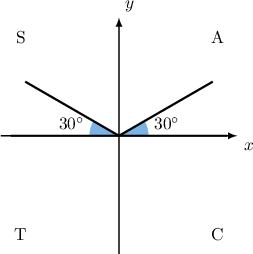
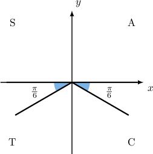
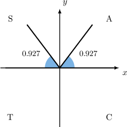
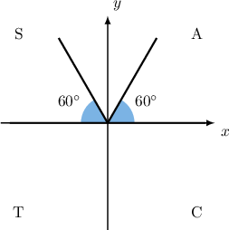

# Elementary Trigonometric Equations Containing Sine

Source: https://www.mathacademy.com/topics/913?courseId=136
Topic ID: 913

## Prerequisites

- [Graphing Sine and Cosine](../../../high-school/traditional/lessons/algebra-ii/1491-graphing-sine-and-cosine.md)

## Lesson

### Introduction

Suppose we want to find all of the solutions to the equation

$$

0^{∘}≤𝑥<360^{∘}.

$$

We can immediately calculate a solution, called the **principal value**, as follows:

$$

x = \arcsin\left(\frac{1}{2}\right) =30^\circ

$$

Since $30^\circ$ lies inside the required domain, our first solution is $x_1=30^\circ.$ This angle lies in the first quadrant and has reference angle $\theta_R = 30^\circ.$

But there is another solution. Since $\sin x = \dfrac{1}{2}>0,$ the second solution to the equation will lie in the second quadrant, and its reference angle is also $\theta_R = 30^\circ.$ To find the second solution, we use a CAST diagram.

Since the second solution $x_2$ lies in the $2$nd quadrant, we can find it using the reference angle as follows:

$$

x_2 = 180^\circ - 30^\circ = 150^\circ

$$

So, the solutions are $x=30^\circ, 150^\circ.$

### Example: Solving a Trigonometric Equation Involving Sine with Special Angles

#### Question

Find the solutions to the equation for

#### Explanation

First, we rearrange the equation, isolating

Now, we find the principal value:

Note that is not in the domain To get the first solution that's within the required domain, we need to find an angle that's coterminal with To do this, we simply add

Our first solution lies in the fourth quadrant and has a reference angle of Since the second solution must lie in the third quadrant, and it also has a reference angle

Since the second solution lies in the rd quadrant, we can find it using the reference angle as follows:

So, the solutions are

### Example: Solving a Trigonometric Equation Involving Sine with Non-Special Angles

#### Question

Calculate, in radians to decimal place, the solutions to the equation for

#### Explanation

First, we find the principal value:

Since lies inside the given domain, our first solution is

Our first solution lies in the first quadrant and has a reference angle of Since the second solution must lie in the second quadrant, and it also has a reference angle

Since the second solution lies in the nd quadrant, we can find it using the reference angle as follows:

So, the solutions (rounded to one decimal place) are

### Solving a Trigonometric Equation Involving Sine Under a Modified Domain

We can look for solutions to trigonometric equations in domains other than or

For instance, suppose that we want to find all of the solutions to

This time, we are looking for solutions in the domain

First, we find the principal value:

Since lies inside the required domain, our first solution is

Our first solution lies in the fourth quadrant and has a reference angle of Since the second solution must lie in the third quadrant, and it also has a reference angle

A second solution to the equation, lies in the rd quadrant, and we can find it using the reference angle as follows:

However, this value is not in the required domain. To get the second solution that's within the given domain, we simply subtract

So, the solutions are

### Example: Solving a Trigonometric Equation Involving Sine Under a Modified Domain

#### Question

Solve the equation for

#### Explanation

First, we rearrange the equation, isolating

Now, we find the principal value:

Since lies inside the required domain, our first solution is

Our first solution lies in the first quadrant and has a reference angle of Since the second solution must lie in the second quadrant, and it also has a reference angle

Since the second solution lies in the nd quadrant, we can find it using the reference angle as follows:

So, the solutions are

### Example: Solving a Trigonometric Equation Involving Sine with Quadrantal Angles

#### Question

Solve the equation for

#### Explanation

First, we find the principal value:

Since lies inside the required domain, our first solution is

This solution is a quadrantal angle. To find the remaining solutions, we use our knowledge of the sine function. We know that the sine function has its maximum values at

Since the domain is one period, and we have already found one maximum value in this period, we conclude that is the only solution.

### Equations Involving the Sine Function With No Solutions

Can we find solutions to the equation

Remember that the sine function always satisfies The number is outside of this range. So, there is no solution to the equation above.

In general, when a number is not in there are no values of such that
