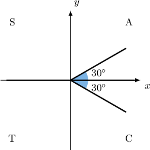
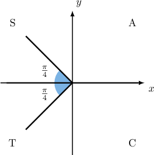
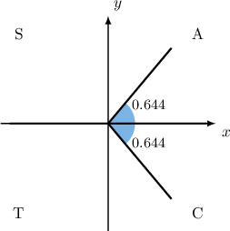

# Elementary Trigonometric Equations Containing Cosine

Source: https://www.mathacademy.com/topics/914?courseId=136
Topic ID: 914

## Prerequisites

- [Graphing Sine and Cosine](../../../high-school/traditional/lessons/algebra-ii/1491-graphing-sine-and-cosine.md)

## Lesson

### Introduction

Suppose we want to find all of the solutions to the equation

$$

\cos x = \dfrac{\sqrt{3}}{2}, \qquad 0^\circ \leq x < 360^\circ.

$$

We can immediately calculate a solution, called the **principal value**, as follows:

$$

x = \arccos\left(\frac{\sqrt{3}}{2}\right) = 30^\circ

$$

Since $30^\circ$ lies inside the required domain, our first solution is $x_1=30^\circ.$ This angle lies in the first quadrant and has reference angle $\theta_R=30^\circ.$

But there is another solution. Since $\cos x=\dfrac{\sqrt{3}}{2} >0,$ the second solution to the equation will lie in the fourth quadrant, and its reference angle is also $\theta_R=30^\circ.$ To find the second solution, we use a CAST diagram.

Since the second solution $x_2$ lies in the $4$th quadrant, we can find it using the reference angle, as follows:

$$

\begin{aligned}𝑥_{2} & =360^{∘}−𝜃_{𝑅} \\ & =360^{∘}−30^{∘} \\ & =330^{∘}\end{aligned}

$$

So, the solutions are $x=30^\circ, 330^\circ.$

### Example: Solving a Trigonometric Equation Involving Cosine with Special Angles

#### Question

Find the solutions to the equation $2\cos{x}+\sqrt{2}=0$ for $0 \leq x < 2\pi.$

#### Explanation

First, we rearrange the equation, isolating $\cos x\mathbin{:}$

$$

\begin{aligned}2cos⁡𝑥+\sqrt{√2} & =0 \\ 2cos⁡𝑥 & =−\sqrt{√2} \\ cos⁡𝑥 & =−\frac{\sqrt{√2}}{2}\end{aligned}

$$

Now, we find the principal value:

$$

\begin{aligned}𝑥=arccos⁡(−\frac{\sqrt{√2}}{2})=\frac{3𝜋}{4}\end{aligned}

$$

Since $\dfrac{3\pi}{4}$ lies inside the specified domain, our first solution is $x_1 = \dfrac{3\pi}{4}.$

Our first solution lies in the second quadrant and has a reference angle of $\theta_R = \dfrac{\pi}{4}.$ Since $\cos{x} < 0,$ the second solution must lie in the third quadrant, and it also has a reference angle $\theta_R = \dfrac{\pi}{4}.$

Since the second solution $x_2$ lies in the $3$rd quadrant, we can find it using the reference angle, as follows:

$$

\begin{aligned}𝑥_{2} & =𝜋+𝜃_{𝑅} \\ & =𝜋+\frac{𝜋}{4} \\ & =\frac{5𝜋}{4}\end{aligned}

$$

So, the solutions are $x = \dfrac{3\pi}{4}, \dfrac{5\pi}{4}.$

### Example: Solving a Trigonometric Equation Involving Cosine with Non-Special Angles

#### Question

Calculate, in radians to $1$ decimal place, the solutions to the equation $\cos x = \dfrac{4}{5}$ for $0 \leq x < 2\pi.$

#### Explanation

First, we find the principal value:

$$

\begin{aligned}𝑥=arccos⁡(\frac{4}{5})=0.643\,501…≈0.644\end{aligned}

$$

Since $0.644$ lies inside the given domain, our first solution is $x_1 = 0.644.$

Our first solution lies in the first quadrant and has a reference angle of $\theta_R = 0.644.$ Since $\cos{x} > 0,$ the second solution must lie in the fourth quadrant, and it also has a reference angle $\theta_R = 0.644.$

Since the second solution $x_2$ lies in the $4$th quadrant, we can find it using the reference angle as follows:

$$

\begin{aligned}𝑥_{2} & =2𝜋−𝜃_{𝑅} \\ & =2𝜋−0.644 \\ & =5.639\end{aligned}

$$

So, the solutions (rounded to one decimal place) are $x = 0.6, 5.6.$

### Solving a Trigonometric Equation Involving Cosine Under a Modified Domain

Suppose we want to find all of the solutions to

$$

−180^{∘}<𝑥≤180^{∘}.

$$

This time, we are looking for solutions in the domain $-180^\circ < x \leq 180^\circ.$

First, we find the principal value:

$$

x = \arccos\left(\frac{\sqrt{3}}{2}\right) = 30^\circ

$$

Since $30^\circ$ lies inside the required domain, our first solution is $x_1=30^\circ.$

Our first solution lies in the first quadrant and has a reference angle of $\theta_R=30^\circ.$ Since $\cos x>0,$ the second solution must lie in the fourth quadrant, and it also has a reference angle $\theta_R=30^\circ.$

A second solution $X$ lies in the $4$th quadrant, and we can find it using the reference angle, as follows:

$$

\begin{aligned}𝑋 & =360^{∘}−𝜃_{𝑅} \\ & =360^{∘}−30^{∘} \\ & =330^{∘}\end{aligned}

$$

However, this value is not in the domain $-180^\circ < x \leq 180^\circ.$ To get a second solution within the required domain, we need to find an angle that's coterminal with $X.$ To do this, we subtract $360^\circ$ from $X\mathbin{:}$

$$

\begin{aligned}𝑥_{2} & =𝑋−360^{∘} \\ & =330^{∘}−360^{∘} \\ & =−30^{∘}\end{aligned}

$$

So, the solutions are $x=-30^\circ, 30^\circ.$

### Example: Solving a Trigonometric Equation Involving Cosine Under a Modified Domain

#### Question

Solve the equation $2\cos x +\sqrt 2 =0$ for $-180^\circ< x \leq 180^\circ.$

#### Explanation

First, we rearrange the equation, isolating $\cos{x} \mathbin{:}$

$$

\begin{aligned}2cos⁡𝑥+\sqrt{√2} & =0 \\ 2cos⁡𝑥 & =−\sqrt{√2} \\ cos⁡𝑥 & =−\frac{\sqrt{√2}}{2}\end{aligned}

$$

Now, we find the principal value:

$$

\begin{aligned}𝑥=arccos⁡(−\frac{\sqrt{√2}}{2})=135^{∘}\end{aligned}

$$

Since $135^\circ$ lies inside the required domain, our first solution is $x_1 = 135^\circ.$

Our first solution lies in the second quadrant and has a reference angle of $\theta_R = 45^\circ.$ Since $\cos{x} < 0,$ the second solution must lie in the third quadrant, and it also has a reference angle $\theta_R = 45^\circ.$

A second solution $X$ lies in the $3$rd quadrant, and we can find it using the reference angle, as follows:

$$

\begin{aligned}𝑋 & =180^{∘}+𝜃_{𝑅} \\ & =180^{∘}+45^{∘} \\ & =225^{∘}\end{aligned}

$$

However, this value is not in the required domain. To get a second solution that's within the required domain, we subtract $360^\circ$ from $X \mathbin{:}$

$$

\begin{aligned}𝑥_{2} & =𝑋−360^{∘} \\ & =225^{∘}−360^{∘} \\ & =−135^{∘}\end{aligned}

$$

So, the solutions are $x = - 135^\circ, 135^\circ.$

### Example: Solving a Trigonometric Equation Involving Cosine with Quadrantal Angles

#### Question

Find the solutions to the equation $\cos x =1$ for $-180^\circ < x \leq 180^\circ.$

#### Explanation

Notice that the solutions to $\cos x = 1$ correspond to the values of $x$ at which $\cos x$ attains its maximum value.

First, we find the principal value:

$$

\begin{aligned}𝑥=arccos⁡(1)=0^{∘}\end{aligned}

$$

Since $0^\circ$ lies inside the required domain, our first solution is $x_1 = 0^\circ.$

This solution is a quadrantal angle. To find the remaining solutions, we use our knowledge of the cosine function. We know that the cosine function has its maximum values at

$$

x = n (360^\circ),

$$

where $n$ is an integer.

Since the domain $- 180^\circ < x \leq 180^\circ$ is one period, and we have already found one maximum value in this period, we conclude that $x = 0^\circ$ is the only solution.

### Equations Involving Cosine with No Solutions

Can we solve the following equation?

$$

0^{∘}≤𝑥<360^{∘}

$$

Remember that the range of the cosine function is given by

$$

-1 \leq \cos{x} \leq 1.

$$

Since the number $3$ lies outside of this range, the equation $\cos x = 3$ has no solution for any value of $x.$

In general, the equation

$$

\cos x = a

$$

has no solutions for $|a| > 1.$
