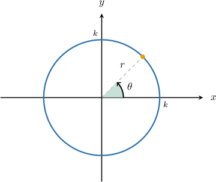
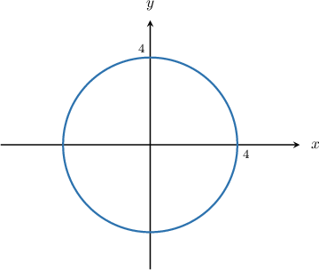
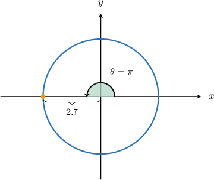
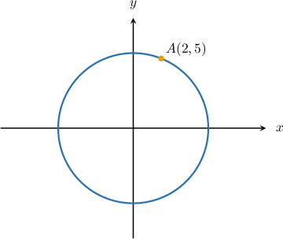

# Polar Equations of Circles Centered at the Origin

Source: https://www.mathacademy.com/topics/937?courseId=136
Topic ID: 937

## Prerequisites

- [Equations of Circles Centered at the Origin](./842-equations-of-circles-centered-at-the-origin.md)
- [Converting from Polar Coordinates to Cartesian Coordinates](./936-converting-from-polar-coordinates-to-cartesian-coordinates.md)

## Lesson

### Introduction

Expressing certain curves in polar coordinates turns out to be very handy in various situations due to their simplicity compared to Cartesian coordinates.

For instance, the equation of a circle of radius $2$ in polar coordinates is simply

$$

r = 2.

$$

This is significantly simpler compared to its Cartesian counterpart $x^2+y^2 = 4.$

More generally, consider a circle of radius $k$ centered at the origin, as shown below.

The equation of the above circle in polar coordinates is simply

$$

r=k.

$$

You might wonder why the polar angle $\theta$ does not appear in the equation. The reason is that the radius of the circle is independent of the polar angle (i.e., it is always the same, regardless of the value of $\theta$). For that reason, the polar angle does not feature in the equation.

### Example: Identifying the Graph of a Polar Circle

#### Question

What is the polar equation of the curve shown below?

#### Explanation

The given curve is a circle of radius $4$ centered at the origin.

Therefore, its polar equation is $r=4.$

### Example: Finding the Intersection of a Polar Circle With an Axis

#### Question

Find the **** coordinates of the point where the polar curve $r=2.7$ intersects the negative $x$-axis.

#### Explanation

The polar curve $r=2.7$ is a circle of radius $2.7$ centered at the origin. It crosses the negative $x$-axis at the point where $r=2.7$ and $\theta = \pi.$

Therefore, the point of intersection in polar coordinates is $\left(2.7, \pi\right).$

### Example: Finding the Polar Equation of a Circle Given a Point on the Circumference

#### Question

Find the polar equation of the circle centered at the origin that passes through the point $A(2,5)$, as shown below.

#### Explanation

A circle of radius $k$ centered at the origin has the polar equation $r = k.$

We can compute the radius $k$ of our circle using the Pythagorean theorem, as follows:

$$

\begin{aligned}𝑘 & =\sqrt{√𝑥^{2}+𝑦^{2}} \\ & =\sqrt{√2^{2}+5^{2}} \\ & =\sqrt{√29}\end{aligned}

$$

Therefore, the equation of the circle is $r=\sqrt{29}.$
