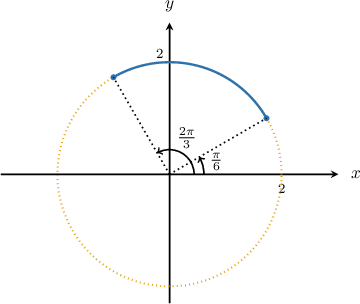
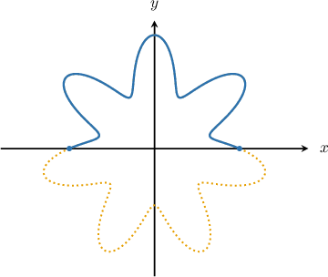
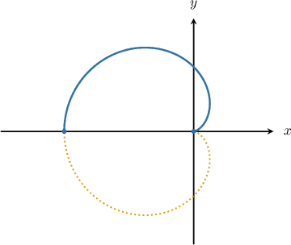

# The Arc Length of a Polar Curve

Source: https://www.mathacademy.com/topics/999?courseId=136
Topic ID: 999

## Prerequisites

- [The Arc Length of a Planar Curve](./760-the-arc-length-of-a-planar-curve.md)
- [Further Differentiation of Curves Given in Polar Form](./3854-further-differentiation-of-curves-given-in-polar-form.md)

## Lesson

### Introduction

To calculate the arc length of a polar curve $r=r(\theta)$ between the rays $\theta=\theta_1$ and $\theta=\theta_2,$ we can use the formula

$$

L = \int_{\theta_1}^{\theta_2} \sqrt{r^2 +\left(\frac{\textrm{d}r}{\textrm{d}\theta}\right)^2 }\textrm{d}\theta.

$$

For example, suppose that we want to find the arc length of the polar curve $r = 2,$ where $\dfrac{\pi}{6} \leq \theta \leq \dfrac{2\pi}{3}.$ The required arc length is shown in blue in the picture below.

We will use the formula to compute the arc length. Since $r=2,$ we have

$$

\dfrac{\textrm{d}r}{\textrm{d}\theta} = 0,

$$

and therefore, the arc length can be calculated as follows:

$$

\begin{aligned}𝐿 & =∫_{𝜃_{2}𝜃_{1}}^{}\sqrt{√𝑟^{2}+(\frac{d𝑟}{d𝜃})^{2}}d𝜃 \\ & =∫_{2𝜋/3𝜋/6}^{}\sqrt{√2^{2}+(0)^{2}}d𝜃 \\ & =∫_{2𝜋/3𝜋/6}^{}2\,d𝜃 \\ & =2∫_{2𝜋/3𝜋/6}^{}d𝜃 \\ & =2𝜃\,_{2𝜋/3𝜋/6}^{} \\ & =2(\frac{2𝜋}{3}−\frac{𝜋}{6}) \\ & =𝜋\end{aligned}

$$

### Example: Creating an Integral Expression For the Arc Length of a Polar Curve

#### Question

Find an integral expression for the arc length of the polar curve $r=3-\sin(7\theta)$ for $0 \leq \theta \leq \pi,$ shown in blue in the diagram above.

#### Explanation

The arc length $L$ of a polar curve $r=r(\theta)$ is given by

$$

L = \int_{\theta_1}^{\theta_2} \sqrt{r^2 +\left(\frac{\textrm{d}r}{\textrm{d}\theta}\right)^2 }\,\textrm{d}\theta.

$$

Since $r=3-\sin(7\theta),$ we have

$$

\dfrac{\textrm{d}r}{\textrm{d}\theta} =-7\cos(7\theta)

$$

Therefore, the arc length is

$$

\begin{aligned}𝐿 & =∫_{𝜃_{2}𝜃_{1}}^{}\sqrt{√𝑟^{2}+(\frac{d𝑟}{d𝜃})^{2}}\,d𝜃 \\ & =∫_{𝜋0}^{}\sqrt{√(3−sin⁡(7𝜃))^{2}+(−7cos⁡(7𝜃))^{2}}\,d𝜃 \\ & =∫_{𝜋0}^{}\sqrt{√9−6sin⁡(7𝜃)+sin^{2}⁡(7𝜃)+49cos^{2}⁡(7𝜃)}\,d𝜃 \\ & =∫_{𝜋0}^{}\sqrt{√9−6sin⁡(7𝜃)+sin^{2}⁡(7𝜃)+cos^{2}⁡(7𝜃)+48cos^{2}⁡(7𝜃)}\,d𝜃 \\ & =∫_{𝜋0}^{}\sqrt{√9−6sin⁡(7𝜃)+1+48cos^{2}⁡(7𝜃)}\,d𝜃 \\ & =∫_{𝜋0}^{}\sqrt{√10−6sin⁡(7𝜃)+48cos^{2}⁡(7𝜃)}\,d𝜃\,.\end{aligned}

$$

### Example: Finding the Arc Length of a Polar Curve

#### Question

Find the arc length of the polar curve $r=2(1-\cos\theta)$ for $0 \leq \theta \leq \pi$ (shown in blue in the picture above).

#### Explanation

The arc length $L$ of a polar curve $r=r(\theta)$ is given by

$$

L = \int_{\theta_1}^{\theta_2} \sqrt{r^2 +\left(\frac{\textrm{d}r}{\textrm{d}\theta}\right)^2 }\,\textrm{d}\theta.

$$

Since $r=2(1-\cos\theta),$ we have

$$

\dfrac{\textrm{d}r}{\textrm{d}\theta} = 2\sin\theta.

$$

Therefore, the arc length is

$$

\begin{aligned}𝐿 & =∫_{𝜃_{2}𝜃_{1}}^{}\sqrt{√𝑟^{2}+(\frac{d𝑟}{d𝜃})^{2}}\,d𝜃 \\ & =∫_{𝜋0}^{}\sqrt{√(2−2cos⁡𝜃)^{2}+(2sin⁡𝜃)^{2}}\,d𝜃 \\ & =∫_{𝜋0}^{}\sqrt{√4−8cos⁡𝜃+4cos^{2}⁡𝜃+4sin^{2}⁡𝜃}\,d𝜃 \\ & =∫_{𝜋0}^{}\sqrt{√4−8cos⁡𝜃+4}\,d𝜃 \\ & =∫_{𝜋0}^{}\sqrt{√8−8cos⁡𝜃}\,d𝜃 \\ & =2\sqrt{√2}∫_{𝜋0}^{}\sqrt{√1−cos⁡𝜃}\,d𝜃.\end{aligned}

$$

We now use the half-angle formula $1-\cos\theta =2\sin^2\left(\dfrac{\theta}{2}\right)$ to give

$$

\begin{aligned}𝐿 & =2\sqrt{√2}∫_{𝜋0}^{}\sqrt{√2sin^{2}⁡(\frac{𝜃}{2})}\,d𝜃 \\ & =2\sqrt{√2}⋅\sqrt{√2}⋅∫_{𝜋0}^{}sin⁡(\frac{𝜃}{2})\,d𝜃 \\ & =−4⋅2(cos⁡(\frac{𝜃}{2}))_{𝜋0}^{} \\ & =−8(cos⁡(\frac{𝜋}{2})−cos⁡0) \\ & =−8(0−1) \\ & =8.\end{aligned}

$$

### Derivation of the Main Formula

We've been using the following formula to compute the arc length bounded by a polar curve:

$$

L = \int_{\theta_1}^{\theta_2} \sqrt{ r^2 + \left( \frac{\textrm{d}r}{\textrm{d}\theta} \right)^2} \:\textrm{d}\theta

$$

But where does this formula come from? Let's start with the familiar formula for the arc length of a parametric curve:

$$

L = \int_{t_1}^{t_2} \sqrt{ \left(\frac{\textrm{d}x}{\textrm{d}t}\right)^2 +\left(\frac{\textrm{d}y}{\textrm{d}t}\right)^2 }\textrm{d}t

$$

A polar curve is really just a parametric curve with parameter $\theta$ and parametric equations given by

$$

\begin{aligned}𝑥 & =𝑟cos⁡𝜃,\,𝑦=𝑟sin⁡𝜃.\end{aligned}

$$

Writing the arc length formula for a parametric function with parameter $\theta,$ we have

$$

L = \int_{\theta_1}^{\theta_2} \sqrt{ \left(\frac{\textrm{d}x}{\textrm{d}\theta}\right)^2 +\left(\frac{\textrm{d}y}{\textrm{d}\theta}\right)^2 }\textrm{d}\theta .

$$

Since $x = r \cos \theta,$ we have

$$

\begin{aligned}\frac{d𝑥}{d𝜃} & =\frac{d}{d𝜃}(𝑟cos⁡𝜃) \\ & =\frac{d𝑟}{d𝜃}cos⁡𝜃+𝑟\frac{d}{d𝜃}(cos⁡𝜃) \\ & =\frac{d𝑟}{d𝜃}cos⁡𝜃−𝑟sin⁡𝜃.\end{aligned}

$$

Likewise, since $y=r\sin \theta,$ we have

$$

\begin{aligned}\frac{d𝑦}{d𝜃} & =\frac{d}{d𝜃}(𝑟sin⁡𝜃) \\ & =\frac{d𝑟}{d𝜃}sin⁡𝜃+𝑟\frac{d}{d𝜃}(sin⁡𝜃) \\ & =\frac{d𝑟}{d𝜃}sin⁡𝜃+𝑟cos⁡𝜃.\end{aligned}

$$

Substituting the above into our expression for $L,$ we reach the desired formula:

$$

\begin{aligned}𝐿 & =∫_{𝜃_{2}𝜃_{1}}^{}\sqrt{√(\frac{d𝑥}{d𝜃})^{2}+(\frac{d𝑦}{d𝜃})^{2}}\,d𝜃 \\ & =∫_{𝜃_{2}𝜃_{1}}^{}\sqrt{√(\frac{d𝑟}{d𝜃}cos⁡𝜃−𝑟sin⁡𝜃)^{2}+(\frac{d𝑟}{d𝜃}sin⁡𝜃+𝑟cos⁡𝜃)^{2}}\,d𝜃 \\ & =∫_{𝜃_{2}𝜃_{1}}^{}\sqrt{√(\frac{d𝑟}{d𝜃})^{2}cos^{2}⁡𝜃+𝑟^{2}sin^{2}⁡𝜃+(\frac{d𝑟}{d𝜃})^{2}sin^{2}⁡𝜃+𝑟^{2}cos^{2}⁡𝜃}\,d𝜃 \\ & =∫_{𝜃_{2}𝜃_{1}}^{}\sqrt{√𝑟^{2}(cos^{2}⁡𝜃+sin^{2}⁡𝜃)+(\frac{d𝑟}{d𝜃})^{2}(cos^{2}⁡𝜃+sin^{2}⁡𝜃)}\,d𝜃 \\ & =∫_{𝜃_{2}𝜃_{1}}^{}\sqrt{√𝑟^{2}+(\frac{d𝑟}{d𝜃})^{2}}\,d𝜃.\end{aligned}

$$
