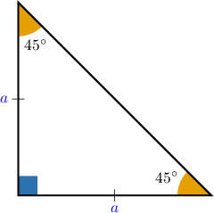
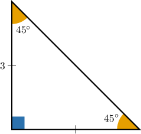
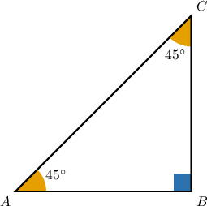
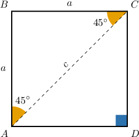
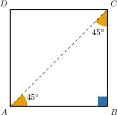

# Isosceles Right Triangles

Source: https://www.mathacademy.com/topics/263?courseId=127
Topic ID: 263

## Prerequisites

- [The Pythagorean Theorem](../../../traditional/lessons/geometry/433-the-pythagorean-theorem.md)
- [Rationalizing Denominators](../../../../middle-school/lessons/grade-8/1318-rationalizing-denominators.md)
- [The Perimeter of a Polygon](../../../../middle-school/lessons/grade-7/1386-the-perimeter-of-a-polygon.md)

## Lesson

### Introduction

In isosceles right triangles such as the one shown below, the angles always measure $45^\circ,$ $45^\circ,$ and $90^\circ.$

Consequently, isosceles right triangles are often called **$\boldsymbol{45^\circ}$-$\boldsymbol{45^\circ}$-$\boldsymbol{90^\circ}$ triangles**.

All $45^\circ$-$45^\circ$-$90^\circ$ triangles share a special property:

*In any ${45^\circ}$-${45^\circ}$-${90^\circ}$ triangle, the length of the hypotenuse is $\sqrt{2}$ times the length of a leg.*

To see why this is, remember that

- in an isosceles triangle, the two legs must have the same length, and

- in a right triangle, the square of the longest side must equal the sum of the squares of the two shorter sides.

So, if an isosceles right triangle has legs of length $a$ and the hypotenuse has length $h,$ then we have

$$

\begin{aligned}ℎ^{2} & =𝑎^{2}+𝑎^{2} \\ ℎ^{2} & =2𝑎^{2} \\ ℎ & =\sqrt{√2𝑎^{2}} \\ ℎ & =\sqrt{√2}⋅𝑎.\end{aligned}

$$

### Example: Calculating the Length of the Hypotenuse of a 45-45-90 Triangle Given the Legs

#### Question

If the side that is opposite to a $45^\circ$ angle in an isosceles right triangle has a length of $3,$ what is the length of the hypotenuse?

#### Explanation

The hypotenuse in an isosceles right triangle is equal to $\sqrt{2}$ times the length of a leg.

The legs of an isosceles right triangle are the sides that are opposite the $45^\circ$ angles. So in the given triangle, the legs have length $3.$

Consequently, the hypotenuse has a length of

$$

\sqrt{2} \cdot 3 = 3\sqrt{2}.

$$

### Example: Calculating the Length of the Legs of a 45-45-90 Triangle Given the Hypotenuse

#### Question

If the hypotenuse of a $45^\circ$-$45^\circ$-$90^\circ$ triangle has a length of $5,$ then what is the length of each leg?

#### Explanation

The hypotenuse in a $45^\circ$-$45^\circ$-$90^\circ$ triangle is equal to $\sqrt{2}$ times the length of a leg.

Here, we know that the hypotenuse has length $5.$ So, if the length of a leg is $a,$ then we must have

$$

\begin{aligned}5 & =\sqrt{√2}⋅𝑎 \\ 𝑎 & =\frac{5}{\sqrt{√2}}.\end{aligned}

$$

To remove the square root from the denominator, we can multiply both the numerator and denominator by $\sqrt{2},$ as follows:

$$

\begin{aligned}𝑎 & =\frac{5⋅\sqrt{√2}}{\sqrt{√2}⋅\sqrt{√2}} \\ 𝑎 & =\frac{5\sqrt{√2}}{2}\end{aligned}

$$

Therefore, the length of each leg is $\dfrac{5\sqrt{2}}{2}.$

### Example: Calculating the Length of a Hypotenuse or Leg of a 45-45-90 Triangle Given its Perimeter

#### Question

The perimeter of the triangle below is $26+13\sqrt{2}.$ Find the measure of the hypotenuse.

#### Explanation

Because the triangle is isosceles, the legs must have the same length. Let $a$ be the length of each leg. So, we have

$$

AB=BC=a.

$$

Moreover, because the triangle is a ** isosceles triangle, the hypotenuse must be equal to $\sqrt{2}$ times the length of a leg. Therefore,

$$

AC = AB\cdot\sqrt{2} = a\sqrt{2}.

$$

Finally, since the perimeter is $p = 26+13\sqrt{2},$ we have

$$

\begin{aligned}𝑝 & =𝐴𝐵+𝐵𝐶+𝐴𝐶 \\ 26+13\sqrt{√2} & =𝑎+𝑎+𝑎\sqrt{√2} \\ 26+13\sqrt{√2} & =2𝑎+𝑎\sqrt{√2} \\ 13(2+\sqrt{√2}) & =𝑎(2+\sqrt{√2}) \\ 13(2+\sqrt{√2}) & =𝑎(2+\sqrt{√2}) \\ 13 & =𝑎.\end{aligned}

$$

Therefore, the length of each leg is $a=13,$ and the length of the hypotenuse is

$$

AC = a \sqrt{2} = 13 \sqrt{2} .

$$

### Applications to Squares

Now that we know about $45^\circ$-$45^\circ$-$90^\circ$ triangles, it's straightforward to see that the diagonal of any square is $\sqrt{2}$ times the side length of the square.

To illustrate, consider the square below, where $a$ is the measure of a side and $c$ is the measure of a diagonal.

Since the sides of a square are congruent, $\triangle{ABC}$ is an isosceles right triangle (a $45^{\circ}$-$45^{\circ}$-$90^{\circ}$ triangle).

So, for the diagonal, we have

$$

\begin{aligned}𝑐=\sqrt{√2}⋅𝑎.\end{aligned}

$$

### Example: Determining the Length of the Diagonal or Side of a Square Given its Perimeter

#### Question

Find the length of the diagonal $\overline{AC}$ of the square $ABCD$ if the perimeter of the square is $p=256\,\mathrm{mm}.$

#### Explanation

Since the perimeter is $p=256\,\textrm{mm},$ the length of a single side is

$$

AB = \dfrac{p}{4} = \dfrac{256}{4} = 64\,\mathrm{mm}.

$$

Now, consider $\triangle{ABC}$, which is an isosceles right triangle since $\angle{ABC} = 90^\circ$ and $AB=BC.$

The hypotenuse in an isosceles right triangle is equal to $\sqrt{2}$ times the length of a leg.

Here, the length of a leg is $AB=64,$ so the length of the hypotenuse is

$$

AC = \sqrt{2}\cdot AB = \sqrt{2}\cdot 64 = 64\sqrt{2}\,\textrm{mm}.

$$

Therefore, the diagonal of the square $ABCD$ has a length of $AC= 64 \sqrt{2} \, \textrm{mm}.$
