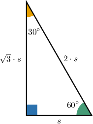
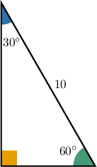
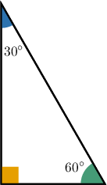

# The Area of a 30-60-90 Triangle

Source: https://www.mathacademy.com/topics/2884?courseId=127
Topic ID: 2884

## Prerequisites

- [30-60-90 Triangles](../../../traditional/lessons/geometry/262-30-60-90-triangles.md)
- [Areas of Triangles](../../../../middle-school/lessons/grade-7/1397-areas-of-triangles.md)

## Lesson

### Introduction

Remember that in a $30^\circ$-$60^\circ$-$90^\circ$ triangle, the hypotenuse is twice as long as the shortest leg, and the length of the longer leg is $\sqrt{3}$ times the length of the shortest leg. If we denote the length of the shortest leg as $s,$ then we can summarize this information in a single diagram, given below.

Therefore, if we know the length of a leg of a $30^\circ$-$60^\circ$-$90^\circ$ triangle, then we can compute its area. The base is of length $s$ and the height is of length $\sqrt{3} \cdot s,$ so the area is given by

$$

\begin{aligned}𝐴 & =\frac{1}{2}⋅𝑏⋅ℎ \\ & =\frac{1}{2}⋅𝑠⋅\sqrt{√3}⋅𝑠 \\ & =\frac{\sqrt{√3}}{2}𝑠^{2}.\end{aligned}

$$

### Example: Finding the Area of a 30-60-90 Triangle Given the Length of the Shortest Side

#### Question

If the shortest side of a $30^\circ$-$60^\circ$-$90^\circ$ triangle has a length of $12,$ then what is its area?

#### Explanation

The area of a $30^\circ$-$60^\circ$-$90^\circ$ triangle whose shortest side has length $s$ is given by

$$

\mathcal A = \dfrac{\sqrt 3}{2} s^2.

$$

In our case, the shortest side has length $s=12,$ so the area is given by

$$

\begin{aligned}A & =\frac{\sqrt{√3}}{2}⋅12^{2} \\ & =\frac{\sqrt{√3}}{2}⋅144 \\ & =72\sqrt{√3}.\end{aligned}

$$

### Example: Finding Length of the Shortest Side of a 30-60-90 Triangle Given the Area

#### Question

If the area of a $30^\circ$-$60^\circ$-$90^\circ$ triangle is $23 \sqrt{3},$ then what is the length of its shortest side?

#### Explanation

The area of a $30^\circ$-$60^\circ$-$90^\circ$ triangle whose shortest side has length $s$ is given by

$$

\mathcal A = \dfrac{\sqrt 3}{2} s^2.

$$

In our case, the area is $\mathcal A = 23 \sqrt{3},$ so we can substitute this into the above formula and solve for $s$ as follows:

$$

\begin{aligned}23\sqrt{√3} & =\frac{\sqrt{√3}}{2}𝑠^{2} \\ 23 & =\frac{1}{2}𝑠^{2} \\ 46 & =𝑠^{2} \\ 𝑠 & =\sqrt{√46}\end{aligned}

$$

### Example: Finding the Area of a 30-60-90 Triangle Given the Length of the Longer Leg or Hypotenuse

#### Question

What is the area of the triangle below?

#### Explanation

From the diagram, we see that we have a $30^\circ$-$60^\circ$-$90^\circ$ triangle with a hypotenuse of length $10.$

In a $30^\circ$-$60^\circ$-$90^\circ$ triangle, the length of the hypotenuse is twice the length of the shortest side. So, if the length of the hypotenuse is $10,$ then the length of the shortest side is

$$

s = \dfrac{10}{2} = 5.

$$

Now, we can use the formula for the area of a $30^\circ$-$60^\circ$-$90^\circ$ triangle, expressed in terms of the length of the shortest side:

$$

\begin{aligned}A & =\frac{\sqrt{√3}}{2}𝑠^{2} \\ & =\frac{\sqrt{√3}}{2}⋅5^{2} \\ & =\frac{\sqrt{√3}}{2}⋅25 \\ & =\frac{25\sqrt{√3}}{2}\end{aligned}

$$

### Example: Finding the Length of the Longer Leg or Hypotenuse of a 30-60-90 Triangle Given the Area

#### Question

If the area of the triangle below is $26 \sqrt{3}$ then what is the length of its longer leg?

#### Explanation

First, we will find the length of the shortest side. Then, we will use that information to find the length of the longer leg.

From the diagram, we see that we have a $30^\circ$-$60^\circ$-$90^\circ$ triangle. The area of a $30^\circ$-$60^\circ$-$90^\circ$ triangle whose shortest side has length $s$ is given by

$$

\mathcal A = \dfrac{\sqrt 3}{2} s^2.

$$

In our case, the area is $\mathcal A =26 \sqrt{3},$ so we can substitute this into the above formula and solve for $s$ as follows:

$$

\begin{aligned}26\sqrt{√3} & =\frac{\sqrt{√3}}{2}𝑠^{2} \\ 52 & =𝑠^{2} \\ 𝑠 & =\sqrt{√52} \\ 𝑠 & =2\sqrt{√13}\end{aligned}

$$

In a $30^\circ$-$60^\circ$-$90^\circ,$ the length of the longer leg is $\sqrt 3$ times the length of the shortest side. So, the length of the longer leg is

$$

\begin{aligned}\sqrt{√3}⋅𝑠 & =\sqrt{√3}⋅2\sqrt{√13} \\ & =2\sqrt{√39}.\end{aligned}

$$
