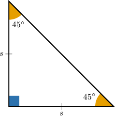
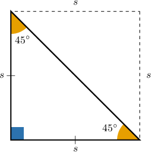
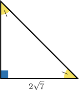
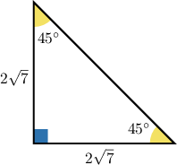
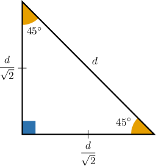
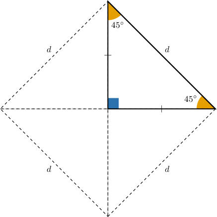
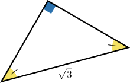
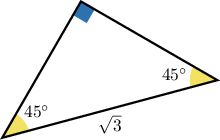

# The Area of an Isosceles Right Triangle

Source: https://www.mathacademy.com/topics/2885?courseId=127
Topic ID: 2885

## Prerequisites

- [Isosceles Right Triangles](../../../traditional/lessons/geometry/263-isosceles-right-triangles.md)
- [Areas of Triangles](../../../../middle-school/lessons/grade-7/1397-areas-of-triangles.md)

## Lesson

### Introduction

Remember that in a $45^\circ$-$45^\circ$-$90^\circ$ triangle, both legs have the same length. Let $s$ denote the length of the legs, as shown below.

Therefore, if we know the length of a leg of a $45^\circ$-$45^\circ$-$90^\circ$ triangle, we can compute its area. The base is of length $s$ and the height is of length $s,$ so the area is given by

$$

\begin{aligned}A & =\frac{1}{2}⋅𝑠⋅𝑠 \\ & =\frac{1}{2}𝑠^{2}.\end{aligned}

$$

There is some nice intuition behind the above formula: as shown below, the $45^\circ$-$45^\circ$-$90^\circ$ triangle covers half the area of a square with side length $s.$

### Example: Finding the Area of a 45-45-90 Triangle Given the Length of a Leg

#### Question

What is the area of the triangle shown below?

#### Explanation

Since the given triangle is a right triangle where the non-right angles are congruent, it must be a $45^\circ$-$45^\circ$-$90^\circ$ triangle.

The area of a $45^\circ$-$45^\circ$-$90^\circ$ triangle with legs of length $s$ is given by

$$

\mathcal A = \dfrac{1}{2} s^2.

$$

In our case, the legs have length $s=2 \sqrt{7},$ so the area is given by

$$

\begin{aligned}A & =\frac{1}{2}⋅(2\sqrt{√7})^{2} \\ & =\frac{1}{2}⋅4⋅7 \\ & =14.\end{aligned}

$$

### Example: Finding a Side Length of a 45-45-90 Triangle Given the Area

#### Question

If the area of a $45^\circ$-$45^\circ$-$90^\circ$ triangle is $16,$ then what is the length of one of its legs?

#### Explanation

The area of a $45^\circ$-$45^\circ$-$90^\circ$ triangle with legs of length $s$ is given by

$$

\mathcal A = \dfrac{1}{2} s^2.

$$

We can solve for $s$ in terms of $\mathcal A$ as follows:

$$

\begin{aligned}\frac{1}{2}𝑠^{2} & =A \\ 𝑠^{2} & =2A \\ 𝑠 & =\sqrt{√2A}\end{aligned}

$$

In our case, the area is $\mathcal A=16,$ so the length of a leg is given by

$$

\begin{aligned}𝑠 & =\sqrt{√2⋅16} \\ & =\sqrt{√2}⋅\sqrt{√16} \\ & =4\sqrt{√2}.\end{aligned}

$$

### The Area of a 45-45-90 Triangle in Terms of the Hypotenuse

We can also find the area of a $45^\circ$-$45^\circ$-$90^\circ$ triangle if we're given the length of the hypotenuse.

First, recall that in a $45^\circ$-$45^\circ$-$90^\circ$ triangle, the length of the hypotenuse is $\sqrt{2}$ times the length of a leg. Therefore, the length of a leg is the length of the hypotenuse *divided* by $\sqrt{2}.$

So, if the hypotenuse has length $d,$ then the legs have length $\dfrac{d}{\sqrt 2}.$

So, the area of the $45^\circ$-$45^\circ$-$90^\circ$ triangle shown above is given by

$$

\begin{aligned}𝐴 & =\frac{1}{2}(\frac{𝑑}{\sqrt{√2}})^{2} \\ & =\frac{1}{2}⋅\frac{𝑑^{2}}{2} \\ & =\frac{1}{4}𝑑^{2}.\end{aligned}

$$

There is some nice intuition behind the above formula: as shown below, the $45^\circ$-$45^\circ$-$90^\circ$ triangle covers a quarter of a square with sides of length $d.$

### Example: Finding the Area of a 45-45-90 Triangle Given the Length of the Hypotenuse

#### Question

What is the area of the triangle below?

#### Explanation

Since the given triangle is a right triangle where the non-right angles are congruent, it must be a $45^\circ$-$45^\circ$-$90^\circ$ triangle.

The area of a $45^\circ$-$45^\circ$-$90^\circ$ triangle with a hypotenuse of length $d$ is given by

$$

\mathcal A = \dfrac{1}{4} d^2.

$$

In our case, the hypotenuse has length $d=\sqrt{3},$ so the area is given by

$$

\begin{aligned}A & =\frac{1}{4}⋅(\sqrt{√3})^{2} \\ & =\frac{1}{4}⋅3 \\ & =\frac{3}{4}.\end{aligned}

$$

### Example: Finding a Hypotenuse of a 45-45-90 Triangle Given the Area

#### Question

If the area of a $45^\circ$-$45^\circ$-$90^\circ$ triangle is $16,$ then what is the length of its hypotenuse?

#### Explanation

The area of a $45^\circ$-$45^\circ$-$90^\circ$ triangle with a hypotenuse of length $d$ is given by

$$

\mathcal A = \dfrac{1}{4} d^2.

$$

We can solve for $d$ in terms of $\mathcal A$ as follows:

$$

\begin{aligned}\frac{1}{4}𝑑^{2} & =A \\ 𝑑^{2} & =4A \\ 𝑑 & =\sqrt{√4A} \\ 𝑑 & =2\sqrt{√A}\end{aligned}

$$

In our case, the area is $\mathcal A=16,$ so the length of the hypotenuse is given by

$$

\begin{aligned}𝑑 & =2\sqrt{√16} \\ & =2⋅4 \\ & =8.\end{aligned}

$$
