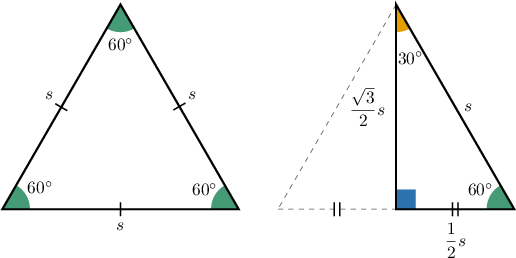
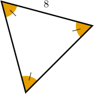
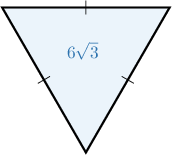

# The Area of an Equilateral Triangle

Source: https://www.mathacademy.com/topics/2886?courseId=127
Topic ID: 2886

## Prerequisites

- [30-60-90 Triangles](../../../traditional/lessons/geometry/262-30-60-90-triangles.md)
- [Areas of Triangles](../../../../middle-school/lessons/grade-7/1397-areas-of-triangles.md)

## Lesson

### Introduction

Notice that if we split an equilateral triangle in half, we get two $30^\circ$-$60^\circ$-$90^\circ$ triangles. We can use this idea to compute the area of an equilateral triangle.

As shown in the above diagram, if the equilateral has side length $s,$ then according to the side length ratios of the $30^\circ$-$60^\circ$-$90^\circ$ triangle, the height of the equilateral triangle is $\dfrac{\sqrt 3}{2} s.$

So, the area of the equilateral triangle is

$$

\begin{aligned}𝐴 & =\frac{1}{2}⋅𝑠⋅\frac{\sqrt{√3}}{2}𝑠 \\ & =\frac{\sqrt{√3}}{4}𝑠^{2}.\end{aligned}

$$

### Example: Finding the Area of an Equilateral Triangle Given the Side Length

#### Question

What is the area of the triangle above?

#### Explanation

Since the measures of all of the angles of the triangle are equal, it is an equilateral triangle.

The area of an equilateral triangle with sides of length $s$ is given by

$$

\mathcal A = \dfrac{\sqrt 3}{4} s^2.

$$

From the diagram, we see that the triangle has sides of length $8.$ Substituting $s=8$ into the above formula, we get

$$

\begin{aligned}A & =\frac{\sqrt{√3}}{4}⋅8^{2} \\ & =\frac{\sqrt{√3}}{4}⋅64 \\ & =16\sqrt{√3}.\end{aligned}

$$

### Example: Finding the Area of an Equilateral Triangle Given the Perimeter

#### Question

What is the area of an equilateral triangle with a perimeter of $12?$

#### Explanation

The area of an equilateral triangle with sides of length $s$ is given by

$$

\mathcal A = \dfrac{\sqrt 3}{4} s^2.

$$

The equilateral triangle has a perimeter of $12,$ so each side has a length of

$$

s = \dfrac{12}{3} = 4.

$$

Substituting $s=4$ into the above formula, we get

$$

\begin{aligned}A & =\frac{\sqrt{√3}}{4}⋅4^{2} \\ & =\frac{\sqrt{√3}}{4}⋅16 \\ & =4\sqrt{√3}.\end{aligned}

$$

### Example: Finding the Side Length of an Equilateral Triangle Given the Area

#### Question

If the triangle above has an area of $6 \sqrt{3},$ what is the length of a side of the triangle?

#### Explanation

Since all of the sides of the triangle have equal lengths, it is an equilateral triangle.

The area of an equilateral triangle with sides of length $s$ is given by

$$

\mathcal A = \dfrac{\sqrt 3}{4} s^2.

$$

In our case, the area is $\mathcal A = 6 \sqrt{3},$ so we can substitute this into the above formula and solve for $s,$ as follows:

$$

\begin{aligned}6\sqrt{√3} & =\frac{\sqrt{√3}}{4}𝑠^{2} \\ 6 & =\frac{1}{4}𝑠^{2} \\ 24 & =𝑠^{2} \\ 𝑠 & =\sqrt{√24} \\ 𝑠 & =2\sqrt{√6}\end{aligned}

$$

### Example: Finding the Perimeter of an Equilateral Triangle Given the Area

#### Question

What is the perimeter of an equilateral triangle whose area is $9 \sqrt{3}?$

#### Explanation

First, we will find the length of a side of the triangle. Then, we will use that information to find the perimeter.

The area of an equilateral triangle with sides of length $s$ is given by

$$

\mathcal A = \dfrac{\sqrt 3}{4} s^2.

$$

In our case, the area is $\mathcal A = 9\sqrt{3},$ so we can substitute this into the above formula and solve for $s,$ as follows:

$$

\begin{aligned}9\sqrt{√3} & =\frac{\sqrt{√3}}{4}𝑠^{2} \\ 9 & =\frac{1}{4}𝑠^{2} \\ 36 & =𝑠^{2} \\ 𝑠 & =\sqrt{√36} \\ 𝑠 & =6\end{aligned}

$$

Therefore, the perimeter of the triangle is

$$

\begin{aligned}3𝑠 & =3⋅6 \\ & =18.\end{aligned}

$$
