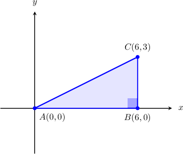
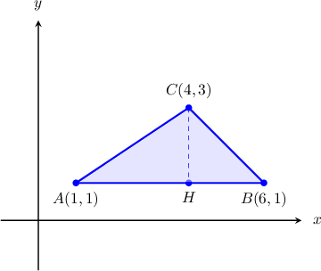
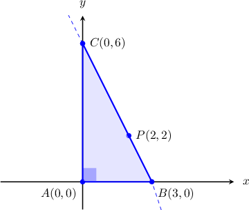
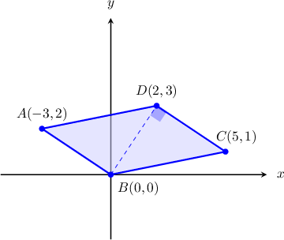

# Calculating Areas of Triangles and Quadrilaterals in the Plane

Source: https://www.mathacademy.com/topics/2977?courseId=127
Topic ID: 2977

## Prerequisites

- [Areas of Triangles](../../../../middle-school/lessons/grade-7/1397-areas-of-triangles.md)
- [Areas of Parallelograms](../../../../middle-school/lessons/grade-7/1399-areas-of-parallelograms.md)
- [Calculating Areas of Rectangles in the Plane](../../../traditional/lessons/geometry/1478-calculating-areas-of-rectangles-in-the-plane.md)

## Lesson

### Introduction

Suppose we would like to find the area of $\triangle ABC,$ where $A(0,0),$ $B(6,0),$ $C(6,3).$ First, let's plot the triangle using the given coordinates.

Notice that $\triangle ABC$ is a right triangle with legs $\overline{AB}$ and $\overline{BC}.$

Since $\overline{AB}$ is horizontal, we can calculate the length of this segment by computing the absolute value of the difference between the $x$-coordinates of the endpoints:

$$

\begin{aligned}𝐴𝐵 & =|𝑥_{𝐵}−𝑥_{𝐴}| \\ & =|6−0| \\ & =6\end{aligned}

$$

Similarly, since $\overline{BC}$ is vertical, we can calculate the length of this segment by computing the absolute value of the difference between the $y$-coordinates of the endpoints:

$$

\begin{aligned}𝐵𝐶 & =|𝑦_{𝐶}−𝑦_{𝐵}| \\ & =|3−0| \\ & =3\end{aligned}

$$

Therefore, using the formula for the area of the triangle, we have

$$

\begin{aligned}A & =\frac{𝐴𝐵⋅𝐵𝐶}{2} \\ & =\frac{6⋅3}{2} \\ & =9.\end{aligned}

$$

### Example: Calculating the Area of a Triangle in the Coordinate Plane

#### Question

Calculate the area of $\triangle ABC$ given that $A(1,1),$ $B(6,1),$ $C(4,3).$

#### Explanation

Let's plot the triangle using the given coordinates.

Since the $y$-coordinates of $A$ and $B$ are the same, the side $\overline{AB}$ must be parallel to the $x$-axis. Let's use this side as a base of the triangle.

From the diagram, we can calculate the length of the base, as follows:

$$

\begin{aligned}𝐴𝐵 & =|𝑥_{𝐵}−𝑥_{𝐴}| \\ & =|6−1| \\ & =5\end{aligned}

$$

Here, $H$ is the point on $\overleftrightarrow{AB}$ such that $\overline{CH}\perp \overline{AB}.$ Since $H$ lies on $\overleftrightarrow{AB},$ the $y$-coordinate of $H$ must be equal to $1$ too.

From the diagram, we can now calculate the length of the height:

$$

\begin{aligned}𝐶𝐻 & =|𝑦_{𝐶}−𝑦_{𝐻}| \\ & =|3−1| \\ & =2\end{aligned}

$$

Therefore, the area of the triangle is

$$

\begin{aligned}A_{𝐴𝐵𝐶} & =\frac{𝐴𝐵⋅𝐶𝐻}{2} \\ & =\frac{5⋅2}{2} \\ & =5.\end{aligned}

$$

### Example: Calculating the Area of a Triangle Formed by a Line and the Coordinate Axes

#### Question

The line $l$ with slope $m=-2$ passes through the point $P(2,2).$ Calculate the area of the triangle bounded by $l$ and the coordinate axes.

#### Explanation

First, we find the equation of $l.$

Since the slope is $m=-2,$ the equation of $l$ is $y=-2x + k,$ where $k$ is a constant. Next, since $P$ lies on $l,$ substituting the coordinates of the point into the equation, we obtain

$$

\begin{aligned}2 & =−2⋅2+𝑘 \\ 𝑘 & =6.\end{aligned}

$$

So, the equation of $l$ is $y=-2x+6.$

Let $A(x_A,0)$ be the intersection point between $l$ and the $x$-axis. Substituting the coordinates into the equation of the line, we get

$$

\begin{aligned}0 & =−2𝑥_{𝐴}+6 \\ 𝑥_{𝐴} & =3.\end{aligned}

$$

Let $B(0,y_B)$ be the intersection point between $l$ and the $y$-axis. Substituting the coordinates into the equation of the line, we get

$$

\begin{aligned}𝑦_{𝐵} & =−2⋅0+6 \\ 𝑦_{𝐵} & =6.\end{aligned}

$$

As a result, we obtain the following right triangle.

From the diagram, we can calculate the length of the legs:

$$

\begin{aligned}𝐴𝐵 & =|𝑥_{𝐵}−𝑥_{𝐴}| \\ & =|3−0| \\ & =3 \\ 𝐴𝐶 & =|𝑦_{𝐶}−𝑦_{𝐴}| \\ & =|6−0| \\ & =6\end{aligned}

$$

Therefore, the area of the triangle is

$$

\begin{aligned}A_{△𝐴𝐵𝐶} & =\frac{𝐴𝐵⋅𝐴𝐶}{2} \\ & =\frac{3⋅6}{2} \\ & =9.\end{aligned}

$$

### Example: Calculating the Area of a Parallelogram in the Coordinate Plane

#### Question

Calculate the area of the parallelogram shown below.

#### Explanation

The area of a parallelogram is given by $\mathcal{A} = b \cdot h,$ where $b$ is the base and $h$ is the height.

In our case, we have $b=AB=CD$ and $h=BD.$

From the diagram, we can calculate the lengths of $\overline{AB}$ and $\overline{BD}\mathbin{:}$

$$

\begin{aligned}𝐴𝐵 & =\sqrt{(𝑥_{𝐵}−𝑥_{𝐴})^{2}+(𝑦_{𝐵}−𝑦_{𝐴})^{2}} \\ & =\sqrt{(0−(−3))^{2}+(0−(2))^{2}} \\ & =\sqrt{9+4} \\ & =\sqrt{13} \\ 𝐵𝐷 & =\sqrt{(𝑥_{𝐷}−𝑥_{𝐵})^{2}+(𝑦_{𝐷}−𝑦_{𝐵})^{2}} \\ & =\sqrt{(2−0)^{2}+(3−0)^{2}} \\ & =\sqrt{4+9} \\ & =\sqrt{13}\end{aligned}

$$

Therefore, the area of the parallelogram is

$$

\begin{aligned}A & =𝐴𝐵⋅𝐵𝐷 \\ & =\sqrt{13}⋅\sqrt{13} \\ & =13.\end{aligned}

$$
