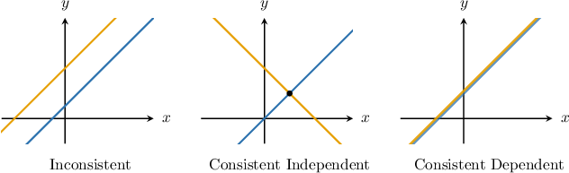
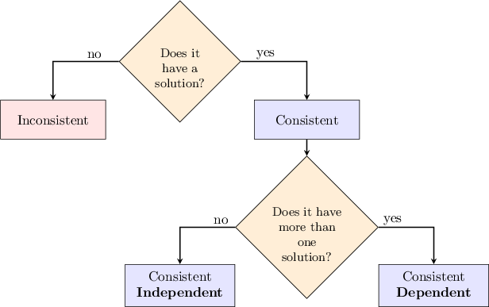

# Consistency and Dependency in Linear Systems

Source: https://www.mathacademy.com/topics/4638?courseId=127
Topic ID: 4638

## Prerequisites

- [Systems of Equations With No Solutions and Infinitely Many Solutions](../../../traditional/lessons/algebra-i/493-systems-of-equations-with-no-solutions-and-infinitely-many-solutions.md)

## Lesson

### Introduction

A system of linear equations is **consistent** if it has *at least one* solution. Otherwise, it is **inconsistent**.

Consistent systems, in turn, can be of the following two types:

- When a system of equations has a *single* solution, it is **consistent independent**.

- When a system of equations has an *infinite number* of solutions, it is **consistent dependent**.

We can summarize these definitions using the diagram shown below.

The solutions of a linear system with two variables correspond to the points of intersection of the two lines defined by the equations. Three possibilities exist, as shown below.

### Understanding the Terminology

Remember that a system is *consistent* if it has a solution. So, the idea that a system of equations with no solution is *inconsistent* probably makes sense to you.

But what about the difference between consistent *dependent* and consistent *independent?* What is the reasoning behind these naming conventions?

To help understand consistent dependent vs. consistent independent, we'll look at some concrete examples:

- First, consider the following system. This system has *infinitely many* solutions corresponding to the fact that the two lines coincide. In a previous lesson, we saw that the set of all solutions $({\color{blue}{x}},{\color{red}{y}})$ can be expressed as where ${\color{blue}{x}}$ is any number. Consequently, any ${\color{red}{y}}$-value in our solution is *dependent* on a corresponding ${\color{blue}{x}}$-value. Thus, the system of equations is consistent-*dependent*.

- Next, we consider the following system: This system has a single solution corresponding to the unique intersection point of the two lines. The unique solution $({\color{blue}{x}},{\color{red}{y}})$ is given by the single point $({\color{blue}{0}},{\color{red}{1}}).$ In this case, the components of the solution do not depend on $x$ or $y.$ Thus, the system of equations is consistent-*independent*.

### Example: Understanding Consistency and Dependency Terminology

#### Question

Consider a system of two linear equations with two variables, where each equation is represented by the corresponding straight line in the plane. What can we say about the intersections of these lines, given that the system is

1. inconsistent,

2. consistent independent, or

3. consistent dependent?

#### Explanation

The solutions of a linear system with two variables correspond to the points of intersection of the two lines defined by the equations. Three possibilities exist, as shown below.

In other words, we have the following cases:

- If a system is ** (has no solutions), the corresponding lines are parallel (do not intersect). And vice versa, parallel lines correspond to an inconsistent system.

- If a system is ** (i.e., has exactly one solution), the corresponding lines intersect at exactly one point. And vice versa, intersecting lines correspond to a consistent independent system.

- If a system is ** (i.e., has infinitely many solutions), the corresponding lines intersect at infinitely many points (coincide). And vice versa, coinciding lines correspond to a consistent dependent system.

### Example: Classifying Slope-Intercept Systems Using Consistency and Dependency Terminology

#### Question

Consider the following system of equations.

$$

\begin{aligned}𝑦=2𝑥+6 \\ 𝑦=2𝑥+1\end{aligned}

$$

Comment on the consistency of this system, the corresponding number of solutions, and its geometric interpretation.

#### Explanation

A system of linear equations is ** if it has at least one solution. Otherwise, it is called **.

Consistent systems, in turn, can be of the following two types:

- When a system of equations has a ** solution, it is called **.

- When a system of equations has an ** of solutions, it is called **.

We can summarize these definitions using the diagram shown below.

The solutions of a linear system with two variables correspond to the points of intersection of the two lines defined by the equations. Three possibilities exist, as shown below.

Notice that the equations in the system have the same slopes ($2$) but distinct $y$-intercepts ($6$ and $1$, respectively). So, the lines $\boxed{\color{blue}\text{are parallel}}$ and do not intersect.

Therefore, the system has $\boxed{\color{blue}\text{no solutions}},$ meaning that it's $\boxed{\color{blue}\text{inconsistent}}.$

### Example: Classifying Systems Using Consistency and Dependency Terminology

#### Question

Determine whether the following system of equations is consistent or inconsistent. If it is consistent, indicate whether it is consistent dependent or consistent independent.

$$

\begin{aligned}𝑥−2𝑦−2=0 \\ 4𝑥−8𝑦=8\end{aligned}

$$

#### Explanation

A system of linear equations is ** if it has at least one solution. Otherwise, it is called **.

Consistent systems, in turn, can be of the following two types:

- When a system of equations has a ** solution, it is called **.

- When a system of equations has an ** of solutions, it is called **.

We can summarize these definitions using the diagram shown below.

We will solve the system using substitution.

First, we can solve the first equation for $x,$ as follows:

$$

\begin{aligned}𝑥−2𝑦−2 & =0 \\ 𝑥 & =2+2𝑦\end{aligned}

$$

Then, we can substitute $x=2+2y$ into the second equation to obtain an equation that we can solve for $y\mathbin{:}$

$$

\begin{aligned}4𝑥−8𝑦 & =8 \\ 4(2+2𝑦)−8𝑦 & =8 \\ 8+8𝑦−8𝑦 & =8 \\ 8 & =8\end{aligned}

$$

Because we obtained a true statement, we conclude that there are infinitely many solutions to the system. Therefore, the system is consistent dependent.
