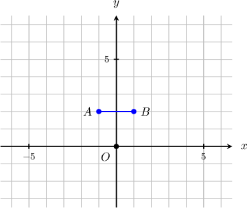
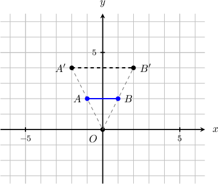
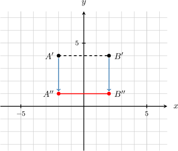
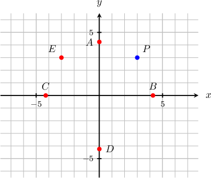
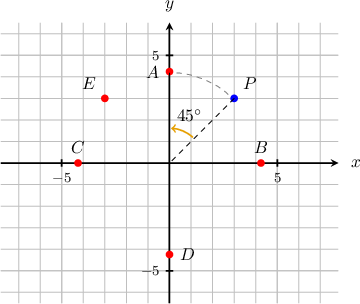
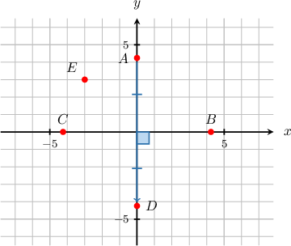
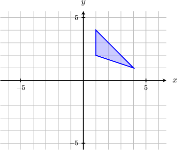
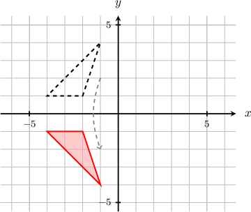

# Combining Geometric Transformations

Source: https://www.mathacademy.com/topics/483?courseId=127
Topic ID: 483

## Prerequisites

- [Dilations of Figures in the Coordinate Plane](../../../traditional/lessons/geometry/577-dilations-of-figures-in-the-coordinate-plane.md)
- [Combining Stretches of Geometric Figures](../../../traditional/lessons/geometry/1363-combining-stretches-of-geometric-figures.md)
- [Rotating Objects in the Coordinate Plane Using Functions](../../../traditional/lessons/geometry/3823-rotating-objects-in-the-coordinate-plane-using-functions.md)

## Lesson

### Introduction

We can combine transformations by applying them in turn.

For example, suppose that the segment $\overline{AB}$ below is dilated with center $O$ and a scale factor $2,$ and then shifted $3$ units down. What is the resulting segment?

Let's apply the transformations in turn.

- Dilating with center $O$ and scale factor $2$ gives the segment $\overline{A'B'},$ shown below:

- Next, we take $\overline{A'B'}$ and shift it by $3$ units down. This gives the segment $\overline{A''B''}\mathbin{:}$

### Example: Determining the Image of a Point Given a Sequence of Transformations

#### Question

The point $P$ below is rotated by $45^\circ$ counterclockwise around the origin and then reflected across the $x$-axis. Which of the given points is the image of $P$ under this sequence of transformations?

#### Explanation

Let's apply the given transformations.

- Rotating the point $P$ by $45^\circ$ counterclockwise around the origin gives the point $A,$ as shown below:

- Reflecting the point $A$ in the $x$-axis gives the point $D,$ as shown below:

Therefore, the correct answer is $D.$

### Example: Applying Multiple Transformations to a Point Using Functions

#### Question

The point $Q(4,3)$ is shifted $2$ units down, reflected across the $y$-axis, and then shifted $1$ unit to the right. What is the resulting point?

#### Explanation

Let's recall the functional representations of our three transformations:

- A shift of $2$ units down can be represented by the function

- A reflection in the $y$-axis can be represented by the function

- A shift of $1$ unit to the right can be represented by the function

Let's apply the given transformations to the point $Q$ using our functions:

First, we apply the shift. The image of the point $\left(4,3\right)$ under the shift is

$$

(4,3) \mapsto (4,3-2)=(4, 1) .

$$

Then, we apply the reflection. The image of the point $\left(4,1\right)$ under the reflection is

$$

(4, 1) \mapsto(-4,1) .

$$

Finally, we apply the second shift. The image of the point $\left(-4,1\right)$ under the shift is

$$

(-4,1) \mapsto (-4+1,1)=(-3, 1) .

$$

Therefore, the resulting point is $(-3,1).$

### Example: Determining the Image of a Polygon Under the Action of Multiple Transformations

#### Question

The triangle shown above is rotated by $90^{\circ}$ counterclockwise about the origin and then reflected across the $x$-axis. What is the resulting triangle?

#### Explanation

Let's apply the given transformation.

- Rotating the triangle by $90^{\circ}$ counterclockwise about the origin gives the following:

- Next, we take the last result and reflect it across the $x$-axis.

### Example: Determining Parameters Given a Point and Its Image Under Multiple Transformations

#### Question

The point $P(5,14)$ is reflected across the line $y=x$ and then stretched according to the function $(x,y) \mapsto (x,ky).$ If the image of $P$ under this sequence of transformations is $(14,25),$ then what is the value of $k?$

#### Explanation

Let's apply the given transformations.

A reflection across the line $y=x$ can be represented by

$$

(x,y ) \mapsto (y, x) .

$$

Applying this to the point $P,$ we get

$$

(5,14 ) \mapsto (14,5) .

$$

Now, applying the stretch to $(14,5),$ we get

$$

(14, 5) \mapsto (14, 5k) .

$$

Since the resulting point is $(14,25),$ by equating the $y$-coordinates, we obtain

$$

\begin{aligned}5𝑘=25\,⟹\,𝑘 & =5.\end{aligned}

$$

Therefore, $k=5.$
