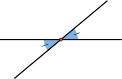
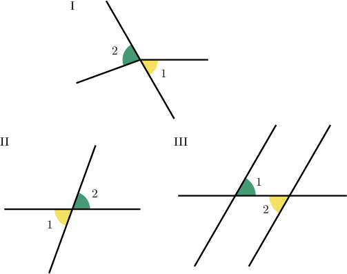
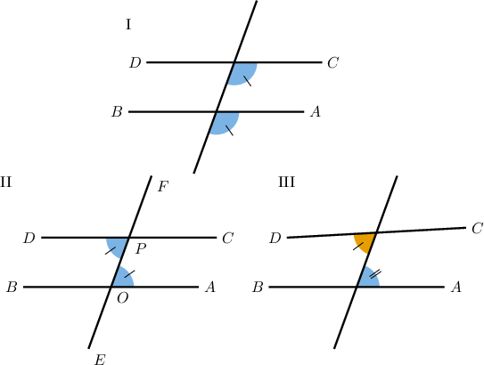
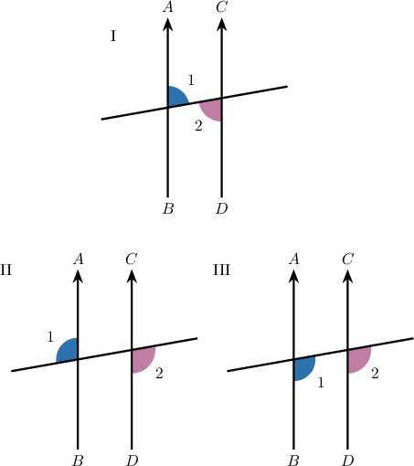
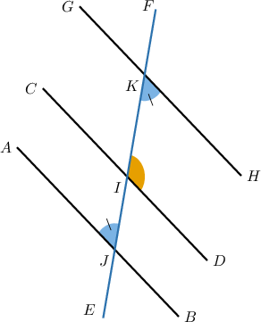
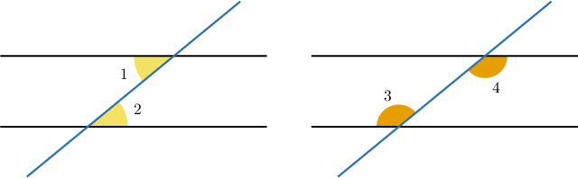

# Identifying Angle Theorems

Source: https://www.mathacademy.com/topics/5434?courseId=127
Topic ID: 5434

## Prerequisites

- [Identifying Angle Postulates](../../../traditional/lessons/geometry/5100-identifying-angle-postulates.md)

## Lesson

### Introduction

A **theorem** is a statement that can be proved mathematically.

So, both postulates and theorems are mathematically true statements. The difference between them is that a theorem *must be proved*, whereas a postulate does not require proof and is considered to be self-evident.

Before we begin proving theorems, let's ensure we can correctly identify some theorems we've already seen. This skill becomes important later.

The diagram below shows two non-parallel lines intersecting at a point, giving two vertical angles.

The **vertical angles theorem** states the following:

*Vertical angles are congruent.*

This means we can add angle markers to our diagram.

### Example: Identifying Instances of the Vertical Angles Theorem

#### Question

Consider the above diagrams. In which one can we apply the vertical angles theorem to conclude that the two marked angles are congruent?

#### Explanation

The vertical angles theorem says that vertical angles (the opposite angles created by two lines meeting at a point) are congruent.

Let's go through the diagrams:

- In diagram I, one line and two rays are meeting at a point, rather than two lines.

- In diagram II, $\angle 1$ and $\angle 2$ are opposite angles created by two lines meeting at a point.

- In diagram III, $\angle 1$ and $\angle 2$ do not meet at a point, and are alternate interior, not opposite.

So diagram $\boxed{\color{blue}\text{II}}$ is the only diagram in which we can apply the vertical angles theorem to $\angle 1$ and $\angle 2.$

### The Alternate Interior Angle Theorems

Let's recall two important theorems related to alternate interior angles.

- The **alternate interior angles theorem** states the following: *If a transversal cuts two parallel lines, then the alternate interior angles are congruent.* In other words, *if* two lines are parallel, this *guarantees* that the alternate interior angles are congruent. Notice that we added angle markers to the diagram on the right.

- The **converse alternate interior angles theorem** states the following: *If a transversal cuts two lines and the alternate interior angles are congruent, then the lines are parallel.* In other words, *if* the alternate interior angles are congruent, this *guarantees* that the lines are parallel. Notice that we added arrows to the diagram on the right.

Make sure you understand the difference between the two theorems.

Finally, remember, alternate interior angles are named this way for a reason:

- *Alternate* means they lie on *opposite sides* of the transversal.

- *Interior* means they lie inside the (parallel) lines.

### Example: Identifying Instances of the Alternate Interior Angle Theorems

#### Question

Consider the above diagrams. In which one can we apply the converse alternate interior angles theorem to conclude that $\overleftrightarrow{AB}$ and $\overleftrightarrow{CD}$ are parallel?

#### Explanation

The converse alternate interior angles theorem says that if a transversal cuts two lines and the alternate interior angles are congruent, then the lines are parallel.

Let's go through the diagrams:

- In diagram I, a transversal cuts two lines, and the marked angles are congruent, but aren't alternate (they are corresponding).

- In diagram II, a transversal cuts two lines, and the marked angles are alternate, interior, and congruent.

- In diagram III, a transversal cuts two lines, and the marked angles are alternate, and interior, but they aren't congruent.

So diagram $\boxed{\color{blue}\text{II}}$ is the only diagram in which we can apply the converse alternate interior angles theorem to conclude that $\overleftrightarrow{AB}$ and $\overleftrightarrow{CD}$ are parallel.

### Alternate Exterior Angle Theorems

Let's recall two important theorems related to alternate exterior angles.

- The **alternate exterior angles theorem** states the following: *If a transversal cuts two parallel lines, then the alternate exterior angles are congruent.* In other words, *if* two lines are parallel, this *guarantees* that the alternate exterior angles are congruent. Notice that we added angle markers to the diagram on the right.

- The **converse alternate exterior angles theorem** states the following: *If a transversal cuts two lines and the alternate exterior angles are congruent, then the lines are parallel.* In other words, *if* the alternate exterior angles are congruent, this *guarantees* that the lines are parallel. Notice that we added arrows to the diagram on the right.

Similar to interior angles, alternate exterior angles are named this way for a reason:

- *Alternate* means they lie on *opposite sides* of the transversal.

- *Exterior* means they lie outside the (parallel) lines.

### Example: Identifying Instances of the Alternate Exterior Angle Theorems

#### Question

Consider the above diagrams. In which one can we apply the alternate exterior angles theorem to conclude that $\angle 1$ and $\angle 2$ are congruent?

#### Explanation

The alternate exterior angles theorem says that if a transversal cuts two parallel lines, then the alternate exterior angles are congruent.

Let's go through the diagrams:

- In diagram I, a transversal cuts two parallel lines, and $\angle 1$ and $\angle 2$ are alternate, but they are interior, not exterior.

- In diagram II, a transversal cuts two parallel lines, and $\angle 1$ and $\angle 2$ are alternate and exterior.

- In diagram III, a transversal cuts two parallel lines, but $\angle 1$ and $\angle 2$ are corresponding, not alternate.

So diagram $\boxed{\color{blue}\text{II}}$ is the only diagram in which we can apply the alternate exterior angles theorem to conclude that $\angle 1$ and $\angle 2$ are congruent.

### Example: Identifying Which Angle Theorem Applies

#### Question

Given that $\angle HKI$ and $\angle AJI$ are congruent, by which theorem does it follow that $\overleftrightarrow{GH}$ and $\overleftrightarrow{AB}$ are parallel?

#### Explanation

When a transversal cuts two lines, we get two pairs of alternate interior angles.

So, in the given diagram, $\angle HKI$ and $\angle AJI$ are alternate interior angles.

The **** states that if a transversal cuts two lines and the alternate interior angles are congruent, then the lines are parallel.

Therefore, $\overleftrightarrow{GH} \parallel \overleftrightarrow{AB}$ by the converse alternate interior angles theorem.
