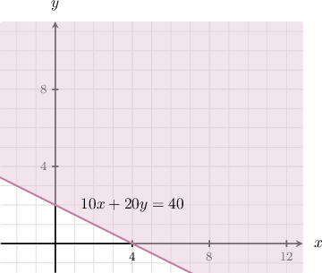
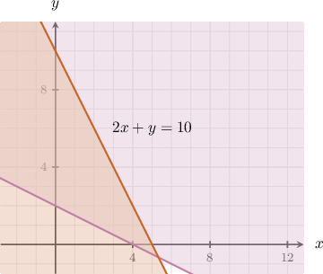
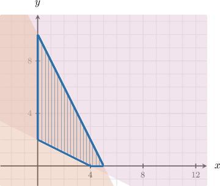
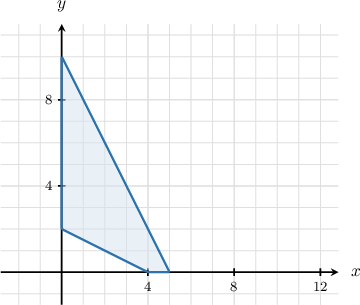
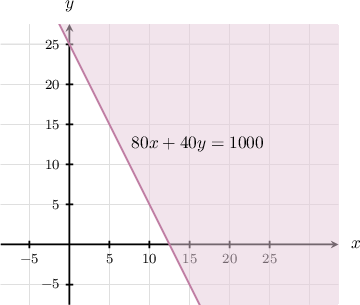
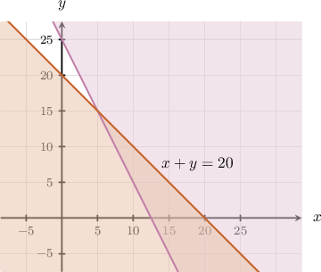
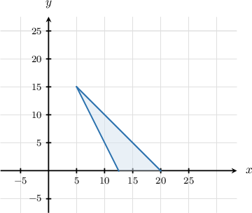
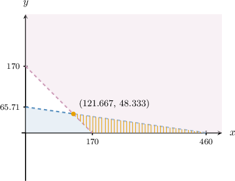

# Modeling and Solving Systems of Linear Inequalities Using Technology

Source: https://www.mathacademy.com/topics/6088?courseId=127
Topic ID: 6088

## Prerequisites

- [Modeling With Systems of Linear Inequalities](../../../traditional/lessons/algebra-i/6360-modeling-with-systems-of-linear-inequalities.md)

## Lesson

### Introduction

In this lesson, we'll learn how to translate real-world goals and constraints into linear inequalities in two variables and use technology, such as graphing calculators, to visualize the *feasible region*. This skill is essential for planning, budgeting, and scheduling problems where we need to identify possible combinations before optimizing for cost, profit, or resources.

For example, suppose a farmer's market sells baskets of apples for $10$ and baskets of pears for $20.$ To pack a basket of apples, they need $2$ crates, and to pack a basket of pears, they need $1$ crate.

If $x$ is the number of apple baskets and $y$ is the number of pear baskets the market sells, let's visualize all possible combinations $(x,y)$ in which the market can sell its baskets if it wishes to:

- Make a profit of at least $40.$

- Use at most $10$ crates.

We start by writing down the inequalities and plotting the corresponding regions in the $xy$-plane. For plotting, it's often handy to use either a *graphing calculator* or *Desmos*. In this particular lesson, we recommend Desmos.

- The profit from selling the baskets is $10x+20y.$ Since the market wishes to make at least $40,$ we have To plot this in the $xy$-plane with Desmos, we type into an entry box for equations the following expression: This gives something similar to the shaded region depicted below, where we additionally have labeled the line $10x + 20y = 40.$

- Also, the market can use at most $10$ crates in total. Each apple basket uses $2$ crates and each pear basket uses $1$ crate. So, we get To add this to our Desmos plot, we type into the next entry box the following expression: This gives the shaded region shown below, where we additionally have labeled the line $2x+y=10.$

- Lastly, since $x$ and $y$ cannot be negative, we restrict our shading to the first quadrant:

Combining all constraints, we obtain the following region:

To get the above region in Desmos explicitly, we can use one neat trick. We can remove all the entered equations, except for the first one. Then, in the first enter box, type in the following:

$$

\boxed{\verb|10x+20y >= 40 {2x+y <= 10} {x >= 0} {y >= 0}|}

$$

This gives the feasible region.

### Example: Identifying a Feasible Region

#### Question

Molly makes homemade jewelry. She sells gold bracelets for $80$ each and silver bracelets for $40$ each. Let $x$ be the number of gold bracelets and $y$ be the number of silver bracelets she makes this month. Find the feasible region if she wants to make at least $1\,000$ this month, yet she only has the time to make at most $20$ bracelets.

#### Explanation

We start by writing down the inequalities and plotting the corresponding regions in the $xy$-plane.

- The profit from selling the bracelets is $80x+40y.$ Since Molly wishes to make at least $ 1\,000,$ we have Plotting this in the $xy$-plane gives the following shaded region. We have labeled the line $80x+40y \geq 1\,000.$

- Also, Molly can make a maximum of $20$ bracelets. So, we get Adding this to our plot, we get the following. We have labeled the line $x + y = 20.$

- Lastly, since $x$ and $y$ cannot be negative, we restrict our shading to the first quadrant:

Combining all constraints, we obtain the following region:

### Example: Finding an Optimal Solution

#### Question

A facilities team has less than $414$ to prepare a cleaning solution. To qualify for a bulk shipping rate, it must mix more than $170$ liters in total. Base solvent costs $0.90$ per liter and disinfectant concentrate costs $6.30$ per liter. Rounded to one decimal place, what is the maximum volume of disinfectant concentrate the team can include while staying within the budget and keeping the shipping rate?

#### Explanation

We start by writing down the inequalities that model the situation. Let $x$ denote the volume of base solvent and $y$ denote the volume of disinfectant concentrate the team purchases.

- The total cost of the solution is $0.90x+6.30y.$ Since the team wants to spend less than $414,$ we have

- The total volume of the solution is $x+y.$ Since the team needs to mix more than $170$ liters to maintain the shipping rate, we have

Also, notice that $x \geq 0$ and $y \geq 0$ as the volumes must be non-negative. So, we obtain the following system:

$$

\begin{aligned}0.90𝑥+6.30𝑦<414 \\ 𝑥+𝑦>170 \\ 𝑥≥0 \\ 𝑦≥0\end{aligned}

$$

Let's now plot the corresponding regions in the $xy$-plane.

Notice that the corner point on the top of the feasible region has the coordinates approximately $(121.667,48.333),$ rounded to three decimal places. So, rounded to one decimal place, the maximum volume of disinfectant concentrate that potentially could satisfy the given constraints is $y=48.3.$

Now, if $y=48.3,$ then

$$

\begin{aligned}𝑥 & >170−𝑦 \\ & =170−48.3 \\ & =121.7.\end{aligned}

$$

Since the inequality is strict we take $x=121.8.$

Substituting $x=121.8$ and $y=48.3$ into the first inequality, we obtain

$$

\begin{aligned}0.90𝑥+6.30𝑦 & =0.90(121.8)+6.30(48.3) \\ & =413.91 \\ & <414\,✓\end{aligned}

$$

So, all the constraints are indeed satisfied. Therefore, the team can include a maximum of $48.3$ liters of disinfectant concentrate.
